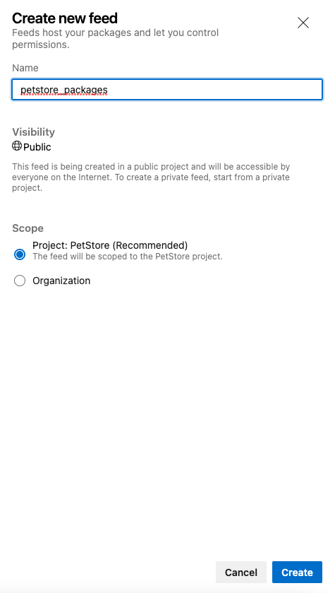
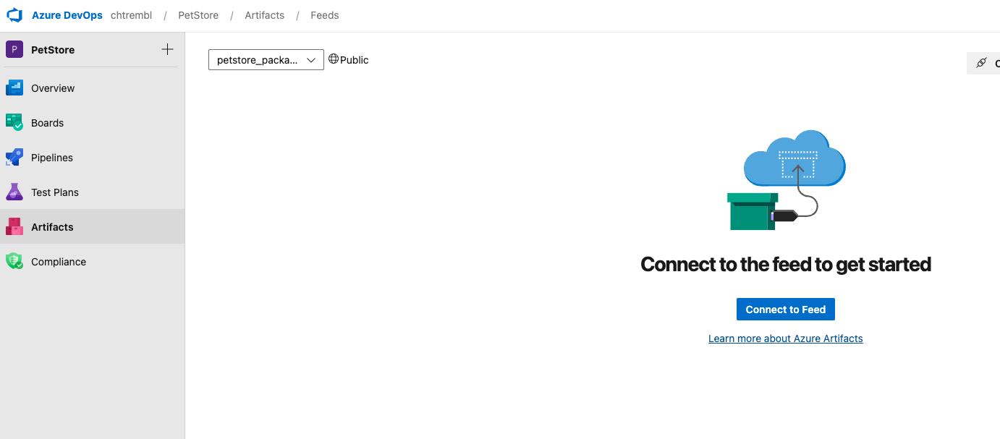
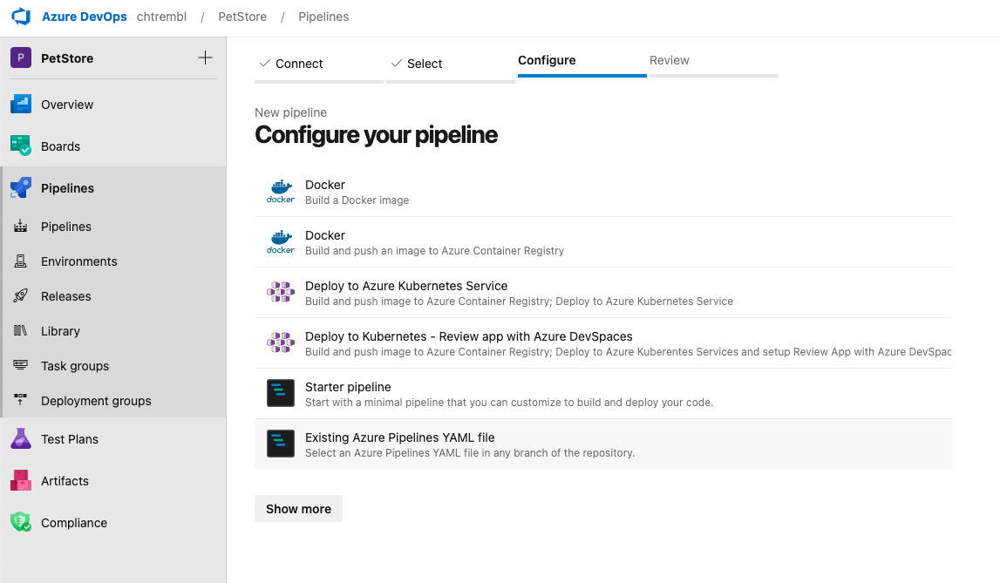
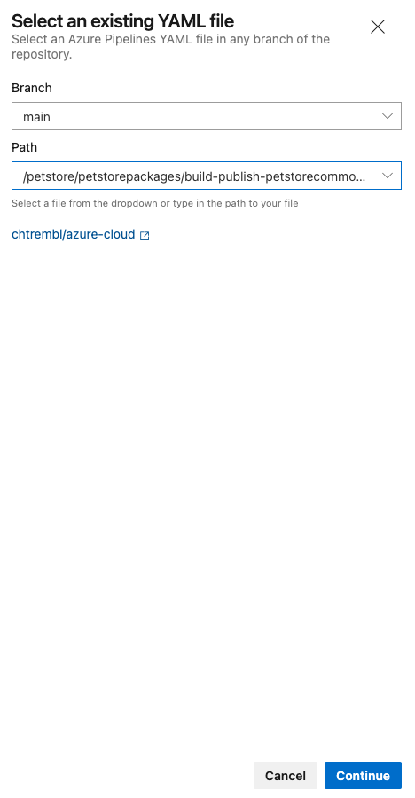
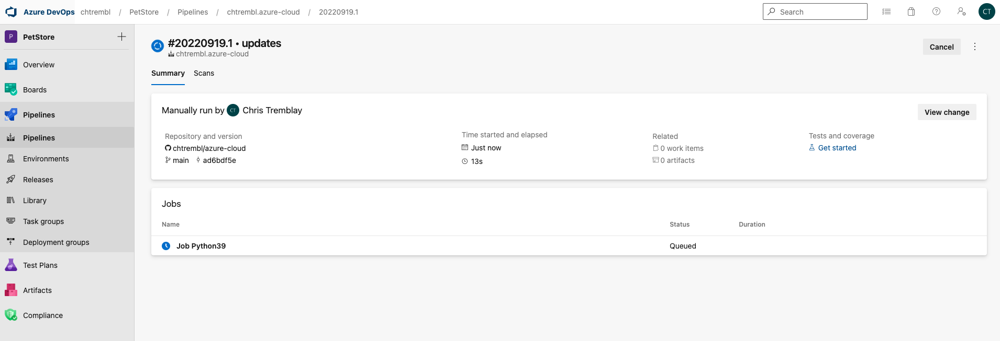
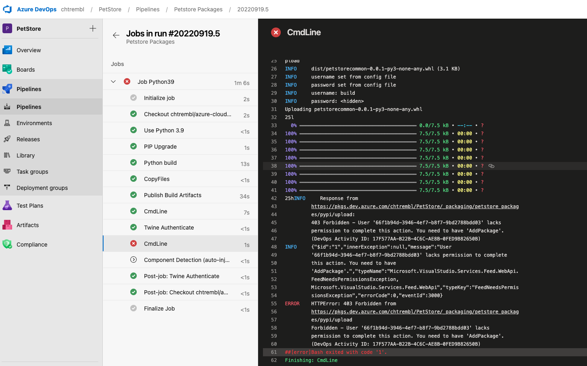
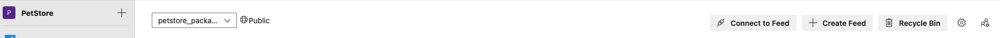
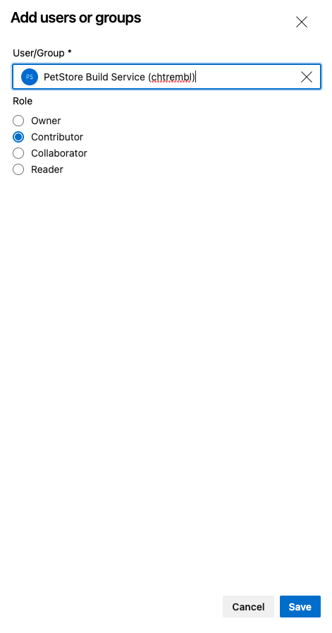
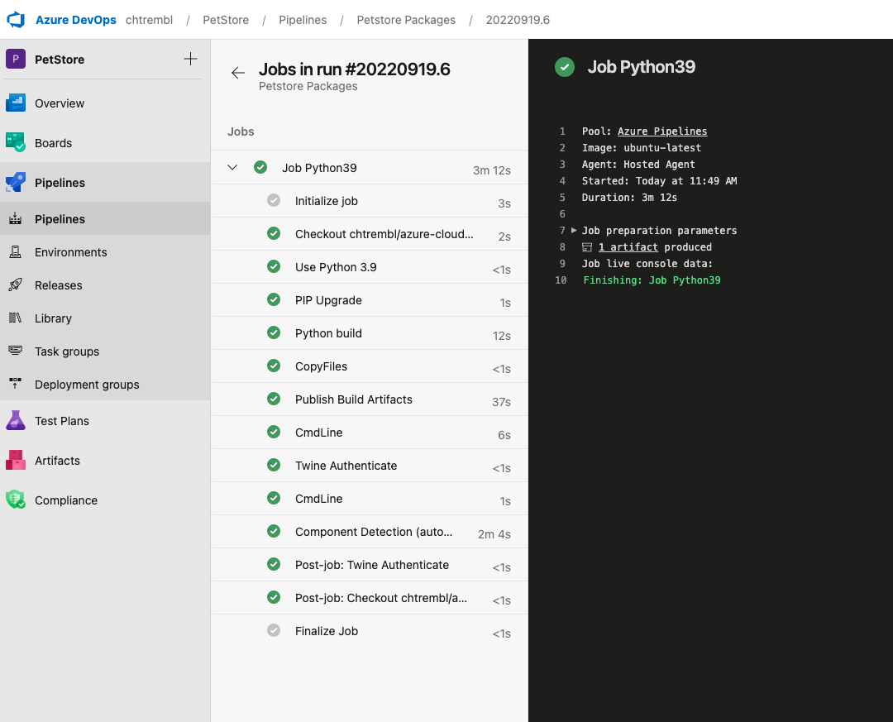
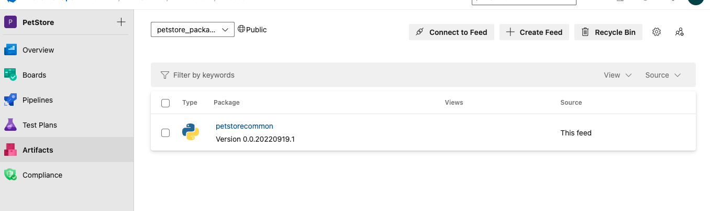

## Using Azure DevOps Artifacts to push/pull Python packages

Are you looking for a collaborative way for developers to source and distribute reusable Python packages? The following will walk through the steps needed to configure an Azure DevOps Pipeline to build and deploy Python Packages to Azure Artifacts for consumption by developers across your organization.

## Step1 Clone this repository and understand the contents ##

```
git clone git@github.com:youralias/azure-cloud.git
```
You will notice the following, petstorecommon is the reusable Python package that will be built by Azure DevOps Pipeline and distributed to Azure Artifacts
```azure-cloud/petstore/petstorepackages/petstorecommon```

petstorecommonconsumer is a sample Python project that consumed the reusable Python petstorecommon package
```azure-cloud/petstore/petstorepackages/petstorecommonconsumer```

build-publish-petstorecommon-package-pipeline is the pipeline that you will import into Azure DevOps Pipelines
```azure-cloud/petstore/petstorepackages/build-publish-petstorecommon-package-pipeline.yml```

## Step2 Understand the petstorecommon package that we are building ##

> 📝 Please Note, The petstorecommon project was built using the packaging structure detailed here https://packaging.python.org/en/latest/tutorials/packaging-projects/

Inspect ```azure-cloud/petstore/petstorepackages/petstorecommon/src/utility.py```

```python
def getBreeds(animal):
    if animal == "Dog":
        return "Afador, American Bulldog, Australian Retriever"
    elif animal == "Cat":
        return "Abyssinian, American Bobtail"
    elif animal == "Fish":
        return "Goldfish, Bass"
```

This is the script that we will center our package around, a reusable package to retrieve pet breeds as needed. Every time we commit a change to this python script, a new DevOps Pipeline will build and deploy the package.

In your terminal run the following:

```cd azure-cloud/petstore/petstorepackages/petstorecommon/src/petstorecommon```

```python run.py```

```bash
❯ /opt/homebrew/bin/python3 /Users/christremblay/Development/git/azure-cloud/petstore/petstorepackages/petstorecommon/src/petstorecommon/run.py
Afador, American Bulldog, Australian Retriever
Abyssinian, American Bobtail
Goldfish, Bass
```

You will notice a list of breeds

## Step3 Create an Azure DevOps Artifacts feed ##

Head to Azure DevOps and create a new Azure Artifacts feed, give it a name, for example ```petstore_packages```

You should see the following:





> 📝 Please Note, Now that the Artifacts feed is setup, we will come back to it in a bit

## Step4 Create an Azure DevOps Pipeline ##

Import the ```azure-cloud/petstore/petstorepackages/build-publish-petstorecommon-package-pipeline.yml``` and select run (which saves the pipeline)

```
trigger:
  branches:
    include:
    - main
  paths:
    include:
    - petstore/petstorepackages/petstorecommon/*

pool:
  vmImage: ubuntu-latest
strategy:
  matrix:
    Python39:
      python.version: '3.9'

steps:
- task: UsePythonVersion@0
  inputs:
    versionSpec: '$(python.version)'
  displayName: 'Use Python $(python.version)'

- script: |
    python -m pip install --upgrade build
  displayName: 'PIP Upgrade'
 
- script: |
    ls -l
    cd petstore/petstorepackages/petstorecommon
    sed -i "s|PACKAGE_VERSION|$(Build.BuildNumber)|g" pyproject.toml
    python -m build
  displayName: 'Python build'

- task: CopyFiles@2
  inputs:
    targetFolder: $(Build.ArtifactStagingDirectory)

- task: PublishBuildArtifacts@1
  inputs:
    PathtoPublish: '$(Build.ArtifactStagingDirectory)'
    ArtifactName: 'dist'
    publishLocation: 'Container'
  displayName: Publish Build Artifacts
  
- script: |
    pip install wheel
    pip install twine

- task: TwineAuthenticate@1
  inputs:
    artifactFeed: PetStore/petstore_packages
  displayName: Twine Authenticate
    
- script: |
    ls -l
    cd petstore/petstorepackages/petstorecommon
    python -m twine upload -r petstore_packages --config-file $(PYPIRC_PATH) dist/*.whl --verbose
```







The build will initiate via ```python -m build```, and on each subsequent commit to your repository folder ```petstorepackages/petstorecommon``` it will run as well. Essentially every time a developer commits a change to ```petstorepackages/petstorecommon``` we will initiate a new pipeline to build and deploy a new package so the other team members/developers can consume. The build label gets injected as well via ```sed -i "s|PACKAGE_VERSION|$(Build.BuildNumber)|g" pyproject.toml``` and twine is used to deploy the package to Artifacts via the Artifact feed that we previously created ```petstore_packages```

> 📝 Please Note, The build will fail because there isn't yet permissions for this Pipeline to deploy to the Artifact feed.



Head to the settings of your Artifacts and add the ```Contributor``` permission.





Rerun the job and it should be successful, you will notice the Artifact gets populated with all of the meta data around it including steps to consume it.





## Step5 Consume the petstorecommon package ##

In your terminal run the following:

```cd azure-cloud/petstore/petstorepackages/petstorecommon/src/petstorecommonconsumer```

run.py is a separate Python project script that consumes the petstorecommon package

```Python 
from petstorecommon import utility

print(utility.getBreeds("Dog"))
print(utility.getBreeds("Cat"))
print(utility.getBreeds("Fish"))
```

```python run.py```

```bash
❯ python run.py 
Traceback (most recent call last):
  File "/Users/christremblay/Development/git/azure-cloud/petstore/petstorepackages/petstorecommonconsumer/run.py", line 1, in <module>
    from petstorecommon import utility
```

This fails because the petstorecommon package does not exist (we haven't installed the package yet)

In your terminal run the following:

```
pip install artifacts-keyring
```

> 📝 Please Note, More details on the Artifacts Connection Feed can be found here https://learn.microsoft.com/en-us/azure/devops/artifacts/quickstarts/python-packages?view=azure-devops

Now install your petstorecommon package that your DevOps Pipeline has built

```
pip install petstorecommon==0.0.20220919.14 --index-url https://pkgs.dev.azure.com/chtrembl/PetStore/_packaging/petstore_packages/pypi/simple/
```

```bash
❯ pip install petstorecommon==0.0.20220919.14 --index-url https://pkgs.dev.azure.com/chtrembl/PetStore/_packaging/petstore_packages/pypi/simple/
WARNING: pip is being invoked by an old script wrapper. This will fail in a future version of pip.
Please see https://github.com/pypa/pip/issues/5599 for advice on fixing the underlying issue.
To avoid this problem you can invoke Python with '-m pip' instead of running pip directly.
DEPRECATION: Configuring installation scheme with distutils config files is deprecated and will no longer work in the near future. If you are using a Homebrew or Linuxbrew Python, please see discussion at https://github.com/Homebrew/homebrew-core/issues/76621
Looking in indexes: https://pkgs.dev.azure.com/chtrembl/PetStore/_packaging/petstore_packages/pypi/simple/
Collecting petstorecommon==0.0.20220919.14
  Downloading https://pkgs.dev.azure.com/chtrembl/6b3206dd-90b3-40f6-a611-e5a1e5a13593/_packaging/de664f4a-a9c5-474a-b501-df8a73272569/pypi/download/petstorecommon/0.0.20220919.14/petstorecommon-0.0.20220919.14-py3-none-any.whl (3.3 kB)
Installing collected packages: petstorecommon
  DEPRECATION: Configuring installation scheme with distutils config files is deprecated and will no longer work in the near future. If you are using a Homebrew or Linuxbrew Python, please see discussion at https://github.com/Homebrew/homebrew-core/issues/76621
DEPRECATION: Configuring installation scheme with distutils config files is deprecated and will no longer work in the near future. If you are using a Homebrew or Linuxbrew Python, please see discussion at https://github.com/Homebrew/homebrew-core/issues/76621
Successfully installed petstorecommon-0.0.20220919.14
```

> 📝 Please Note, the build label reflects the artifact that you wish to consume

In your terminal run the following:

```
pip list
```

You will see the petstorecommon package now

```petstorecommon      0.0.20220919.14```

In your terminal run the following:

```python run.py```

```bash
❯ python run.py 
Afador, American Bulldog, Australian Retriever
Abyssinian, American Bobtail
Goldfish, Bass
```

## Step6 Make petstorecommon changes, initiate a DevOps Pipeline, retest ##

Now as you make changes to your petstorecommon package script(s) and commit them, your DevOps pipeline will automatically build/deploy a package to Artifacts and you can choose which petstorecommon Artifact to consume with the pip install command above, toggling between different versions. You can optionally remove the package as well with ```pip uninstall petstorecommon```
