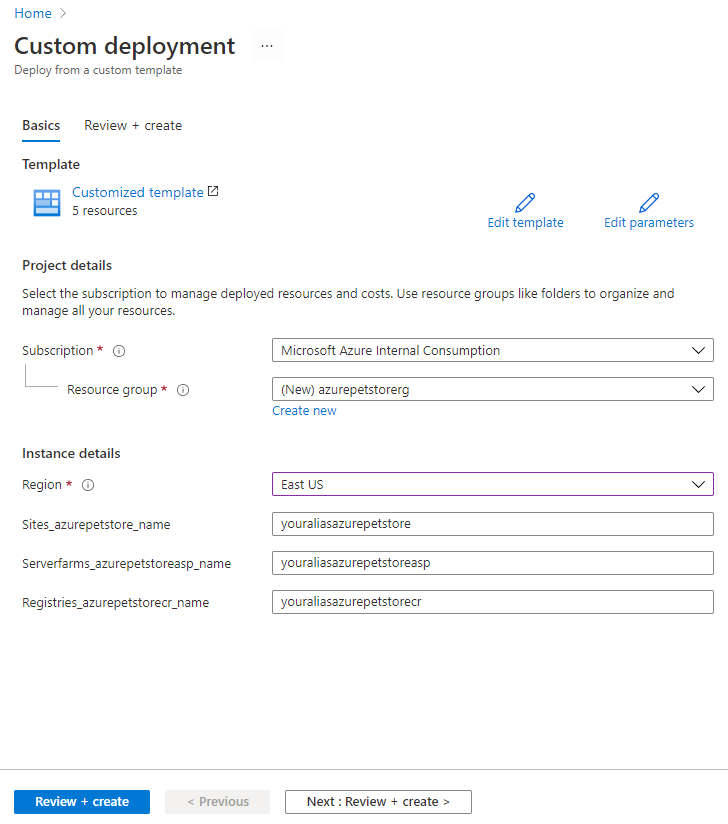

# 00 - Setup your environment

__This guide is part of the [Azure Pet Store App Dev Reference Guide](../README.md)__

In this section, we'll begin to set up your environment.

*Please note, if your not interested in building/deploying locally, you can certainly skip ahead and leverage Azure DevOps Pipelines and GitHub Actions to do the build & deploys for you.*

---

## Creating Azure Resources

To save time, we have an ARM template to get a few Azure resources created:

 - App Service (Pet Store Application)
 - App Service Plan (Resources needed to host the Pet Store Application)
 - Container Registry (Used to store Docker Images for Pet Store Application and Pet Store Service)
 
> 💡 Please Note, Azure B2C, Azure Kubernetes Service, Azure Application Insights, API Management & Azure Key Vault will be setup in the subsequent guides.

Go ahead and Deploy to Azure

 

> 💡 Create a new resource when prompted, such as: **azurepetstorerg** and substitute your network alias for **youralias**, or something unique that will appear as a FQDM for accessing your Azure Pet Store Application.

You should see something similar to the below image:

>⏱ The resource provisioning will take some time. **Do not wait!** Continue with the guides. Remember your Resource Group!

If you head over to your Azure Resource Group (once completed) You should see something similar to the below image:

## Prerequisites

Thus guide assumes you have Java JDK, Maven, Docker Desktop and Azure CLI installed on your machine. Until we setup your Azure Pipeline & GitHub Action, we will use Maven, Docker and Azure CLI, locally, to build and push both the PetStoreApp and PetStoreService Docker Images into Azure Container Registry. We will do other things like Administer our Azure Kubernetes Cluster.

 - Install Java JDK 13 or higher using the guide from the following https://examples.javacodegeeks.com/download-and-install-java-development-kit-jdk-13/

 - Install Maven using the following guide from https://maven.apache.org/guides/getting-started/maven-in-five-minutes.html
  
 - Install Docker Desktop from the following https://www.docker.com/products/docker-desktop and ensure you can run Docker from your command line.
 
 - Install Azure CLI from the following https://docs.microsoft.com/en-us/cli/azure/install-azure-cli-windows?tabs=azure-cli and ensure you can run AZ from your command line.

---

➡️ Next guide: [01 - Build the Docker Images](../01-build-the-docker-images/README.md)
