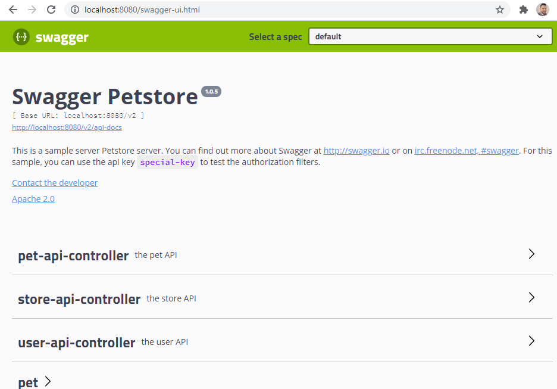
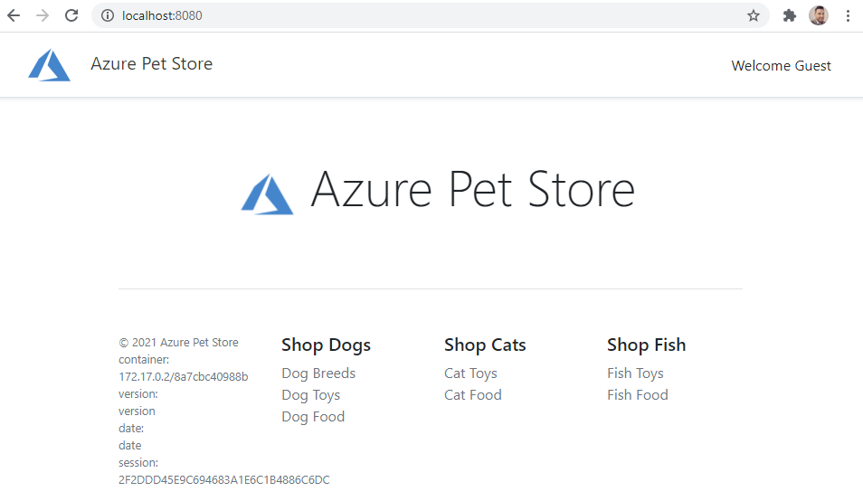
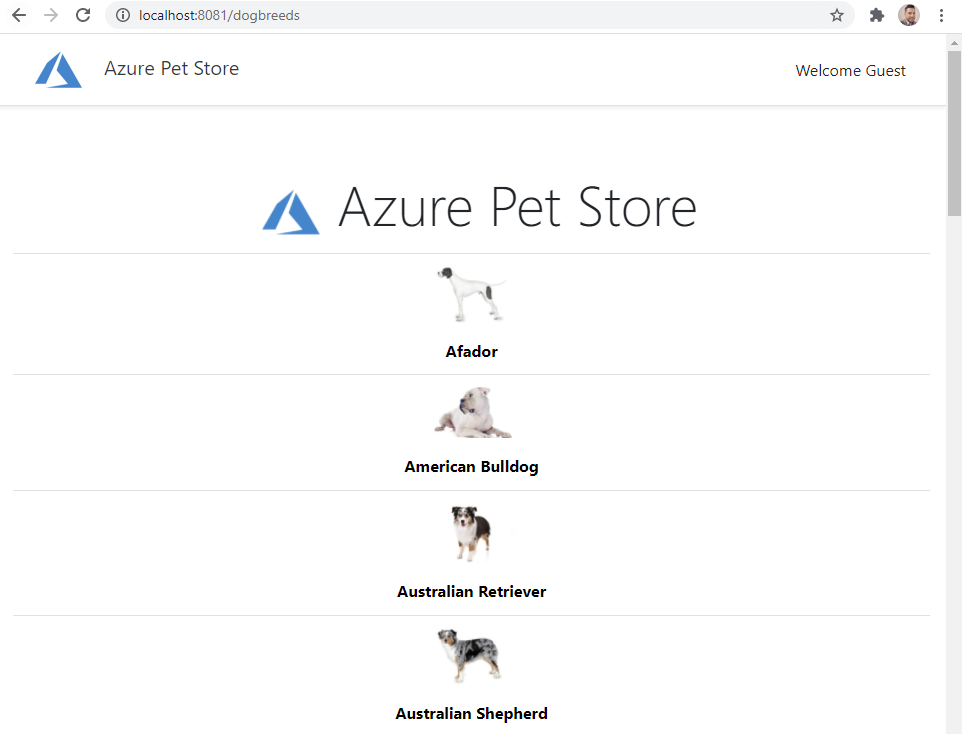

# 01 - Build the Docker Images (For Local Development Only using Docker in Linux containers mode)
__This guide is part of the [Azure Pet Store App Dev Reference Guide](../README.md)__

In this section, we'll build the Docker Images and run them locally

> 📝 Please Note, if you're planning to complete this guide, we assume you have Docker installed https://docs.docker.com/get-docker/ and configured in Linux Containers mode with CLI access to execute Docker commands

> 📝 Please Note, We will assume you have forked the azure-cloud repository, it is the easiest way to get going (for instructions on this view the "**Forking the azure-cloud**" section in [00-setup-your-environment](../00-setup-your-environment/README.md). Also, both PetStoreApp and PetStoreService use a Spring Boot Application properties file named application.yml to drive the functionality/configuration of these applications which is located in src/main/resources/application.yml of both projects. By default, this file has all of the properties that are needed throughout the guides, and by default are commented out. This means that the applications will start automatically without having to configure anything. As you progress through the guides, each guide will inform you of what properties to uncomment and configure within your environment. If you have not already done so, login to your GitHub account, head to https://github.com/chtrembl/azure-cloud, and fork.

From your terminal, clone this repository: https://github.com/chtrembl/azure-cloud and set azure-cloud/petstore as your working directory

**1. Build and Run the Pet Store Service Docker Image**

cd to azure-cloud/petstore/petstoreservice

Fist lets setup a local bridge network so our Docker containers (PetStoreApp and PetStoreService can communicate)

run the following command 

```docker network create petstorebridge```

Now lets have Docker build our PetStoreService Spring Boot jar (containing all of the PetStoreService code) and our Docker Image containing this Spring Boot jar and all of the dependencies.

run the following command 

> 📝 Please Note, Docker will use the root directory (indicated by '.') and execute the Dockerfile commands to build a Docker Image tagged petstoreservice:latest

```docker build -t petstoreservice .```

Congratulations, you know have a Docker Image.

run the following command 

```docker image ls``` 

You should see your latest petstoreservice:latest image

Lets now test our Pet Store Application

run the following command

> 📝 Please Note, This will instruct Docker to start a running container with the following petstore:latest image, forwarding port 8080 to the Spring Boot App running on 8080 (default Spring Boot Port). The PETSTORESERVICE_SERVER_PORT is one of several environment variables that we will introduce over the course of these guidas.

```docker run --rm --net petstorebridge --name petstoreservice -p 8081:8081 -e PETSTORESERVICE_SERVER_PORT=8081 -d petstoreservice:latest```

Open a browser and head to http://localhost:8081

You should see something similar to the below image:



**2. Build and Run the Pet Store App Docker Image**

Leave your existing CLI tab open and create a new one (The PetStoreService container is still running, we will need it when we connect the PetStoreApp to it)

cd to azure-cloud/petstore/petstoreapp and run the following command

```ls -l``` 

You should see something similar to the below image:


Now lets have Docker build our PetStoreApp Spring Boot jar (containing all of the PetStoreApp code) and our Docker Image containing this Spring Boot jar and all of the dependencies.

run the following command 

> 📝 Please Note, Docker will use the root directory (indicated by '.') and execute the Dockerfile commands to build a Docker Image tagged petstoreapp:latest

```docker build -t petstoreapp .``` 

You should see something similar to the below image:


Congratulations, you know have a Docker Image.

run the following command 

```docker image ls``` 

You should see something similar to the below image:


Lets get the IP Address if the running Pet Store Service from the other CLI Tab

run the following command and capture the ip address that is displayed, for example 172.19.0.2

```docker inspect -f '{{range.NetworkSettings.Networks}}{{.IPAddress}}{{end}}' container_name_or_id```

Lets now test our Pet Store Application

run the following command

```
>``` 📝 Please Note, This will instruct Docker to start a running container with the following petstoreapp:latest image, forwarding port 8080 to the Spring Boot App running on 8080 (default Spring Boot Port). The PETSTOREAPP_SERVER_PORT is one of several environment variables that we will introduce over the course of these guides. You may have noticed that we are also injecting a PETSTORESERVICE_URL property without an actual service yet. I am doing this because we will tie the two running apps together in Step 3 below so its nice to keep this property available to ensure we are able to inject real values.

>``` 📝 Please Note, make sure you use your PetStoreService ipaddress instead of 172.19.0.2:8081

```docker run --rm --net petstorebridge --name petstoreapp -p 8080:8080 -e PETSTOREAPP_SERVER_PORT=8080 -e PETSTORESERVICE_URL=http://172.19.0.2:8081 -d petstoreapp:latest 

```

Open a browser and head to http://localhost:8080

You should see something similar to the below image:



> 📝 Please Note,the footer of this application contains meta data that will be useful as we progress through the guides. Things like container id (useful for understanding containers at scale), CI/CD dates/version, Session Id for N-Tier Correlated Telemetry with Application Insights. We will also integrate our products with the Pet Store Service and allow for external user authentication via B2C.

Noq test that the PetStoreApp can communicate with the PetStoreService

Click on Dog Breeds or head to http://localhost:8080/dogbreeds?category=Dog

You should see something similar to the below image:



🎉Congratulations, you have successfully integrated your Pet Store Application with the Pet Store Service and have made a service call to retrieve Dog Breeds. 

> 📝 Please Note, all Pet Store Service Data is currently persisted In Memory, no databases are used at the moment.

Things you can now do now with this guide

☑️ Building and Testing Docker Images locally

---
➡️ Next guide: [02 - Push the Docker Images to Azure Container Registry](../02-push-the-docker-images-to-acr/README.md)
