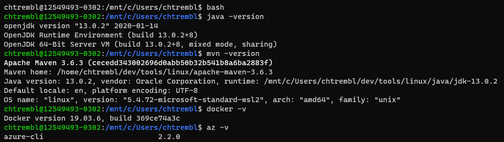
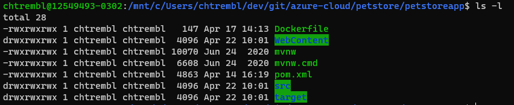
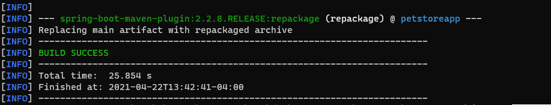
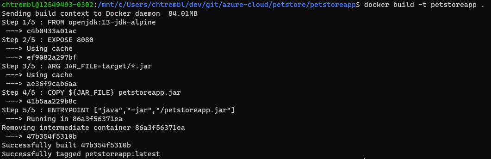
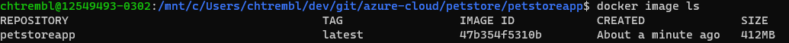
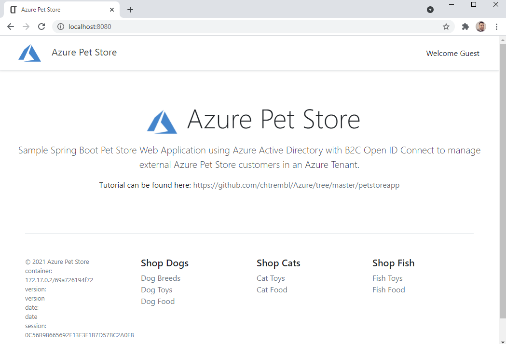

# 01 - Build the Docker Images
__This guide is part of the [Azure Pet Store App Dev Reference Guide](../README.md)__

In this section, we'll build the Docker Images and run them locally

> 💡 Please Note, if you're planning to complete this guide, we assume you have Java JDK 13+, Maven, Docker Desktop and Azure CLI installed.

From your terminal, clone this repository: https://github.com/chtrembl/azure-cloud and set azure-cloud/petstore as your working directory

Run the following four commands to ensure your envrionment is good to go. 

```java -version```

```mvn -version```

```docker -v```

```az -v```

You should see something similar to the below image:



**1. Build and Run the Pet Store App Docker Image**

cd to azure-cloud/petstore/petstoreapp and run the following command

```ls -l``` 

You should see something similar to the below image:



First lets comment some properties needed for services that we are not yet ready for. Thinks like Application Insights, API Management & B2C.

run the following command

```vi src/main/resources/application.yml```

> 💡 You can also open in any editor of choice

Add '#' characters to the start of the following lines, this will disable the services that we are not yet integrating with. Be sure to save!

We are going to use Maven to first build the Spring Boot artifact .jar file that will be needed by Docker.

run the following command

```mvn clean package``` 

This will compile a Spring Boot jar file and place it in the /target directory. You will do this each and every time you make any code changes to petstoreapp. Utlimatley our Azure DevOps Pipelines & GitHub Actions will perform this compilation task for us.

You should see something similar to the below image:



run the following command 

```ls target -l``` 

You should see petstoreapp-0.0.1-SNAPSHOT.jar newly created. We can then run this Spring Boot .jar file if we would like. However the goal is to containerize it with all of the required dependecis (Java Runtime Environment etc... so that we can deploy anyqhere within Azure)

Now lets have Docker build our image.

run the following command 
> 💡 Docker will use the root directory (indicated by '.') and execute the Dockerfile commands to build a Docker Image tagged petstoreapp:latest

```docker build -t petstoreapp .``` 

You should see something similar to the below image:



Congratulations, you know have a Docker Image.

run the following command 

```docker image ls``` 

You should see something similar to the below image:



Lets now test our petstore application

run the following command
> 💡 This will instruct Docker to start a running container with the following petstore:latest image, forwarding port 8080 to the Spring Boot App running on 8080 (default Spring Boot Port). The PETSTOREAPP_SERVER_PORT is one of several environment variables that we will introduce over the course of these guidas.

```docker run -p 8080:8080 -e PETSTOREAPP_SERVER_PORT=8080 -e PETSTORESERVICE_URL=http://localhost:8080 petstoreapp:latest```

Open a browser and head to http://localhost:8080

You should see something similar to the below image:



**2. Build and Run the Pet Store Service Docker Image**

---
➡️ Next guide: [02 - something](../02-something/README.md)