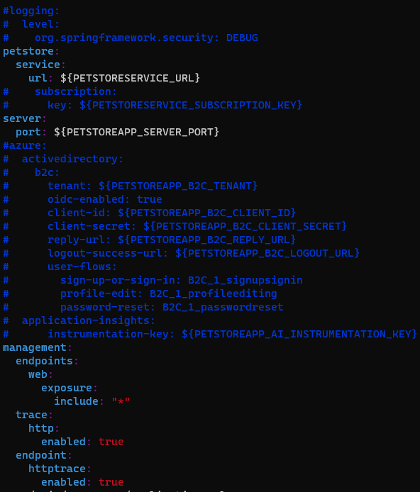
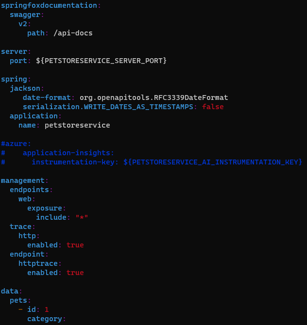

# 01 - Build the Docker Images (Local Development Only)
__This guide is part of the [Azure Pet Store App Dev Reference Guide](../README.md)__

In this section, we'll build the Docker Images and run them locally

> 📝 Please Note, if you're planning to complete this guide, we assume you have Java JDK 13+, Maven, Docker Desktop and Azure CLI installed.

From your terminal, clone this repository: https://github.com/chtrembl/azure-cloud and set azure-cloud/petstore as your working directory

Run the following four commands to ensure your envrionment is good to go. 

```java -version```

```mvn -version```

```docker -v```

```az -v```

You should see something similar to the below image:


**1. Build and Run the Pet Store App Docker Image**

cd to azure-cloud/petstore/petstoreapp and run the following command

```ls -l``` 

You should see something similar to the below image:


First lets comment some properties needed for services that we are not yet ready for. Thinks like Application Insights, API Management & B2C.

run the following command

```vi src/main/resources/application.yml```

> 📝 Please Note, You can also open in any editor of choice

Add '#' characters to the start of the following lines (in the screenshot below), this will disable the services that we are not yet integrating with. Be sure to save!



We are going to use Maven to first build the Spring Boot artifact .jar file that will be needed by Docker.

run the following command

```mvn clean package``` 

This will compile a Spring Boot jar file and place it in the /target directory. You will do this each and every time you make any code changes to petstoreapp. Utlimatley our Azure DevOps Pipelines & GitHub Actions will perform this compilation task for us.

You should see something similar to the below image:


run the following command 

```ls target -l``` 

You should see petstoreapp-0.0.1-SNAPSHOT.jar newly created. We can then run this Spring Boot .jar file if we would like. However the goal is to containerize it with all of the required dependencies (Java Runtime Environment etc... so that we can deploy anyqhere within Azure)

Now lets have Docker build our image.

run the following command 

> 📝 Please Note, Docker will use the root directory (indicated by '.') and execute the Dockerfile commands to build a Docker Image tagged petstoreapp:latest

```docker build -t petstoreapp .``` 

You should see something similar to the below image:


Congratulations, you know have a Docker Image.

run the following command 

```docker image ls``` 

You should see something similar to the below image:


Lets now test our petstore application

run the following command

> 📝 Please Note, This will instruct Docker to start a running container with the following petstore:latest image, forwarding port 8080 to the Spring Boot App running on 8080 (default Spring Boot Port). The PETSTOREAPP_SERVER_PORT is one of several environment variables that we will introduce over the course of these guidas. You may have noticed that we aren injecting also injecting a PETSTORESERVICE_URL property without an actual service yet. I am doing this because we will tie the two running apps together in Step 3 below so its nice to keep this property available to ensure we are able to inject real values.

```docker run -p 8080:8080 -e PETSTOREAPP_SERVER_PORT=8080 -e PETSTORESERVICE_URL=http://localhost:8080 petstoreapp:latest```

Open a browser and head to http://localhost:8080

You should see something similar to the below image:


> 📝 Please Note,the footer of this application contains meta data that will be useful as we progress through the guides. Things like container id (useful for understanding containers at scale), CI/CD dates/version, Session Id for N-Tier Correlated Telemetry with Application Insights. We will also integrate our products with the Pet Store Service and allow for external user authentication via B2C.

You can now stop the Docker contaier.

run the following command 

``` ctrl+c ```

or 

``` docker stop <containerid> ```

**2. Build and Run the Pet Store Service Docker Image**

The steps are going to be similar to the above

cd to azure-cloud/petstore/petstoreservice

run the following command

```vi src/main/resources/application.yml```

> 📝 Please Note, You can also open in any editor of choice

Add '#' characters to the start of the following lines (in the screenshot below), this will disable the services that we are not yet integrating with. Be sure to save!



run the following command

```mvn clean package``` 

run the following command 

```ls target -l``` 

You should see petstoreservice-0.0.1-SNAPSHOT.jar newly created. We can then run this Spring Boot .jar file if we would like. However the goal is to containerize it with all of the required dependencies (Java Runtime Environment etc... so that we can deploy anyqhere within Azure)

Now lets have Docker build our image.

run the following command 

> 📝 Please Note, Docker will use the root directory (indicated by '.') and execute the Dockerfile commands to build a Docker Image tagged petstoreservice:latest

```docker build -t petstoreservice .```

run the following command 

```docker image ls``` 

You should see your latest petstoreservice:latest image

run the following command

> 📝 Please Note, This will instruct Docker to start a running container with the following petstore:latest image, forwarding port 8080 to the Spring Boot App running on 8080 (default Spring Boot Port). The PETSTORESERVICE_SERVER_PORT is one of several environment variables that we will introduce over the course of these guidas.

```docker run -p 8080:8080 -e PETSTORESERVICE_SERVER_PORT=8080 petstoreservice:latest```

Open a browser and head to http://localhost:8080

You should see something similar to the below image:


**3. Test the two applications together locally**

With the petstoreservice:latest container still running on 8080, start up the petstoreapp and test the two together.

> 📝 Please Note, we are starting petstoreapp with Maven, outside of a Docker container, to avoid having to configure the two Docker containers to communicate with eachother. For simplicity locally, this is easier for this guide and still conveys the point of integrating the two apps. Once we deploy to Azure we will keep the containerized in Docker PaaS based services.

run the following command (you can use another terminal window for this)

```mvn spring-boot:run -Dspring-boot.run.arguments="--server.port=8081 --PETSTORESERVICE_URL=http://localhost:8080"```

Open a browser and head to http://localhost:8081/dogbreeds

You should see something similar to the below image:


🎉Congratulations, you have successfully integrated your Pet Store Application with the Pet Store Service and have made a service call to retrieve Dog Breeds. 

> 📝 Please Note, all Pet Store Service Data is currently persisted In Memory, no databases are used at the moment.


Things you can now do now with this guide

☑️ Building Docker Images locally

---
➡️ Next guide: [02 - Push the Docker Images to Azure Container Registry](../02-push-the-docker-images-to-acr/README.md)