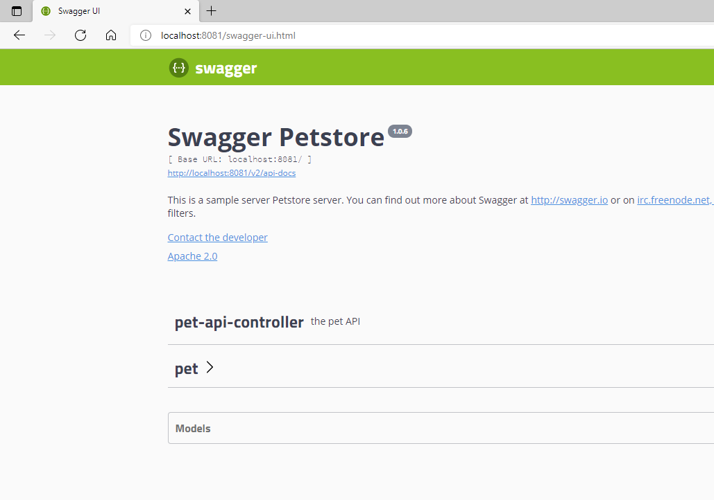
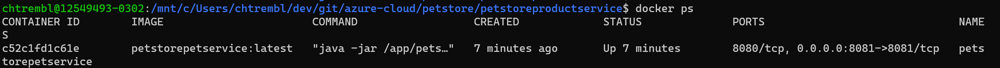
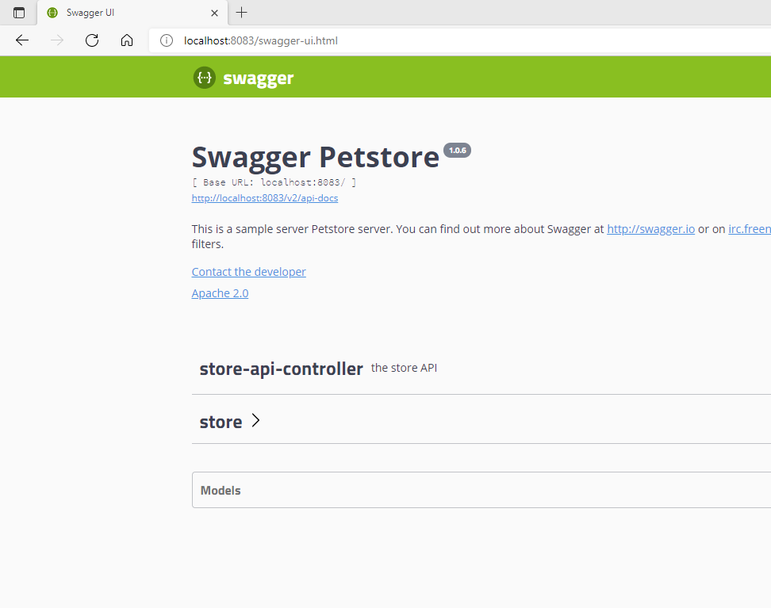
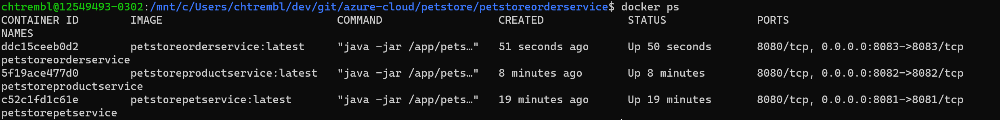
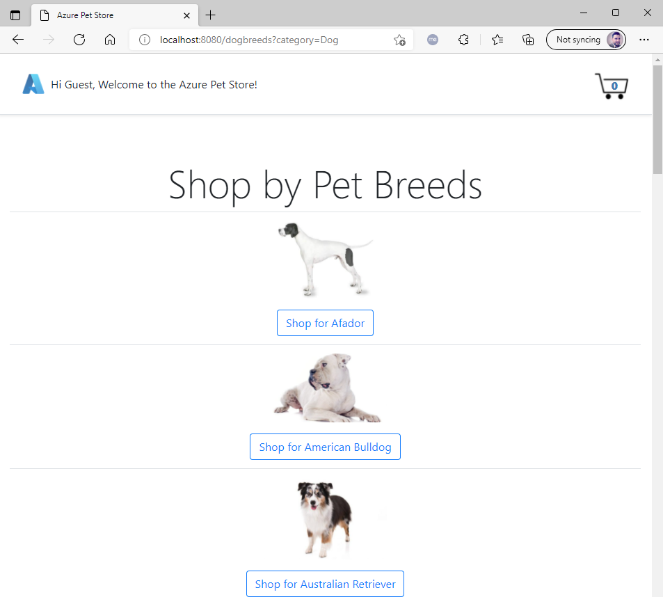
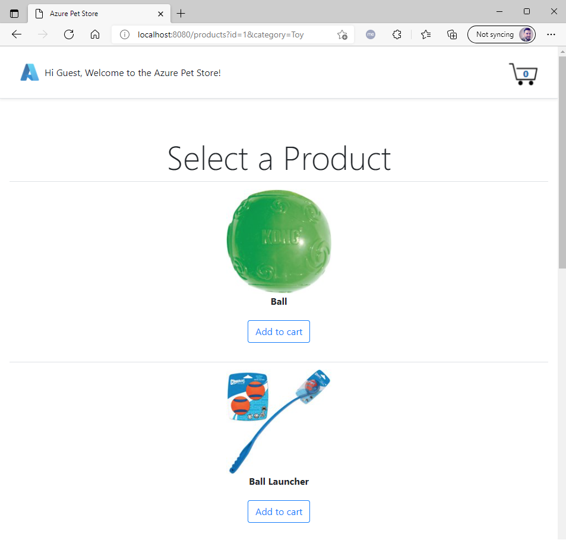
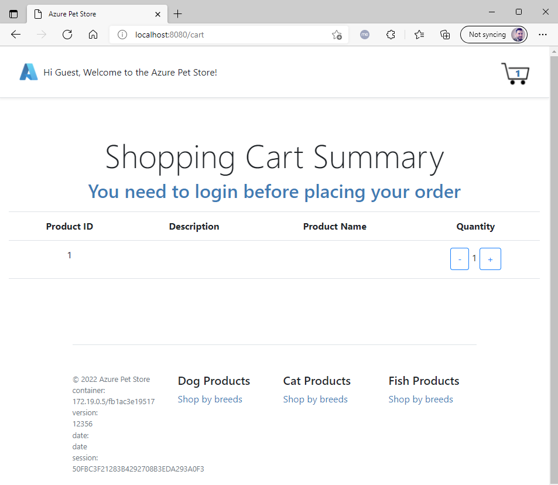

# 01 - Build the Docker Images

**This guide is part of the [Azure Pet Store App Dev Reference Guide](../README.md)**

> 📝 Please note, this guide is optional and is useful for local building and deploying outside of Azure (At this point there are no dependencies on Azure, throughout the guides we will leverage various Azure services to facilitate DevOps, elements of container orchestration, telemetry etc...), you can certainly skip ahead and leverage Azure DevOps Pipelines and GitHub Actions to do the build & deploys for you and you can safely jump head to [03-configure-app-service-for-cd](../03-configure-app-service-for-cd/README.md) otherwise please continue to the next guide.

In this section, we'll build the Docker Images and run them locally

## Prerequisites (Local development only if you wish to build the Docker images locally)

This guide assumes you have Docker installed on your machine. Until we setup your Azure Pipeline & GitHub Action, we can use Docker, locally, to build and test PetStoreApp, PetStorePetService, PetStoreProductService & PetStoreOrderService Docker Images. With local development, we can also do other things like Administer our Azure Kubernetes Cluster.

- Install Docker Desktop from the following https://docs.docker.com/get-docker and ensure you can run Docker from your command line.

> 📝 Please Note, We will assume you have forked the azure-cloud repository, it is the easiest way to get going (for instructions on this view the "**Forking the azure-cloud**" section in [00-setup-your-environment](../00-setup-your-environment/README.md). Also, both PetStoreApp and PetStoreService use a Spring Boot Application properties file named application.yml to drive the functionality/configuration of these applications which is located in src/main/resources/application.yml of both projects. By default, this file has all of the properties that are needed throughout the guides, and by default are commented out. This means that the applications will start automatically without having to configure anything. As you progress through the guides, each guide will inform you of what properties to uncomment and configure within your environment. If you have not already done so, login to your GitHub account, head to https://github.com/chtrembl/azure-cloud, and fork.

---

**1. Build and Run the Pet Store Pet Service Docker Image**

cd to azure-cloud/petstore/petstorepetservice

Fist lets setup a local bridge network so our Docker containers (PetStoreApp, PetStorePetService, PetStoreProductService & PetStoreOrderService can all communicate)

run the following command:

`docker network create petstorebridge`

Now lets have Docker build our PetStorePetService Docker Image. (This is a multi stage Docker build, it will compile the PetStorePetService code and build our Docker Image containing this Spring Boot jar and all of the dependencies.)

run the following command:

> 📝 Please Note, Docker will use the root directory (indicated by '.') and execute the Dockerfile commands to build a Docker Image tagged petstorepetservice:latest

`docker build -t petstorepetservice .`

🎉Congratulations, you should now have a Docker Image.

run the following command

`docker image ls`

You should see your latest petstorepetservice:latest image

Lets now test our Pet Store Application

run the following command:

> 📝 Please Note, This will instruct Docker to start a running container with the following petstorepetservice:latest image, forwarding port 8081 to the Spring Boot App running on 8081. The PETSTOREPETSERVICE_SERVER_PORT is one of several environment variables that we will introduce over the course of these guides.

`docker run --rm --net petstorebridge --name petstorepetservice -p 8081:8081 -e PETSTOREPETSERVICE_SERVER_PORT=8081 -d petstorepetservice:latest`

Open a browser and head to `http://localhost:8081`

You should see something similar to the below image:

run the following command:

`docker ps `

You should see something similar to the below image, which shows one process/container running (petstorepetservice:latest) and the image command used to start the application.

**2. Build and Run the Pet Store Product Service Docker Image**

cd to azure-cloud/petstore/petstoreproductservice

Now lets have Docker build our PetStoreProductService Docker Image. (This is a multi stage Docker build, it will compile the PetStoreProductService code and build our Docker Image containing this Spring Boot jar and all of the dependencies.)

run the following command:

> 📝 Please Note, Docker will use the root directory (indicated by '.') and execute the Dockerfile commands to build a Docker Image tagged petstoreproductservice:latest

`docker build -t petstoreproductservice .`

Congratulations, you should now have a Docker Image.

run the following command

`docker image ls`

You should see your latest petstoreproductservice:latest image

Lets now test our Pet Store Application

run the following command

> 📝 Please Note, This will instruct Docker to start a running container with the following petstoreproductservice:latest image, forwarding port 8082 to the Spring Boot App running on 8082. The PETSTOREPRODUCTSERVICE_SERVER_PORT is one of several environment variables that we will introduce over the course of these guides.

`docker run --rm --net petstorebridge --name petstoreproductservice -p 8082:8082 -e PETSTOREPRODUCTSERVICE_SERVER_PORT=8082 -d petstoreproductservice:latest`

Open a browser and head to `http://localhost:8082`

You should see something similar to the below image:

run the following command:

`docker ps `

You should see something similar to the below image, which now shows two processes/containers running (petstorepetservice:latest & petstoreproductservice:latest) and the image commands used to start the applications.

**3. Build and Run the Pet Store Order Service Docker Image**

cd to azure-cloud/petstore/petstoreorderservice

Now lets have Docker build our PetStoreOrderService Docker Image. (This is a multi stage Docker build, it will compile the PetStoreOrderService code and build our Docker Image containing this Spring Boot jar and all of the dependencies.)

run the following command:

> 📝 Please Note, Docker will use the root directory (indicated by '.') and execute the Dockerfile commands to build a Docker Image tagged petstoreorderservice:latest

`docker build -t petstoreorderservice .`

Congratulations, you should now have a Docker Image.

run the following command

`docker image ls`

You should see your latest petstoreorderservice:latest image

Lets now test our Pet Store Application

run the following command

> 📝 Please Note, This will instruct Docker to start a running container with the following petstoreorderservice:latest image, forwarding port 8083 to the Spring Boot App running on 8083. The PETSTOREORDERSERVICE_SERVER_PORT is one of several environment variables that we will introduce over the course of these guides.

`docker run --rm --net petstorebridge --name petstoreorderservice -p 8083:8083 -e PETSTOREORDERSERVICE_SERVER_PORT=8083 -d petstoreorderservice:latest`

Open a browser and head to `http://localhost:8083`

You should see something similar to the below image:

run the following command:

`docker ps `

You should see something similar to the below image, which now shows three processes/containers running (petstorepetservice:latest & petstoreproductservice:latest & petstoreorderservice:latest) and the image commands used to start the applications.

**4. Build and Run the Pet Store App Docker Image**

cd to azure-cloud/petstore/petstoreapp

Now lets have Docker build our PetStoreApp Docker Image. (This is a multi stage Docker build, it will compile the PetStoreApp code and build our Docker Image containing this Spring Boot jar and all of the dependencies.)

run the following command:

> 📝 Please Note, Docker will use the root directory (indicated by '.') and execute the Dockerfile commands to build a Docker Image tagged petstoreapp:latest

`docker build -t petstoreapp .`

Congratulations, you should now have a Docker Image.

run the following command:

`docker image ls`

You should see your latest petstoreapp:latest image

Lets get the IP Addresses of the running Pet Store Services, we will need to pass them to the PetStoreApp to ensure communication can be made at runtime.

run the following command 3 times (substituting the <container_name_or_id> for petstorepetservice:latest & petstoreproductservice:latest & petstoreorderservice:latest that appeared in the latest docker ps command above) and capture the ip address that is displayed for each, for example 172.18.0.2 is the ip address for the petstorepetservice on my machine.

`docker inspect -f '{{range.NetworkSettings.Networks}}{{.IPAddress}}{{end}}' <container_name_or_id>`

You should see something similar to the below image (remember you will want to run the command 3 times to get the ip address for all 3 pet store services)

Lets now test our Pet Store Application (You will be using the 3 ip addresses from above)

> 📝 Please Note, This will instruct Docker to start a running container with the following petstoreapp:latest image, forwarding port 8080 to the Spring Boot App running on 8080 (default Spring Boot Port). The PETSTOREAPP_SERVER_PORT is one of several environment variables that we will introduce over the course of these guides.

> 📝 Please Note, you will be substituting ip addresses for all 3 services

run the following command

`docker run --rm --net petstorebridge --name petstoreapp -p 8080:8080 -e PETSTOREAPP_SERVER_PORT=8080 -e PETSTOREPETSERVICE_URL=http://172.18.0.2:8081 -e PETSTOREPRODUCTSERVICE_URL=http://172.18.0.3:8082 -e PETSTOREORDERSERVICE_URL=http://172.18.0.4:8083 -d petstoreapp:latest`

Open a browser and head to http://localhost:8080

You should see something similar to the below image:

Now test that the PetStoreApp can communicate with the PetStorePetService and PetStoreProductService by selecting Breeds and Products. (Don't worry about the PetStoreOrderService just yet, we haven't configured the PetStoreOrderService to communicate with the PetStoreProductService therefore it cannot function properly and hence the Shopping Cart functionality will not yet work, we will address this when we deploy to Azure.)

You should see something similar to the below image:

You should see something similar to the below image:

You should see something similar to the below image:

run the following command:

`docker ps `

You should see something similar to the below image, which now shows four processes/containers running (petstoreapp:latest & petstorepetservice:latest & petstoreproductservice:latest & petstoreorderservice:latest) and the image commands used to start the applications.

To kill all running containers with Docker run the following command:

`docker kill $(docker ps -q)`

🎉Congratulations, you have successfully integrated your Pet Store Application with the Pet Store Service(s) and have made service calls to retrieve service data (Pets & Products).

> 📝 Please Note, all Pet Store Service Data is currently persisted In Memory, no databases are used at the this time.

Things you can now do now with this guide

☑️ Building and Testing Docker Images locally

---

➡️ Next guide: [02 - Push the Docker Images to Azure Container Registry](../02-push-the-docker-images-to-acr/README.md)
