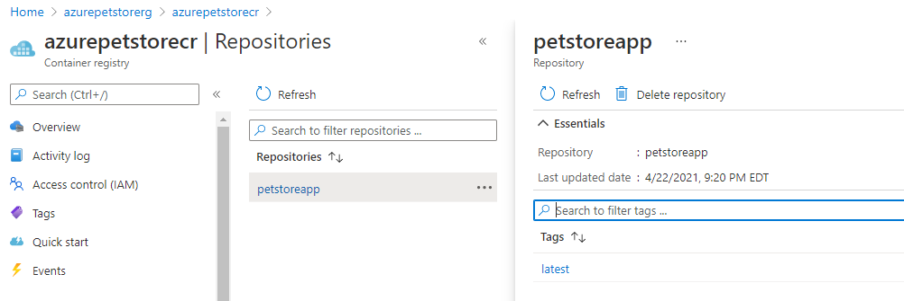

# 02 - Push the Docker Images to Azure Container Registy (For local development only using Docker in Linux containers mode and Azure CLI)

__This guide is part of the [Azure Pet Store App Dev Reference Guide](../README.md)__

In this section, we'll push the Docker Images to Azure Container Registy

## Prerequisites (Local development only if you wish to deploy the Docker images from your local machine into Azure Container Reguistry)

Thus guide assumes you have Docker installed on your machine and the Azure CLI. Until we setup your Azure Pipeline & GitHub Action, we can use Docker and Azure CLI, locally, to build and push both the PetStoreApp and PetStoreService Docker Images into Azure Container Registry. We will also do other things like Administer our Azure Kubernetes Cluster.
  
 - Install Docker Desktop from the following https://docs.docker.com/get-docker and ensure you can run Docker from your command line.
 
 - Install Azure CLI from the following https://docs.microsoft.com/en-us/cli/azure/install-azure-cli-windows?tabs=azure-cli and ensure you can run AZ from your command line.

---

> 📝 Please Note, Since the Docker Images were built in the previous guide, we can run from any path on the terminal. But if you prefer, or if you plan to build more images, cd to azure-cloud/petstore/petstoreapp azure-cloud/petstore/petstoreservice accordingly  

> 📝 Please Note, We will assume you have forked the azure-cloud repository, it is the easiest way to get going (for instructions on this view the "**Forking the azure-cloud**" section in [00-setup-your-environment](../00-setup-your-environment/README.md). Also, both PetStoreApp and PetStoreService use a Spring Boot Application properties file named application.yml to drive the functionality/configuration of these applications which is located in src/main/resources/application.yml of both projects. By default, this file has all of the properties that are needed throughout the guides, and by default are commented out. This means that the applications will start automatically without having to configure anything. As you progress through the guides, each guide will inform you of what properties to uncomment and configure within your environment. If you have not already done so, login to your GitHub account, head to https://github.com/chtrembl/azure-cloud, and fork.

--- 

**1. Push the Pet Store App Docker Image to Azure Container Registry**

run the following commands:

```az login``` 

```az account list --output table```

> 📝 Please Note, use your subscription for "your subscription" and your container registry value for "youraliaspetstorecr" from the first guide 00-setup-your-environment

```az account set --subscription <your subscription>```

```az acr login --name <youraliaspetstorecr>```

> 📝 Please Note, the following is what enables us to get Web Hook control for our App Service Continuous Integration

```az acr update -n <youraliaspetstorecr> -g <yourresourcegroup> --admin-enabled true```

> 📝 Please Note, tag your local Docker image built in the previous guide so that we can push it to Azure Container Registry then push it

```docker image tag petstoreapp:latest <youraliaspetstorecr>.azurecr.io/petstoreapp:latest```

```docker push <youraliaspetstorecr>.azurecr.io/petstoreapp:latest```

You should see something similar to the below image:


If you head to Azure Portal and view your Container Registry Resource "youraliaspetstorecr" you should see something similar to the below image:



**1. Push the Pet Store Service Docker Image to Azure Container Registry**

> 📝 Please Note, Since the Docker Images were built in the previous guide, we can run from any path on the terminal. But if you prefer, or if you plan to build more images, cd to azure-cloud/petstore/petstoreservice

You are still logged in from before...

run the following commands:

> 📝 Please Note, tag your local Docker image built in the previous guide so that we can push it to Azure Container Registry then push it

```docker image tag <petstoreservice>:latest <youraliaspetstorecr>.azurecr.io/petstoreservice:latest```

```docker push <youraliaspetstorecr>.azurecr.io/petstoreservice:latest```

Things you can now do now with this guide

☑️ Administration of Azure Container Registry, pushing of Docker Images

---
➡️ Next guide: [03 - Configure App Service for continuous deployment](../03-configure-app-service-for-cd/README.md)
