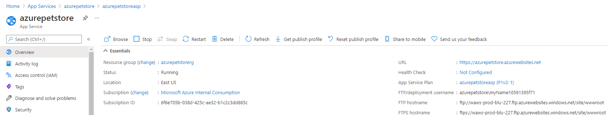
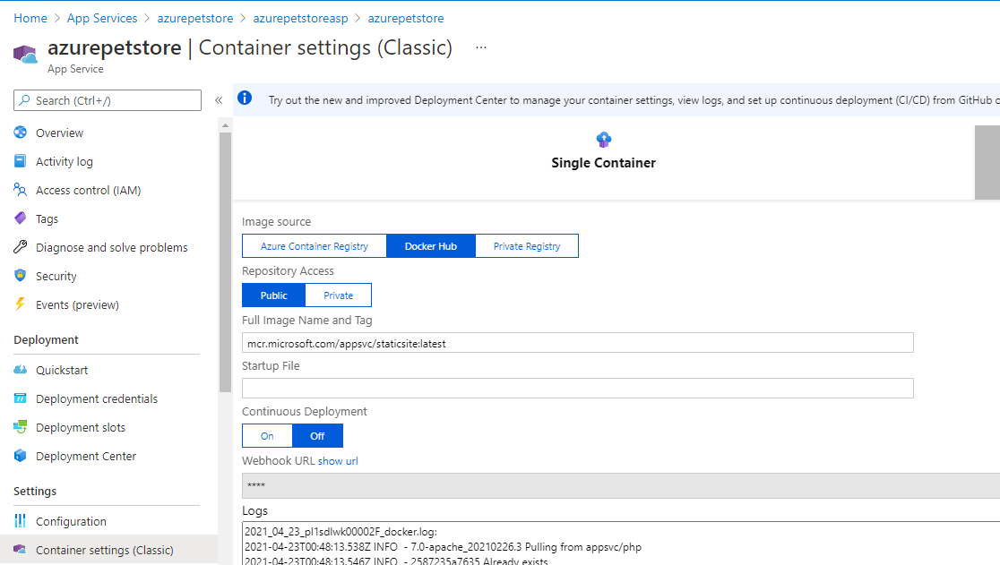
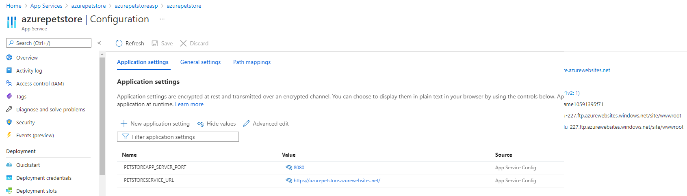
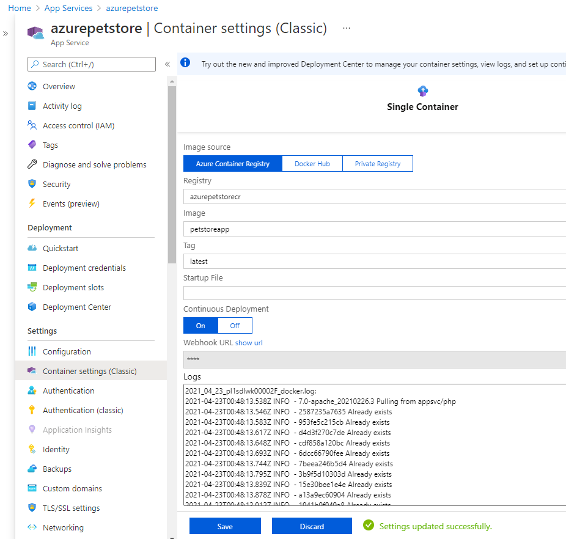
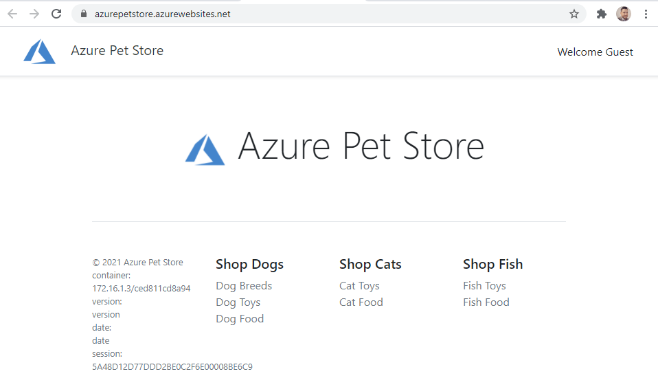

# 03 -Configure App Service for continuous deployment

__This guide is part of the [Azure Pet Store App Dev Reference Guide](../README.md)__

In this section, we'll Configure App Service for continuous deployments of Azure Container Registry Docker image updates

We are going to use Web Hooks to deploy the latest Azure Container Registry Docker image for Pet Store App.

> 💡 Pet Store Service will get deployed to Azure Kubernetes Service, we will tackle that in a subsequent guide.

Head to Azure Portal > App Services and find your App Service that was created in 00-setup-your-environment.

You should see something similar to the below image:

> 💡 Note, the URL listed is how we will be accessing our Pet Store App. If you visit that URL in a browser, you should see a generic App Service Page, deployed from a generic Azure Docker image. Keep this URL handy.

Select Configuration and add two Application Settings, be sure to click Save.

 1. PETSTOREAPP_SERVER_PORT=8080
 2. PETSTORESERVICE_URL=THE_URL_FROM_THE_SCREENSHOT_ABOVE 

You should see something similar to the below image:

> 💡 Note, the port is needed to tell App Service where to find our Spring Boot Pet Store App (remember it is running on port 8080). The URL will be the Pet Store Service URL where our Pet Store App will retrieve data from. We have not yet deployed that Pet Store Service to Azure Kubernetes Service, so we can put anything in here for now. We wont be using it just yet so this is really just a placeholder so the Pet Store App starts up without issues.

Select Container Settings (Classic)

You should see something similar to the below image:

> 💡 Note, this is the default configuration, we are going to change this up. Change Image Source to Azure Container Registry, Find your Pet Store Image Name and Tag and Select On for Continous Deployment. Make sure to click Save.

You should see something similar to the below image:

> 💡 Note, you will notice the logs within this view as well, notice the Docker commands being executes just as they were when you did this locally. It's the same behavior. Docker pulls the latest image and then runs it injecting the configuration settings that are specified.

Open a browser and head to your URL from above

You should see something similar to the below image:

Congratulations, you now have Pet Store App Continuously Deploying into your App Service each and evey time an image is pushed to Azure Container Registry.

---
➡️ Next guide: [04 - something](../04/README.md)