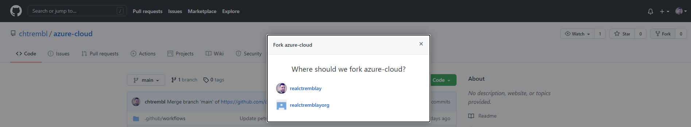
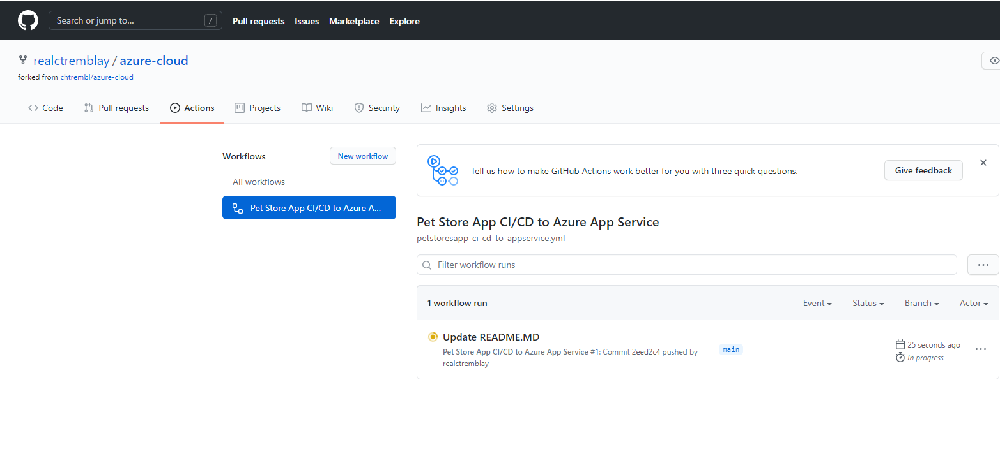
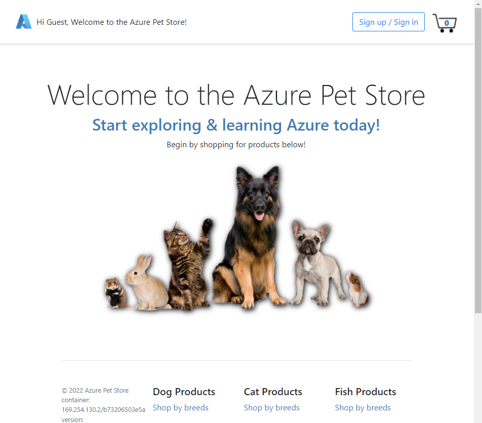
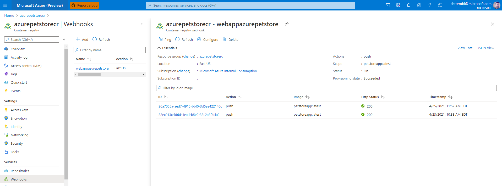

# 04 - Configure Git Hub Action for CI/CD into App Service

**This guide is part of the [Azure Pet Store App Dev Reference Guide](../README.md)**

In this section, we'll configure Git Hub Action for Pet Store App CI/CD into App Service

Head to Azure Portal and find your Container Registry (as seen below, that was provisioned in the first guide 00-setup-your-environment) and copy your Login Server, Username and Password off somewhere (you will need them)

You should see something similar to the below image:

> 📝 Please Note, you will have to enable Admin user


Head to GitHub. By now you should have already cloned or forked https://github.com/chtrembl/azure-cloud and are working in the same repository structure within your GitHub account

> 📝 Please Note, We will assume you have forked the azure-cloud repository, it is the easiest way to get going (for instructions on this view the "**Forking the azure-cloud**" section in [00-setup-your-environment](../00-setup-your-environment/README.md). Also, both PetStoreApp and PetStoreService use a Spring Boot Application properties file named application.yml to drive the functionality/configuration of these applications which is located in src/main/resources/application.yml of both projects. By default, this file has all of the properties that are needed throughout the guides, and by default are commented out. This means that the applications will start automatically without having to configure anything. As you progress through the guides, each guide will inform you of what properties to uncomment and configure within your environment. If you have not already done so, login to your GitHub account, head to https://github.com/chtrembl/azure-cloud, and fork.

You should see something similar to the below image:



Head to Settings > Secrets, Add a secret to store the Azure Container Registry Secret from above. Create a PETSTORECRSECRET, and paste in password from above.

You should see something similar to the below image:


Head to Actions, and select "I Agree" to enable Actions...

You should see something similar to the below image:


Head to azure-cloud/blob/main/.github/workflows/petstoresapp_ci_cd_to_appservice.yml and update the following properties to reflect your Container Registry and your Username from above:

`AZURE_CONTAINER_REGISTRY`

`AZURE_CONTAINER_REGISTRY_USERNAME`

Commit your changes

> 📝 Please Note, azure-cloud/blob/main/.github/workflows/petstoresapp_ci_cd_to_appservice.yml action is configured to execute on any changes to the perstoreapp folder

```
on:
  push:
    branches:
      - main
    paths:
      - petstore/petstoreapp/**
```

Let's first take a look at azure-cloud/blob/main/.github/workflows/petstoresapp_ci_cd_to_appservice.yml to understand what is going on.

There are several Git Hub Tasks. The goal is to build the Spring Boot Java Pet Store Application Docker Image, Push it into Azure Container Registry and have an Azure App Service Web Hook to notify/deploy.

```
name: Pet Store App CI/CD to Azure App Service

env:
  AZURE_CONTAINER_REGISTRY: azurepetstorecr.azurecr.io
  AZURE_CONTAINER_REGISTRY_USERNAME: azurepetstorecr

on:
  push:
    branches:
      - main
    paths:
      - petstore/petstoreapp/**

jobs:
  build:
    runs-on: ubuntu-latest
    steps:
    - uses: actions/checkout@v2
    - name: Checking the file system listing for Pet Store App
      run: |
        ls -al
    - name: Update the version.json
      run: echo -n -e "{\"version\":\"${{ github.sha }}\",\"date\":\"$(date '+%m-%d-%Y %H:%M:%S')\"}" > petstore/petstoreapp/src/main/resources/static/content/version.json
    - run: cat petstore/petstoreapp/src/main/resources/static/content/version.json
    - uses: actions/setup-java@v2
      name: Building Pet Store App with Java 13
      with:
        java-version: '13'
        distribution: 'adopt'
    - name: Run Maven build
      run: mvn -f petstore/petstoreapp/pom.xml --batch-mode --update-snapshots verify
    - name: Upload Maven build artifact
      uses: actions/upload-artifact@v1
      with:
        name: artifact
        path: petstore/petstoreapp/target/petstoreapp-0.0.1-SNAPSHOT.jar
    - uses: azure/docker-login@v1
      name: Build Docker image
      with:
        login-server: ${{ env.AZURE_CONTAINER_REGISTRY }}
        username: ${{ env.AZURE_CONTAINER_REGISTRY_USERNAME }}
        password: ${{ secrets.PETSTORECRSECRET }}
    - name: Push Docker image to Azure Container Registry
      run: |
        docker build petstore/petstoreapp -t ${{env.AZURE_CONTAINER_REGISTRY}}/petstoreapp:latest -t ${{ env.AZURE_CONTAINER_REGISTRY }}/petstoreapp:${{ github.sha }}
        docker push ${{ env.AZURE_CONTAINER_REGISTRY }}/petstoreapp:${{ github.sha }}
        docker push  ${{ env.AZURE_CONTAINER_REGISTRY }}/petstoreapp:latest
```

This workflow action does both CI & CD. Below are the details:

- On any Change to petstoreapp/\*\* main branch, the Action will execute
- The code is then checked out into a project workspace using actions/checkout@v2
- A version.json is created each time containing meta data about the build (Date/Version) and will be built as part of the Docker Image as static content. This is useful for obtaining version info at application runtime.
- actions/setup-java@v2 is used to compile our Spring Boot Java Application using Maven. Since we are not configuring Docker for a Multi Stage build, we first build the petstoreapp.jar executable, in advance of our Docker Image.
- actions/upload-artifact@v1 is used to store the petstoreapp.jar artifact, we do not need this for anything, however its more for academic purposes to show that we can persist build artifacts. (Ultimately we persist Docker Images in ACR)
- azure/docker-login@v1 is used to authenticate/build/push into Azure Container Registry.
- The latest Docker image for PetStoreApp gets tagged with the GitHub Hash (seen in version.json) as well as latest. CD in App Service is configured to always web hook to the latest tag.

Head to your azure-cloud/petstore/petstoreapp folder and edit your README.MD file and commit, this will trigger the azure-cloud/blob/main/.github/workflows/petstoresapp_ci_cd_to_appservice.yml

You should see something similar to the below image:


Head to Actions again and your action should bow be building/deploying

You should see something similar to the below image:



Once successful you will see something like


> 📝 Please Note, verify your Azure App Service Container Settings are set for Continuous Deployments of the Images being built in this guide, you may have skipped this step in the previous guide 03-configure-app-service-for-cd

If successful you can head to a browser and visit your FQDN Azure App Service URL as seen below (this is the URL from the previous guide 03-configure-app-service-for-cd)



🎉Congratulations, you now have Pet Store App Continuously Deploying into your App Service each and every time an image is pushed to Azure Container Registry from your Git Hub Action. Notice the Date/Version within your App Service HTML Footer (seen in browser) matches the Git Hub Action Build Meta Data.

> 📝 Please Note, Enable application logging (Linux/Container) so that logs start aggregating for you. To enable application logging for Linux apps or custom container apps in the Azure portal, navigate to your app and select App Service logs. In Application logging, select File System. In Quota (MB), specify the disk quota for the application logs. In Retention Period (Days), set the number of days the logs should be retained. When finished, select Save. This will come in handy when you start experimenting with Application Insights.

Things you can now do now with this guide

☑️ GitHub Action to CI/CD into App Service, showcasing the details behind building/deploying and the associated meta data reflecting within the running application

☑️ Build Meta Data appears within your running application which matches the container configuration reflected in your App Service

> 📝 Please Note, if you're interested in viewing the web hook that got created, **automagically**, when Container Configuration was updated to sync with Azure Container Registry, you can view these under the Azure Container Registry as seen below.



---

➡️ Next guide: [05 - Create an Azure Kubernertes Cluster](../05-create-an-azure-k8s-cluster/README.md)
