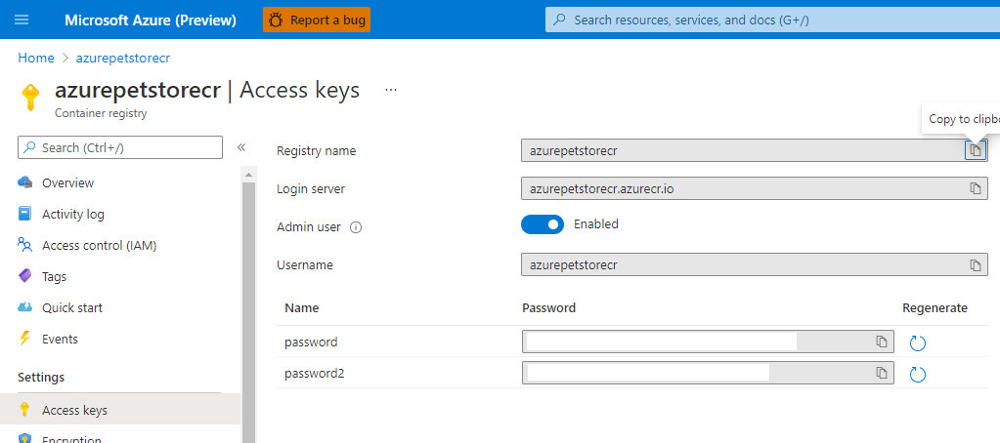
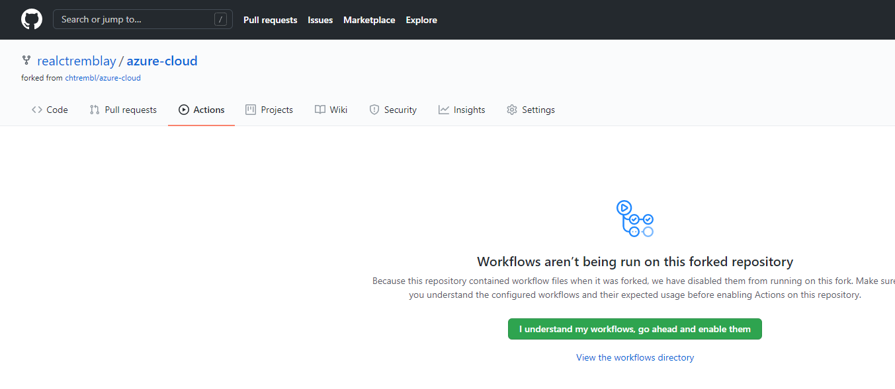
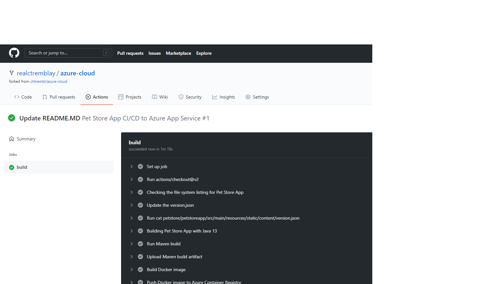
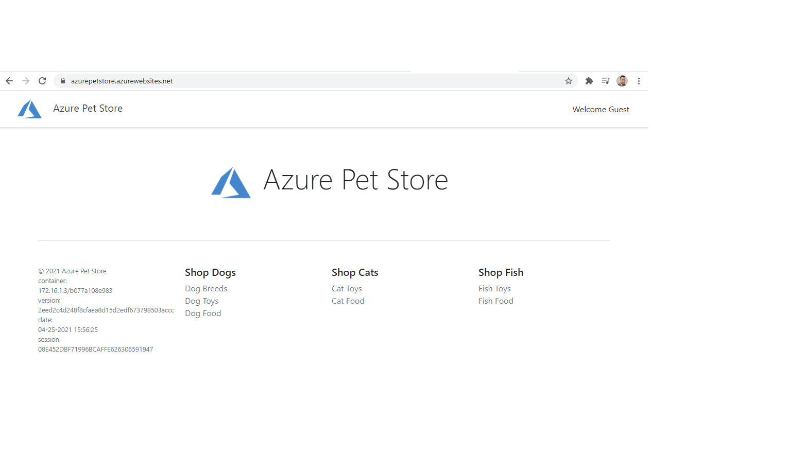

# 04 - Configure Git Hub Action for CI/CD into App Service

__This guide is part of the [Azure Pet Store App Dev Reference Guide](../README.md)__

In this section, we'll Configure Git Hub Action for CI/CD into App Service

Head to Azure Portal and find your Container Registry (as seen below) and copy your Login Server, Username and Password off somewhere (you will need them)

You should see something similar to the below image:



Head to GitHub. By now you should have already cloned or forked https://github.com/chtrembl/azure-cloud and are working in the same repository structure within your GitHub account

> 📝 Please Note, We will assume you have forked the azure-cloud repository, it is the easiest way to get going

Login to your GitHub account, head to https://github.com/chtrembl/azure-cloud, select Fork, select your GitHub account.

You should see something similar to the below image:


Head to Settings > Secrets, Add a secret to store the Azure Container Registry Secret from above. Create a PETSTORESECRET, and paste in password 1 from above.

You should see something similar to the below image:


Head to Actions, and select "I Agree" to enable Actions...

You should see something similar to the below image:



Head to azure-cloud/blob/main/.github/workflows/petstoresapp_ci_cd_to_appservice.yml and update the following properties to refect your Container Registry and your Username from above:

```AZURE_CONTAINER_REGISTRY```

```AZURE_CONTAINER_REGISTRY_USERNAME```

Commit your changes

> 📝 Please Note, azure-cloud/blob/main/.github/workflows/petstoresapp_ci_cd_to_appservice.yml action is configured to execute on any changes to the perstoreapp folder 

```
on:
  push:
    branches:
      - main
    paths:
      - petstore/petstoreapp/**
```

Head to your azure-cloud/petstore/petstoreapp folder and edit your README.MD file and commit, this will trigger the azure-cloud/blob/main/.github/workflows/petstoresapp_ci_cd_to_appservice.yml 

You should see something similar to the below image:


Head to Actions again and your action should bow be building/deploying

You should see something similar to the below image:


Once successfull you will see somehting like 



If successfull, you can head to a browser and visit your FQDN Azure App Service URL as seen below (this is the URL from the previous guide 03-configure-app-service-for-cd)



🎉Congratulations, you now have Pet Store App Continuously Deploying into your App Service each and evey time an image is pushed to Azure Container Registry from your Git Hub Action.


---
➡️ Next guide: [05 - Create an Azure Kubernertes Cluster](../05-create-an-azure-k8s-cluster/README.md)