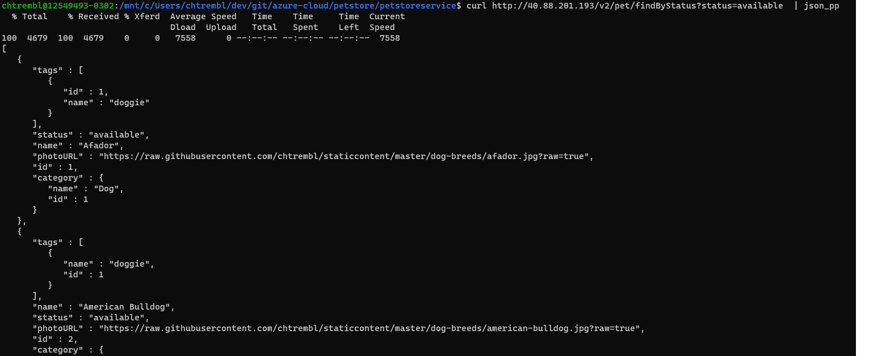
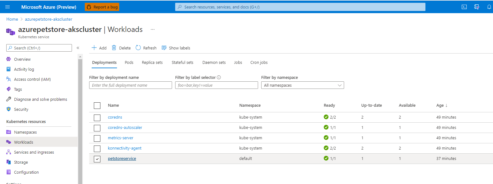
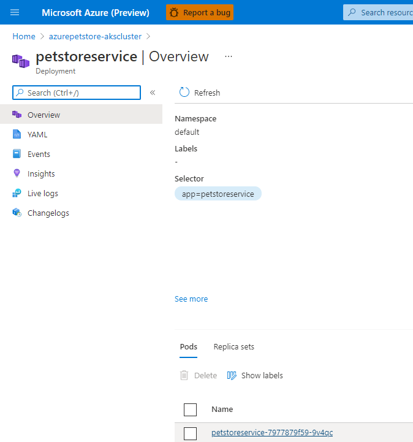
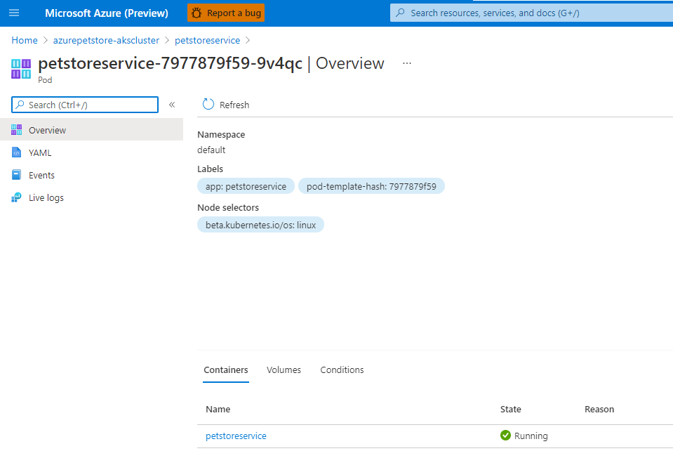
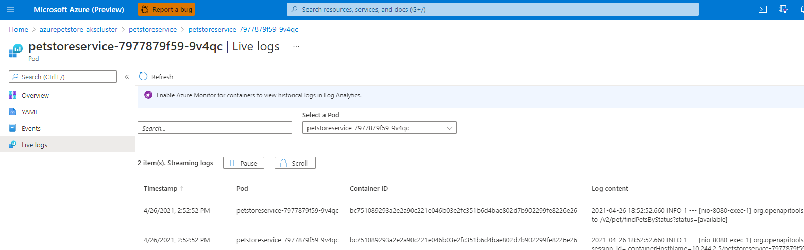

# 05 - Create an Azure Kubernetes Cluster

__This guide is part of the [Azure Pet Store App Dev Reference Guide](../README.md)__

Lets get an AKS Cluster provisioned in the same Resource Group as your other services (that you provisioned in 00-setup-your-envrionment)

> 📝 Please Note, You can use AZ CLI or Azure Portal to do this. If you didn't complete the first two guides, 01-build-the-docker-images and 02-push-the-docker-images-to-acr and/or do not have a local environment for building Java applications and pushing Docker Images, you will want to provision an AKS Cluster via Azure Portal and let Azure DevOps Piplelines handle the CI/CD for you (next guide). Complete the first step within Azure Portal below (Provision AKS via Azure Portal) and then move on to the next guide. Otherwise, skip the Azure Portal AKS provisioning and follow along to build/deploy/provision locally (Provision AKS via Azure CLI).

> 📝 Please Note, We will assume you have forked the azure-cloud repository, it is the easiest way to get going (for instructions on this view the "**Forking the azure-cloud**" section in [00-setup-your-environment](../00-setup-your-environment/README.md). Also, both PetStoreApp and PetStoreService use a Spring Boot Application properties file named application.yml to drive the functionality/configuration of these applications which is located in src/main/resources/application.yml of both projects. By default, this file has all of the properties that are needed throughout the guides, and by default are commented out. This means that the applications will start automatically without having to configure anything. As you progress through the guides, each guide will inform you of what properties to uncomment and configure within your environment. If you have not already done so, login to your GitHub account, head to https://github.com/chtrembl/azure-cloud, and fork.

## Provision AKS via Azure Portal

Go through the "Create an AKS CLuster" steps here https://docs.microsoft.com/en-us/azure/aks/kubernetes-walkthrough-portal and make note of your Kubernetes Cluster Name. I reccomend using "azurepetstore-akscluster" which will make updating the deployment manifests in the next guide that much easier for you. The rest of the default settings are fine, you can take the latest version of Kubernetes. Once you have that cluster available (without an application deployed) Head over to the Next guide: [06 - Configure Azure DevOps Pipeline for CI/CD into Azure Kubernetes Service](../06-configure-ado-pipeline-for-ci-cd-into-aks/README.md) to get an Azure DevOps Pipeline deploying workloads for you.

## Provision AKS via Azure CLI

> 📝 Please Note, We will be using the [Azure CLI](https://docs.microsoft.com/en-US/cli/azure/install-azure-cli?view=azure-cli-latest) here to complete all of the necessary steps. The CLI is handy and often used for scripting tasks. Also make sure you completed 1. Push the Pet Store Service Docker Image to Azure Container Registry from  [02 - Push the Docker Images to Azure Container Registy (Local Development Only)](../02-push-the-docker-images-to-acr/README.md)

1. Login to your Azure account

	```az login```

2. Choose your Azure subscription (enter your subscription id here, subscriptions are listed after logging in above)

	```az account set -s <YourSubscriptionIDThatYouHaveBeenUsing>```

3. You should already have a Resource Group that you have been using for all of the previous guides. If so, skip this step. If not, create a resource group to group for your AKS Cluster.
	
	```az group create --name=<yourresourcegroup> --location=eastus```

4. You should arleady have an Azure Container Registry that you have been using for all of the previous guides. If so, skip this step. If not, create an Azure Container Registry (ACR) to hold our Docker images
	  
	```az acr create --resource-group <yourresourcegroup> --location eastus	--name azurepetstorecr --sku Basic```

5. Set the Azure Container Registry to use

	```az configure --defaults acr=<yourazurecontainerregistry>```
  
6. Login to the Azure Container Registry

	```az acr login -n <yourazurecontainerregistry>```
 
7. (Optionally) Build a Pet Store Service Docker Image and push to the Azure Container Registry. This will allow us to test our Pet Store Service running in AKS before we setup CI/CD with Azure DevOps Pipelines. If you didnt complete guides 01-build-the-docker-images and 02-push-the-docker-images-to-acr and/or you do not have a local environment for building Java applications and Pushing Docker images, no worries, you can skip this step.

  
8. Create a Kubernetes cluster in an Azure Kubernetes Service (AKS)

	 ``` az aks create --resource-group=<yourresourcegroup> --name=azurepetstore-akscluster --attach-acr <yourazurecontainerregistry> --dns-name-prefix=<youralias>azurepetstoreserviceaks --generate-ssh-keys```

	 This will take some time to complete, 5-10 minutes or so...

9. Install ```kubectl``` using the Azure CLI. Linux users may have to prefix this command with `sudo` since it deploys the Kubernetes CLI to `/usr/local/bin`
 
	```az aks install-cli```
  
10. Download the cluster configuration information so you can manage your cluster from the Kubernetes web interface and `kubectl`
  
	```az aks get-credentials --resource-group=<yourresourcegroup> --name=azurepetstore-akscluster```
 
11. Using VI or VSC etc... create a deployment.yaml in your petstoreservice/ root with the following contents and save... (or use the existing one) This deployment yml is pretty simplified. There is a Deployment to configure Kubernetes with 1 replica of the petstoreservice Docker Image that we built above (Ultimately our running Docker image is a Kubernetes Container) We have configured container resources as well, and we know our Spring Boot petstoreservice will listen to HTTP requests on 8080. We will want to access these containers externally, so we also configure a Kubernetes Service (LoadBalancer) to expose our container. Instead of exposing it on port 8080, we will target port 80. 

> 📝 Please Note, Make sure to reference your container registry instead of mine image: <yourcontainerregistry>.azurecr.io/petstoreservice:latest

	```vi deployment.yml```

	```
	apiVersion: apps/v1
	kind: Deployment
	metadata:
	  name: petstoreservice
	spec:
	  replicas: 1
	  selector:
	    matchLabels:
	      app: petstoreservice
	  template:
	    metadata:
	      labels:
		app: petstoreservice
	    spec:
	      nodeSelector:
		"beta.kubernetes.io/os": linux
	      containers:
	      - name: petstoreservice
		image: azurepetstorecr.azurecr.io/petstoreservice:latest
		resources:
		  requests:
		    cpu: 100m
		    memory: 128Mi
		  limits:
		    cpu: 250m
		    memory: 256Mi
		ports:
		- containerPort: 8080
		env:
		- name: PETSTORESERVICE_SERVER_PORT
		  value: 8080
	---
	apiVersion: v1
	kind: Service
	metadata:
	  name: petstoreservice
	spec:
	  type: LoadBalancer
	  ports:
	  - port: 80
	    targetPort: 8080
	  selector:
	    app: petstoreservice
	````

> 📝 Please Note, you'll notice above that we are injective two env variables to the container, similar to what we did with App Service Configuration. The Pet Store Service is coded to send Telementry to Application Insights, however since we havent yet gotten to that guide, we are disabling it by injecting an empty key.

12. Deploy your Kubernetes configuration to AKS (You can run this command any time you want to deploy updates to be re orchestrated by K8S/AKS)

	`kubectl apply -f deployment.yml`

	If successful you will be able to access the AKS cluster via the Service Load Balancer configured above. Since this is dynamic, run the following

	`kubectl get services -o jsonpath={.items[*].status.loadBalancer.ingress[0].ip} --namespace=default`
 
	This will output the Service Load Balancer IP address, 40.88.201.193 for example...

	Then access petstoreservice via the ipaddress (40.88.201.193 in my case)
  
	```
	curl http://40.88.201.193/v2/pet/findByStatus?status=available | json_pp
  	```
    	
	You should see something similar to the below image:

	

	> 📝 Please Note, If your not able to access your Service Load Balancer, something may have went wrong with the deployment. You can run the following command to get some insight, if you see something in STATUS other than RUNNING, you will need to investigate by getting the pod details and troubleshooting, seen below...*

    ```
    ~/dev/git/azure-cloud/petstore/petstoreservice$ kubectl get all
    NAME READY STATUS RESTARTS AGE
    pod/petstoreservice-77c556d945-btb65 0/1 ImagePullBackOff 0 14s

    ~/dev/git/azure-cloud/petstore/petstoreservice$ kubectl describe pod/petstoreservice-77c556d945-btb65
    

    Warning Failed 11s (x3 over 53s) kubelet, aks-nodepool1-56647556-vmss000001 Failed to pull image "petstoreservice:v1": rpc error: code = Unknown desc = Error response from daemon: pull access denied for petstoreservice, repository does not exist or may require 'docker login': denied: requested access to the resource is denied
    ```

> 📝 Please Note, In the above, ImagePullBackOff indicated that the image could not be pulled from the Azure Container registry, checking permissions and container image definition in deployment.yaml usually resolves... You can view all of these messages and details within the Azure Portal as well via logging as seen below.

13.  You can view the application logs from the Spring Boot running container via the Azure Portal. If you head to the Azure Portal > Kubernetes Services and select the petstore-akscluster, there will be an Insights link. Select the Containers tab followed by the running container "petstoreservice" from the table below (we only have 1). You can the select "View container logs" which will show standard out from the Spring Boot petstoreservice container.

Navigate to the petstoreservice Deployment within your AKS Cluster

You should see something similar to the below image:



Select the service link

You should see something similar to the below image:



Select Live Logs

You should see something similar to the below image:



View Live Logs

You should see something similar to the below image:




> 📝 Please Note, you can also use kubectl to tail your pod application logs

```
kubectl get all
kubectl logs --follow <pod names here>
```

Things you can now do now with this guide

☑️ Create a Kubernetes Cluster and Administer it

---
➡️ Next guide: [06 - Configure Azure DevOps Pipeline for CI/CD into Azure Kubernetes Service](../06-configure-ado-pipeline-for-ci-cd-into-aks/README.md)
