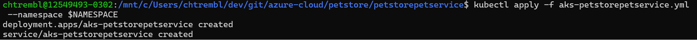
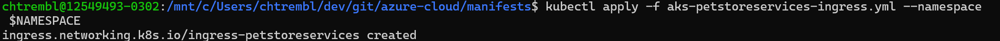

# 05 - Create an Azure Kubernetes Cluster and configure NGINX Ingress controller

**This guide is part of the [Azure Pet Store App Dev Reference Guide](../README.md)**

In this section, we'll get an AKS Cluster provisioned in the same Resource Group as your other services (that you provisioned in 00-setup-your-environment)

> 📝 Please Note, You can use AZ CLI or Azure Portal to do this. If you didn't complete the first two guides, 01-build-the-docker-images and 02-push-the-docker-images-to-acr and/or do not have a local environment for building Java applications and pushing Docker Images, you will want to provision an AKS Cluster via Azure Portal and let Azure DevOps Pipelines handle the CI/CD for you (next guide). Complete the first step within Azure Portal below (Provision AKS via Azure Portal) and then move on to the next guide. Otherwise, skip the Azure Portal AKS provisioning and follow along to build/deploy/provision locally (Provision AKS via Azure CLI).

> 📝 Please Note, We will assume you have forked the azure-cloud repository, it is the easiest way to get going (for instructions on this view the "**Forking the azure-cloud**" section in [00-setup-your-environment](../00-setup-your-environment/README.md). Also, both PetStoreApp and PetStoreService use a Spring Boot Application properties file named application.yml to drive the functionality/configuration of these applications which is located in src/main/resources/application.yml of both projects. By default, this file has all of the properties that are needed throughout the guides, and by default are commented out. This means that the applications will start automatically without having to configure anything. As you progress through the guides, each guide will inform you of what properties to uncomment and configure within your environment. If you have not already done so, login to your GitHub account, head to https://github.com/chtrembl/azure-cloud, and fork.

## Provision and Configure AKS via Azure CLI

> 📝 Please Note, We will be using the [Azure CLI](https://docs.microsoft.com/en-US/cli/azure/install-azure-cli?view=azure-cli-latest) here to complete all of the necessary steps. The CLI is handy and often used for scripting tasks. Also make sure you completed 1. Push the Pet Store Service Docker Image to Azure Container Registry from [02 - Push the Docker Images to Azure Container Registry (Local Development Only)](../02-push-the-docker-images-to-acr/README.md)

1. Login to your Azure account

    `az login`

2. Choose your Azure subscription (enter your subscription id here, subscriptions are listed after logging in above)

   `az account list --output table`

   `az account set -s <SubscriptionId from above>`

3. You should already have a Resource Group that you have been using for all of the previous guides. If so, skip this step. If not, create a resource group to group for your AKS Cluster.

   `az group create --name=<yourresourcegroup> --location=eastus`

4. You should already have an Azure Container Registry that you have been using for all of the previous guides. If so, skip this step. If not, create an Azure Container Registry (ACR) to hold our Docker images

   `az acr create --resource-group <yourresourcegroup> --location eastus --name azurepetstorecr --sku Basic`

5. Set the Azure Container Registry to use

   `az configure --defaults acr=<yourazurecontainerregistry>`

6. Login to the Azure Container Registry

   `az acr login -n <yourazurecontainerregistry>`

7. Create a Kubernetes cluster in an Azure Kubernetes Service (AKS)

   `az aks create --resource-group=<yourresourcegroup> --name=<youralias>azurepetstore-akscluster --attach-acr <yourazurecontainerregistry> --dns-name-prefix=<youralias>azurepetstoreserviceaks --generate-ssh-keys`

   This will take some time to complete, 5-10 minutes or so...

8. (Optionally) Build the 3 Pet Store Service Docker image(s) and push to the Azure Container Registry. This will allow us to test our 3 Pet Store Services running in AKS before we setup CI/CD with Azure DevOps Pipelines. If you didn't complete guides 01-build-the-docker-images and 02-push-the-docker-images-to-acr and/or you do not have a local environment with Docker installed for building and pushing Docker images, no worries you will configure it in the next guide when we setup CI/CD with Azure DevOps Pipelines.

9. Install `kubectl` using the Azure CLI. Linux users may have to prefix this command with `sudo` since it deploys the Kubernetes CLI to `/usr/local/bin`

   `az aks install-cli`

10. Download the cluster configuration information so you can manage your cluster from the Kubernetes web interface and `kubectl`

    `az aks get-credentials --resource-group=<yourresourcegroup> --name=<youralias>azurepetstore-akscluster`

11. Install Helm and get familiar with Ingress controllers (An Ingress controller abstracts away the complexity of Kubernetes application traffic routing and provides a bridge between Kubernetes services and external ones.). There is a nice guide here https://docs.microsoft.com/en-us/azure/aks/ingress-basic I will provide the commands below but it would be a good idea to read through the document as well. It explains the Ingress controller concept. We are going to be using it to expose/route the 3 Pet Store Services (petstorepetservice, petstoreproductservice and petstoreorderservice) to our Pet Store App running in App Service.

## Install and Configure NGINX Ingress controller

1. We will be using an AKS namespace for our configurations, we can setup a local variable for references within our commands further down.

   `NAMESPACE=ingress-petstoreservices`

> 📝 Please Note, as of 11/2/2022 you can skip the remaining steps in this section below by just running one command ```helm install quickstart ingress-nginx/ingress-nginx --namespace $NAMESPACE``` and you will not even need to manually configure NGINX as seen in this section, it will be taken care of for you with the quickstart. Also note that at the time of this update there is an issue with AKS 1.24 and above that would require Health Prob updates if you choose to proceed with something 1.24 or greater. If you choose 1.24 or greater you will need to update the health probes to "healthz" seen here https://github.com/Azure/AKS/issues/3210 

2. We will setup a few more variables to simply our commands further down.

   ```cli
   RESOURCE_GROUP=<yourresourcegroup>
   ACR_URL=<yourazurecontainerregistry>.azurecr.io
   REGISTRY_NAME=<yourazurecontainerregistry>
   SOURCE_REGISTRY=k8s.gcr.io
   CONTROLLER_IMAGE=ingress-nginx/controller
   CONTROLLER_TAG=v1.0.4
   PATCH_IMAGE=ingress-nginx/kube-webhook-certgen
   PATCH_TAG=v1.1.1
   DEFAULTBACKEND_IMAGE=defaultbackend-amd64
   DEFAULTBACKEND_TAG=1.5
   ```

3. Instruct Helm to add the ingress-nginx repo

   `helm repo add ingress-nginx https://kubernetes.github.io/ingress-nginx`

4. Run a Helm repo update

   `helm repo update`

5. Import the Ingress controller and required images into your ACR (Helm will use them on the install below)

   `az acr import --resource-group=$RESOURCE_GROUP --name $REGISTRY_NAME --source $SOURCE_REGISTRY/$CONTROLLER_IMAGE:$CONTROLLER_TAG --image $CONTROLLER_IMAGE:$CONTROLLER_TAG`

   `az acr import --resource-group=$RESOURCE_GROUP --name $REGISTRY_NAME --source $SOURCE_REGISTRY/$PATCH_IMAGE:$PATCH_TAG --image $PATCH_IMAGE:$PATCH_TAG`

   `az acr import --resource-group=$RESOURCE_GROUP --name $REGISTRY_NAME --source $SOURCE_REGISTRY/$DEFAULTBACKEND_IMAGE:$DEFAULTBACKEND_TAG --image $DEFAULTBACKEND_IMAGE:$DEFAULTBACKEND_TAG`

   If you head over to the Azure Portal > Azure Container Registry > Repositories you can view the recently imported images

   You should see something similar to the below image:

   

6. Instruct Helm to install and configure the Ingress controller with the images

   ```cli
   helm install ingress-nginx ingress-nginx/ingress-nginx \
   --namespace $NAMESPACE --create-namespace \
   --set controller.replicaCount=2 \
   --set controller.nodeSelector."kubernetes\.io/os"=linux \
   --set controller.image.registry=$ACR_URL \
   --set controller.image.image=$CONTROLLER_IMAGE \
   --set controller.image.tag=$CONTROLLER_TAG \
   --set controller.image.digest="" \
   --set controller.admissionWebhooks.patch.nodeSelector."kubernetes\.io/os"=linux \
   --set controller.admissionWebhooks.patch.image.registry=$ACR_URL \
   --set controller.admissionWebhooks.patch.image.image=$PATCH_IMAGE \
   --set controller.admissionWebhooks.patch.image.tag=$PATCH_TAG \
   --set controller.admissionWebhooks.patch.image.digest="" \
   --set defaultBackend.nodeSelector."kubernetes\.io/os"=linux \
   --set defaultBackend.image.registry=$ACR_URL \
   --set defaultBackend.image.image=$DEFAULTBACKEND_IMAGE \
   --set defaultBackend.image.tag=$DEFAULTBACKEND_TAG \
   --set defaultBackend.image.digest=""
   ```

   You should see something similar to the below image:

   

   Verify it is up and running

   `kubectl --namespace $NAMESPACE get services -o wide -w ingress-nginx-controller`

   You should see something similar to the below image:

   

## Deploy Pet Store Services to AKS

1. Deploy petstorepetservice to AKS

   cd to azure-cloud/petstore/petstorepetservice

   `vi petstorepetservice-deployment.yml`

   update the image path to that of your container registry, save and exit

   `image: azurepetstorecr.azurecr.io/petstorepetservice:latest`

   run the deployment

   `kubectl apply -f petstorepetservice-deployment --namespace $NAMESPACE`
   
   `kubectl apply -f petstorepetservice-service --namespace $NAMESPACE`

   You should see something similar to the below image:

   

   verify the deployment

   `kubectl get all --namespace $NAMESPACE`

   Notice the aks-petstorepetservice in a running state)

2. Deploy petstoreproductservice

   cd to azure-cloud/petstore/petstoreproductservice

   `vi petstoreproductservice-deployment.yml`

   update the image path to that of your container registry, save and exit

   `image: azurepetstorecr.azurecr.io/petstoreproductservice:latest`

   run the deployment

   `kubectl apply -f petstoreproductservice-deployment --namespace $NAMESPACE`
   
   `kubectl apply -f petstoreproductservice-service --namespace $NAMESPACE`

   You should see something similar to the below image:

   

   verify the deployment

   `kubectl get all --namespace $NAMESPACE`

   Notice the aks-petstoreproductservice in a running state)

3. Deploy petstoreorderservice

   cd to azure-cloud/petstore/petstoreorderservice

   `vi petstoreorderservice-deployment.yml`

   update the image path to that of your container registry, save and exit

   `image: azurepetstorecr.azurecr.io/petstoreorderservice:latest`

   run the deployment

   `kubectl apply -f petstoreorderservice-deployment --namespace $NAMESPACE`
   
   `kubectl apply -f petstoreorderservice-service --namespace $NAMESPACE`

   You should see something similar to the below image:

   

   verify the deployment

   `kubectl get all --namespace $NAMESPACE`

   Notice the aks-petstoreorderservice in a running state)

4. Verify all of the pods are up

   `kubectl get all --namespace $NAMESPACE`

   You should see something similar to the below image:

   

   You can also view the application logs from each running pod

   ` kubectl logs --follow <pod_name_from_command_output_above> --namespace $NAMESPACE`

5. Deploy Ingress controller configuration

   cd to azure-cloud/manifests

   `kubectl apply -f aks-petstoreservices-ingress.yml --namespace $NAMESPACE`

   You should see something similar to the below image:

   

6. Test Ingress to all 3 services

   Get the Ingress controller External IP address and save it off

   `kubectl --namespace $NAMESPACE get services -o wide -w ingress-nginx-controller`

   Access petstorepetservice (substituting the external address from above)

   `curl http://52.226.196.34/petstorepetservice/v2/pet/info | json_pp`

   Access petstoreproductservice (substituting the external address from above)

   `curl http://52.226.196.34/petstoreproductservice/v2/product/info | json_pp`

   Access petstorepetservice (substituting the external address from above)

   `curl http://52.226.196.34/petstoreorderservice/v2/store/info | json_pp`

   You should see something similar to the below image:

   

   🎉Congratulations, you now have the 3 services deployed and accessible via the NGINX Ingress controller. The Ingress controller configuration won't change often, however in the next guide you will configure an Azure DevOps Pipelines to continuously deploy the services (k8s deployments of new service code/feature updates)

To cleanup your old replica sets you can run the following command

`kubectl get rs -A -o wide | tail -n +2 | awk '{if ($3 + $4 + $5 == 0) print "kubectl delete rs -n "$1, $2 }' | sh`

Things you can now do now with this guide

☑️ Create a Kubernetes cluster and administer it

☑️ Create an Ingress controller and administer it

---

➡️ Next guide: [06 - Configure Azure DevOps Pipeline for CI/CD into Azure Kubernetes Service](../06-configure-ado-pipeline-for-ci-cd-into-aks/README.md)
