# 06 - Configure Azure DevOps Pipeline for CI/CD into Azure Kubernetes Service

__This guide is part of the [Azure Pet Store App Dev Reference Guide](../README.md)__

In this section, we'll Configure an Azure DevOps Pipeline for Pet Store Service CI/CD into Azure Kubernetes Service

> 📝 Please Note, We will assume you have forked the azure-cloud repository, it is the easiest way to get going (for instructions on this view the "**Forking the azure-cloud**" section in [00-setup-your-environment](../00-setup-your-environment/README.md). Also, both PetStoreApp and PetStoreService use a Spring Boot Application properties file named application.yml to drive the functionality/configuration of these applications which is located in src/main/resources/application.yml of both projects. By default, this file has all of the properties that are needed throughout the guides, and by default are commented out. This means that the applications will start automatically without having to configure anything. As you progress through the guides, each guide will inform you of what properties to uncomment and configure within your environment. If you have not already done so, login to your GitHub account, head to https://github.com/chtrembl/azure-cloud, and fork.

By now you have a CI/CD GitHub Action that you can experiment with. This guide will give you a DevOps Pipeline with very similar tasks. We will then tie them together.

This Pipeline will execute on any commit to petstoreapp, executing security scanning using Cred Scan, create a version file with build meta data (useful at runtime), execute unit test/code coverage (useful for dashboard metrics) and last but not least compile Compile the Spring Boot Pet Store Service, build the Docker Image and Deploy into AKS.

https://github.com/chtrembl/azure-cloud

Head to Azure DevOps and create and organization & project if you do not have one (I have an organization called chtrembl and a project called PetStore) and lets get started.

As we did with the GitHub Action, I have the manifests files already created here https://github.com/chtrembl/azure-cloud/tree/main/manifests, Although we can't simply import them, we can reuse them. I will walk you through that below. 

> 📝 Please Note, by now, https://github.com/chtrembl/azure-cloud should be forked.

Within your DevOps Organization, lets create a new Pipeline. Essentially what we are doing here is asking DevOps to setup the connectors to AKS for us, we will then use this meta data and paste into the manifests from https://github.com/chtrembl/azure-cloud/tree/main/manifests

You should see something similar to the below image:

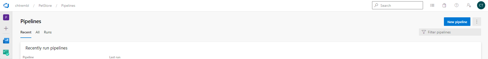

Select GitHub (Where your fork/clone is)

You should see something similar to the below image:

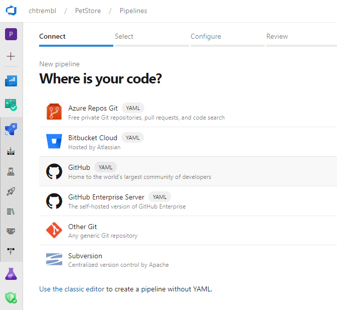

Select the azure-cloud fork (or clone if you went that route) 

You should see something similar to the below image:

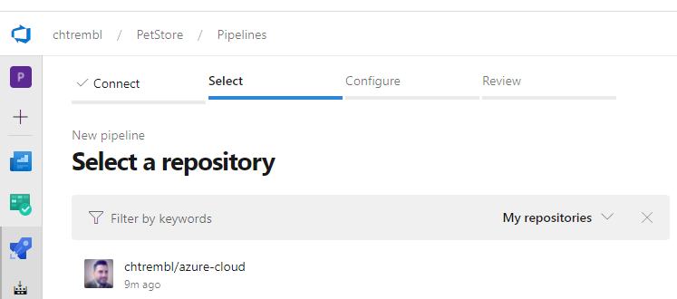

Select Azure Kubernetes Service and your subscription where your AKS Cluster is running (remember from the previous guide 05-create-an-azure-k8s-cluster)

You should see something similar to the below image:

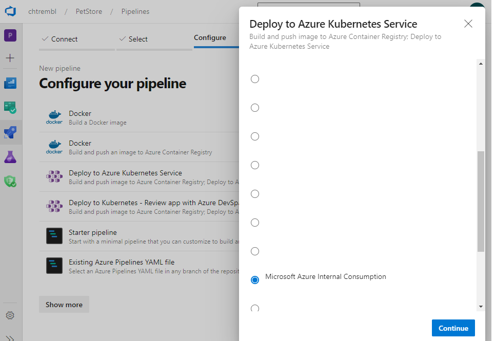

Fill in the meta data as seen in the image. 

> 📝 Please Note, if your curious, essentially Azure DevOps will generate Kubernetes Manifests files for you based on this data we enter. We will actually end up overriding all of this with our own manifests seen here https://github.com/chtrembl/azure-cloud/tree/main/manifests but for now go ahead and enter.

    - Cluster (Select your cluster (remember from the previous guide 05-create-an-azure-k8s-cluster))
    - Namespace Existing & default is fine. (We aren't going to discuss namespaces in this guide)
    - Container Registry (remember got created for you in guide 00-setup-your-environment)
    - Image Name is "petstoreservice"
    - Service Port 8080 

You should see something similar to the below image:

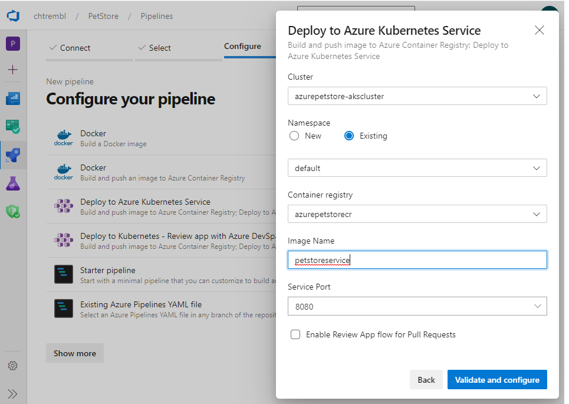

Validate and configure, what you will see if a pre generated yml deployment file. There are only a couple of useful things here before we make significant changes

    - Make note of your imagePullSecret
    - Make note of your dockerRegistryServiceConnection

> 📝 Please Note, At this point Azure DevOps was kind enough to create service connections to Azure Container Registry and AKS for us, automagically. You can see these under Settings > Service Connections, if curious you can take a look (do this in another tab so you don't lose your current work)

You should see something similar to the below image:


Anyways, back to this pre generated yml file, its a good start but we want to do more than just deploy. We want to run Cred Scan, Unit Test, Create a version file with Build Meta Data, Compile, Build Docker Image, Push Docker Image and then Deploy to Azure Kubernetes Service. So we will leverage the manifests from https://github.com/chtrembl/azure-cloud/tree/main/manifests 

At this point you made note of the imagePullSecret and dockerRegistryServiceConnection

You should see something similar to the below image:

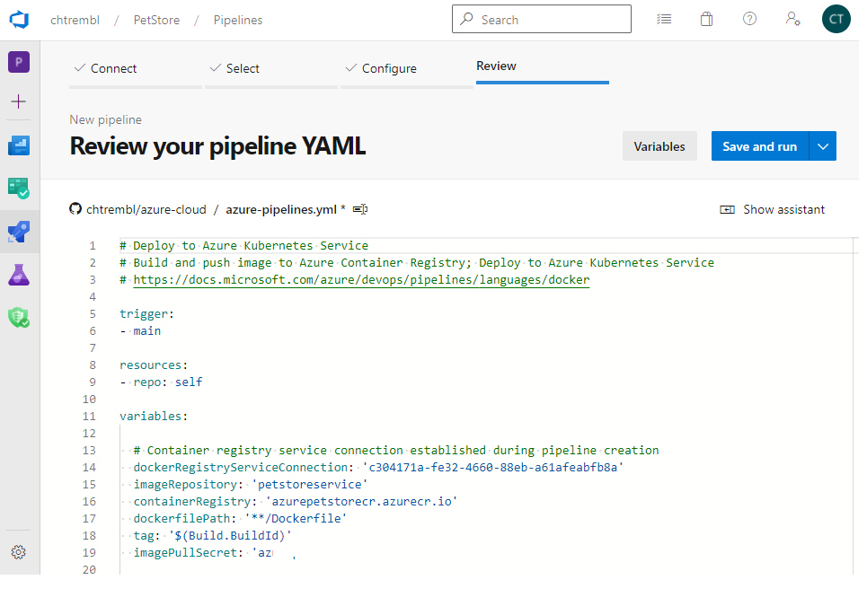

Azure DevOps is asking for your consent on file name of this deployment pipeline along with contents. I like to change the path to manifests/something-more meaningful, for example azure-petstoreservice-ci-cd-to-aks-pipeline or azure-petstoreservice-pipeline. If you are cloning/forking, you will have to pick a different name, Azure DevOps unfortunately won't commit on an existing version.

Now for the tricky part, remove all of the body contents from the inline editor and paste in the contents from https://github.com/chtrembl/azure-cloud/blob/main/manifests/azure-petstoreservice-ci-cd-to-aks-pipeline.yml

I am going to go through each line you want to review and/or change and why

 - line 11 make sure you are executing this pipeline on only changes from petstore/petstoreservice (no need to trigger on petstoreapp changes etc...) (if your cloning/forking this should not change)
 - line 19 overwrite dockerRegistryServiceConnection with the id you copied above
 - line 20 verify imageRepository matches your Azure Container Registry/Image Repository (if your cloning/forking this should not change)
 - line 21 verify your containerRegistry is the one configured in guide 00-setup-your-environment (if your cloning/forking this should not change)
 - line 22 verify your path is correct to the Dockefile (if your cloning/forking this should not change)
 - line 24 overwrite imagePullSecret with '$(crImagePullSecret)', we will inject this sensitive value as a pipeline secret below
 - line 89 kubernetesServiceConnection should match your service connection that you made in the previous dialog and can view in your settings/service connections
 - line 98 kubernetesServiceConnection should match your service connection that you made in the previous dialog and can view in your settings/service connections
 - line 100 Azure DevOps Pipelines will create a generic deployment file for you, we are using this one (it's part of your clone/fork) for better naming (just imagine you have multiple pipelines someday)
 - line 101 Azure DevOps Pipelines will create a generic service file for you, we are using this one (it's part of your clone/fork) for better naming (just imagine you have multiple pipelines someday)
 
After you are done editing (don't worry this file will vet versioned in GitHub in the next dialog and you can always make changes at any time)

Click Save and run

You should see something similar to the below image:

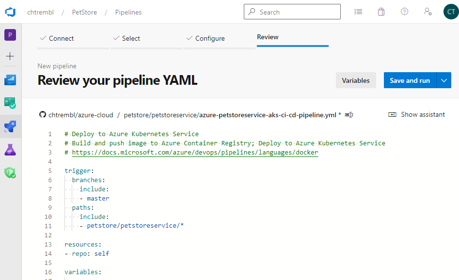

Enter the ```crImagePullSecret``` secret with the sensitive value that was auto generated, to inject every time this pipeline executes

You should see something similar to the below image:

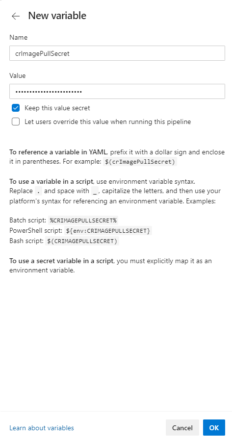

Click Save and run

You should see something similar to the below image:

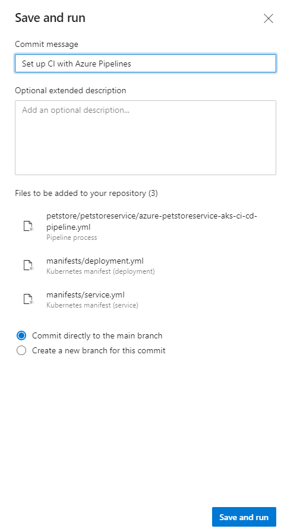

Azure DevOps is going to source a manifests/deployment.yml and manifests/service.yml for you in GitHub. You can safely remove those in favor of the ones that are preexisting for you.

At this point the build will run, and it will also run any time you make a commit to petstore/petstore service. 

> 📝 Please Note, the build should fail

While this failing build is running, double check your manfiests/petstoreservice-deployment.yml and manifests/petstoreservice-service.yml

You'll want to make sure you're using your Azure Container Registry. (I should of probably externalized these but for now you can update them to reflect your own)  

```containers:
      - name: petstoreservice
        image: azurepetstorecr.azurecr.io/petstoreservice
```

Re run the failed pipeline. Once successful you can then regression test.

I like to renane my Pipelines to something more meaningful, you can do so by hovering over the pipeline (there will be an ellipse on the right and select rename)

You should see something similar to the below image:

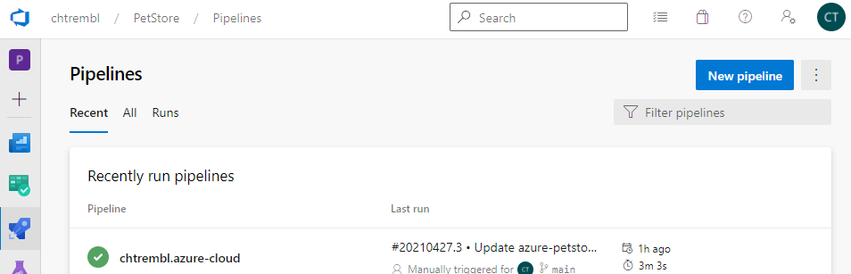

Give it a nice name

You should see something similar to the below image:

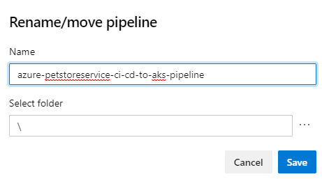

> 📝 Please Note, Now when you inspect the pipeline, if you scroll all the way down to the bottom of the Deploy to Kubernetes cluster, you will see the Load Balancer IP Address, this will also match your kubectl commands as well if your working on the Azure CLI.

You should see something similar to the below image:

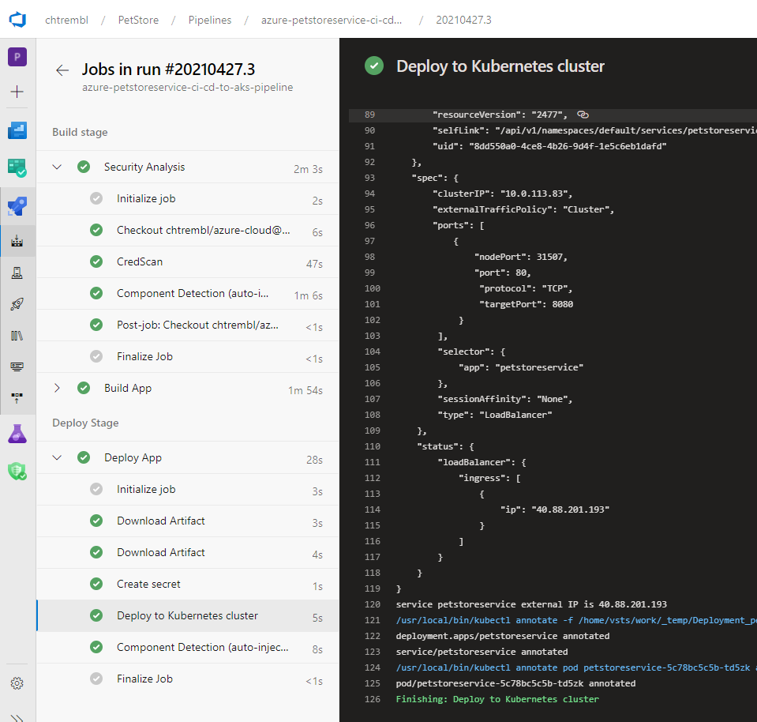

Lets do a curl 

```
curl http://40.88.201.193/v2/info | json_pp
```

You should see something similar to the below image:

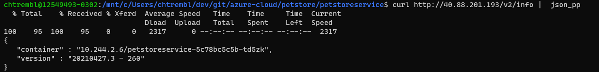

You will see the build id (matches Azure Container Registry) as well as the container runtime too!

This is handy to ensure what your viewing at runtime within your application is what matches what was just built :)

Head to Azure Portal, find your AKS Cluster, view workloads and you'll see the same matching pod as depicted in your curl results

You should see something similar to the below image:

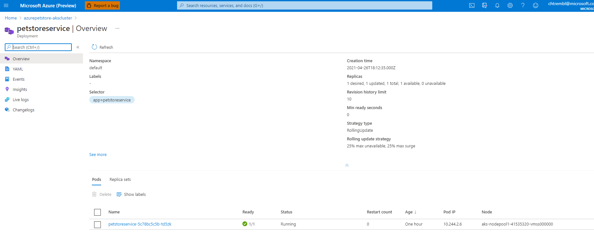

Things you can now do now with this guide

☑️ CI/CD to your Kubernetes Cluster using Azure DevOps Pipelines

☑️ DevOps code coverage/unit test coverage reporting within Azure DevOps

☑️ Build Meta Data appears within your running application which matches the container configuration reflected in your Kubernetes Cluster


---
➡️ Next guide: [07 - Connect PetStoreApp and PetStoreService together](../07-connect-petstoreapp-and-petstoreservice-together/README.md)
