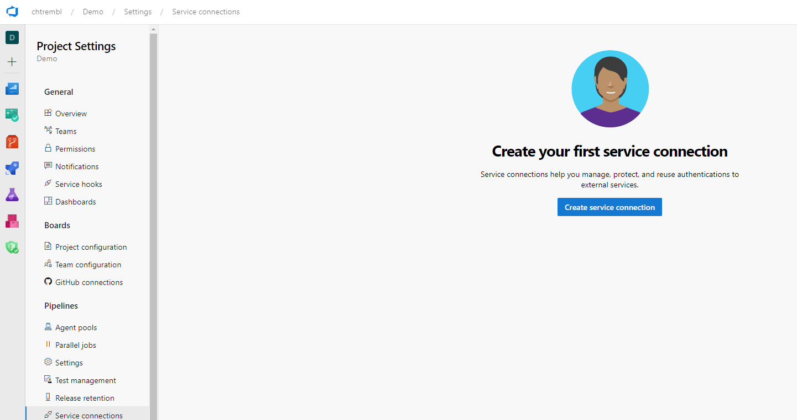
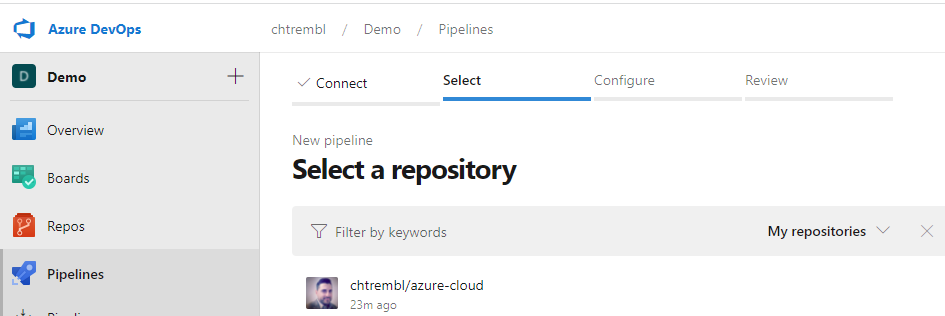
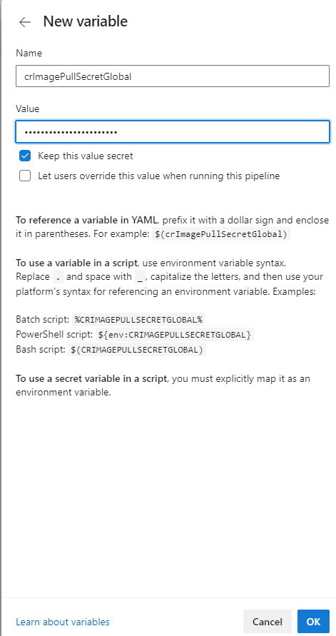
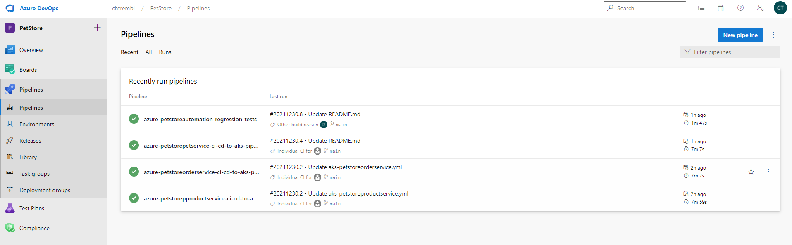

# 06 - Configure Azure DevOps Pipeline for CI/CD into Azure Kubernetes Service

**This guide is part of the [Azure Pet Store App Dev Reference Guide](../README.md)**

In this section, we'll configure an Azure DevOps Pipeline for Pet Store Service CI/CD into Azure Kubernetes Service

> 📝 Please Note, We will assume you have forked the azure-cloud repository, it is the easiest way to get going (for instructions on this view the "**Forking the azure-cloud**" section in [00-setup-your-environment](../00-setup-your-environment/README.md). Also, both PetStoreApp and PetStoreService use a Spring Boot Application properties file named application.yml to drive the functionality/configuration of these applications which is located in src/main/resources/application.yml of both projects. By default, this file has all of the properties that are needed throughout the guides, and by default are commented out. This means that the applications will start automatically without having to configure anything. As you progress through the guides, each guide will inform you of what properties to uncomment and configure within your environment. If you have not already done so, login to your GitHub account, head to https://github.com/chtrembl/azure-cloud, and fork.

By now you have a CI/CD GitHub Action that you can experiment with for PetStoreApp, in this guide we will build CI/CD Azure DevOps Pipelines for the PetStorePetService, PetStoreProductService & PetStoreOrderService (Until this point, that orchestration of CI/CD is being done manually via CLI as seen in the previous guide.)

These pipelines will execute on any commit to PetStorePetService, PetStoreProductService & PetStoreOrderService (respectively), executing security scanning using Cred Scan, create a version file with build meta data (useful at runtime), execute unit test/code coverage (useful for dashboard metrics) and last but not least compile Compile the Spring Boot Pet Store Service, build the Docker Image and Deploy into AKS.

Head to Azure DevOps and create and organization & project if you do not have one (I have an organization called chtrembl and a project called Demo) and lets get started.

As we did with the GitHub Action, I have the manifests files already created here https://github.com/chtrembl/azure-cloud/tree/main/manifests, Although we can't simply import them, we can reuse them. I will walk you through that below.

> 📝 Please Note, by now, https://github.com/chtrembl/azure-cloud should be forked.

> 📝 Please Note, if you haven't installed the Security Dev Tools in your DevOps Organization, please head to the Marketplace and install it, its quick and needed for the security tasks to run in your Pipeline. https://marketplace.visualstudio.com/items?itemName=securedevelopmentteam.vss-secure-development-tools

Let's first get the service connections created that our pipelines will need (Azure Container Registry, Azure Kubernetes Service and GitHub)

If you had over to Project Settings > Service Connections, you will see that you probably do not have any yet

You should see something similar to the below image:

There a few ways to add these Service Connections, each time you create a pipeline, ADO will generate them for you, that is the approach we are going to take here, just to get them created, then we are going to reuse them for all 3 pipelines by substituting in the values for each of the yml's I have provided here https://github.com/chtrembl/azure-cloud/tree/main/manifests.

Head back to Pipelines and select "Create Pipeline" or "New Pipeline"

You should see something similar to the below image:

Select GitHub and the repository that you have forked

You should see something similar to the below image:

Select "Deploy to Azure Kubernetes Service"

You should see something similar to the below image:

Select your Azure Subscription and Continue

Specify your AKS Cluster name, namespace and container registry that you have previously setup. Image Name and Service Port do not matter here (all we are doing is getting ADO to generate the service connections for us, we wont actually be using this pipeline that gets generated.)

You should see something similar to the below image:

Select "Validate and configure"

This next step is very important. Make note of your dockerRegistryServiceConnection value and your imagePullSecret value. Save them off in notepad somewhere, you can never retrieve these. These are associated to your Service Connections and we can re use them for all 3 Pipelines. We will also move the secret to an encrypted variable.

You should see something similar to the below image:

You do not need to save this Pipeline. Discard it. Head back to Service Connections.

You should see something similar to the below image:

You now have 3 Service Connections and the values needed to re use them in your new Pipelines that you create. Your going to be creating a pipeline for each service that deploys to AKS, substituting my yml into your pipelines.

## Setup azure-petstorepetservice-ci-cd-to-aks-pipeline Pipeline

At this point you already have the Service Connections and values saved off in a notepad file from above.

Do the same with azure-petstorepetservice-ci-cd-to-aks-pipeline.yml from your fork or grab it from here https://github.com/chtrembl/azure-cloud/edit/main/manifests/azure-petstorepetservice-ci-cd-to-aks-pipeline.yml (you will be using this file with your Service Connections)

Head back to Pipelines and select "Create Pipeline" or "New Pipeline" and follow the same steps as above. This is going to re create more service connections, and for each of the 3 pipelines, however you saved the values for the original Service Connections as seen above so we can safely re use those and then delete the new ones once complete.

Update the file path to reflect your Fork location, you will want to append your alias to the file name. ADO will ultimately be sourcing a new pipeline for you. There is no way to re use the existing one I've created, hence the need to append your alias if your using the same folder "manifests"

Paste in the contents of azure-petstorepetservice-ci-cd-to-aks-pipeline.yml from your fork or grab it from here https://github.com/chtrembl/azure-cloud/edit/main/manifests/ and update the dockerRegistryServiceConnection value and the imagePullSecret value with '$(crImagePullSecretGlobal)'. (We will inject this as a secret in the next step). Also search for "kubernetesServiceConnection" and make sure the value matches the name of your Service Connection as well (The one from above that was created originally and the one that will be re used). Delete the last stage "stage: Automation" (We will cover this in a later guide).

You should see something similar to the below image:

Select variables > new variable and paste in your crImagePullSecretGlobal key and password (This is sensitive so lets inject it so that others cannot gain access to your Container Registry Service Connection) and select "Ok".

You should see something similar to the below image:

You can Save and Run. This should version a new Pipeline yml for you with the file name you specified.

ADO will execute this pipeline any time changes are made to PetStorePetService.

If you inspect that Pipeline yml closely, you will notice two files that are being referenced for the k8s deployment

`$(Pipeline.Workspace)/manifests/petstorepetservice-deployment-everything-enabled.yml`
`$(Pipeline.Workspace)/manifests/petstorepetservice-service-everything-enabled.yml`

You are going to need to update the contents of `$(Pipeline.Workspace)/manifests/petstorepetservice-deployment-everything-enabled.yml` because it references an application properties with configuration that you do not yet need as well as a k8s secret for Application Insights that does not yet exists (covered in a later guide).

Head to GitHub and edit that file directly or locally and push it to GitHub.

Ensure you have comments on the following, this is done via '#'

          #- name: spring.config.name
          #  value: application_with_everything_enabled
          #- name: PETSTORESERVICES_AI_INSTRUMENTATION_KEY
          #  valueFrom:
          #    secretKeyRef:
          #      name: aisecretkey
          #      key: secret

Head back to the Pipelines and you may notice that your Pipeline has a funky name. You can rename this. On the far right select Rename from the ellipse.

You should see something similar to the below image:

You can give it a meaningful name

You should see something similar to the below image:

## Setup azure-petstoreproductservice-ci-cd-to-aks-pipeline Pipeline

Do the same thing as above instead for petstorepetservice do it for petstoreproductservice, using the petstoreproductservice yml files.

## Setup azure-petstoreorderservice-ci-cd-to-aks-pipeline Pipeline

Do the same thing as above instead for petstorepetservice do it for petstoreorderservice, using the petstoreorderservice yml files.

Head back to Pipelines

You should see something similar to the below image: (minus the regression pipeline which comes in a later guide)

You can also go back into Service Connections and delete the newly generated ones that are not being used. (You should just have the 3 that were originally created and were re used)

🎉Congratulations, you now have the 3 services configured with ADO Pipelines. If you make changes to the projects you should see the corresponding pipelines execute, build and deploy.

Things you can now do now with this guide

☑️ CI/CD to your Kubernetes Cluster using Azure DevOps Pipelines

☑️ DevOps code coverage/unit test coverage reporting within Azure DevOps

☑️ Build Meta Data appears within your running application which matches the container configuration reflected in your Kubernetes Cluster

---

➡️ Next guide: [07 - Connect PetStoreApp and PetStoreService together](../07-connect-petstoreapp-and-petstoreservice-together/README.md)
