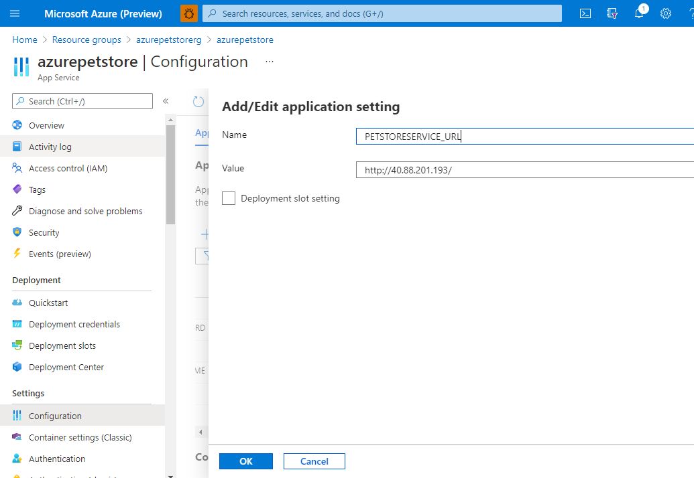
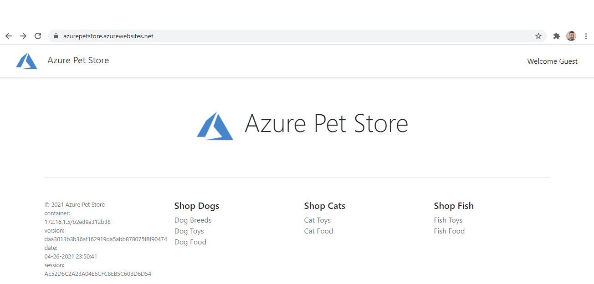
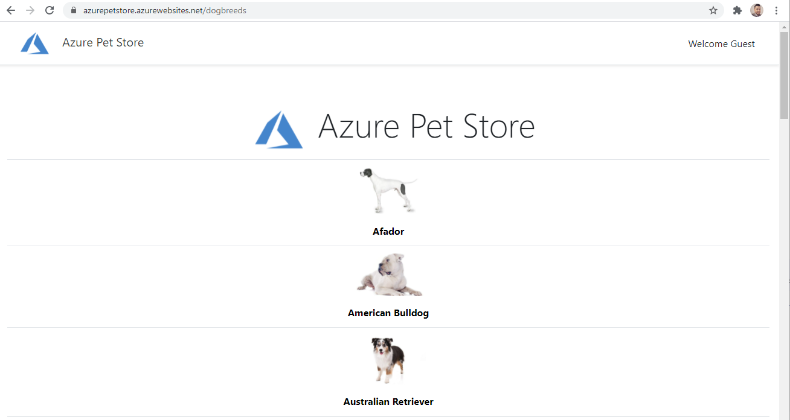

# 07 - Connect PetStoreApp and PetStoreService Together

__This guide is part of the [Azure Pet Store App Dev Reference Guide](../README.md)__

> 📝 Please Note, We will assume you have forked the azure-cloud repository, it is the easiest way to get going. Also, both PetStoreApp and PetStoreService use a Spring Boot file called application.yml to drive the functionality/configuration of these applications with is located in src/main/resources/application.yml of both projects. By default, this file has all of the properties that are needed throughout the guides commented out. This means that the applications will start automatically without having to configure anything. As you progress through the guides, each one will inform you of what properties to uncomment and configure within your environment. If you have not already done so, login to your GitHub account, head to https://github.com/chtrembl/azure-cloud, select Fork, select your GitHub account.

Remember that Kubernetes Load Balancer IP Address from the previous guide? Update your App Service Configuration Setting for ```PETSTORESERVICE_URL``` to reflect it, and save it (Container Restart will happen automagically)

Also update src/main/resources/application.yml to uncomment the following. By uncommenting, this tells the Spring Boot Java Runtime to look for a petstore.service.url and if you set ```PETSTORESERVICE_URL``` as a container setting, it will get injected at runtime initialization.

```
petstore:
  service:
    url: ${PETSTORESERVICE_URL}
```

You should see something similar to the below image:



Head over to yor App Service URL and now test it out. You should see the same Pet Store App, however now able to pull Dog Breeds JSON from the Pet Store Service.

You should see something similar to the below image:



Click On Dog Breeds

You should see something similar to the below image:



🎉Congratulations, you now have Pet Store App pulling data from Pet Store Service

Things you can now do now with this guide

☑️ Integrate two applications

---
➡️ Next guide: [08 - Configure Apps to use Application Insights](../08-configure-apps-to-use-application-insights/README.md)
