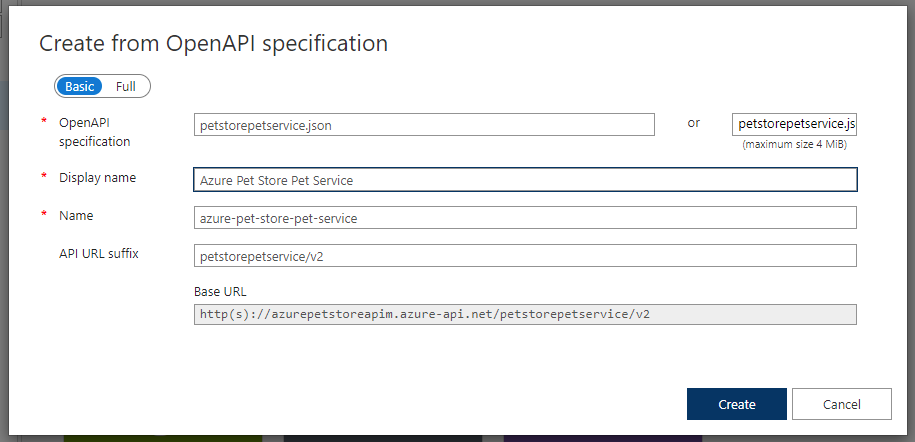
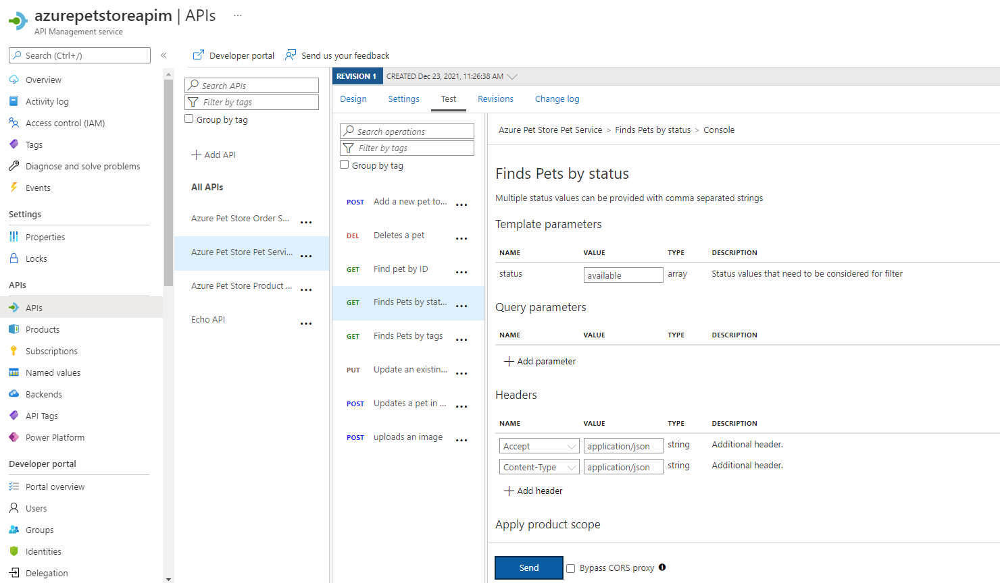
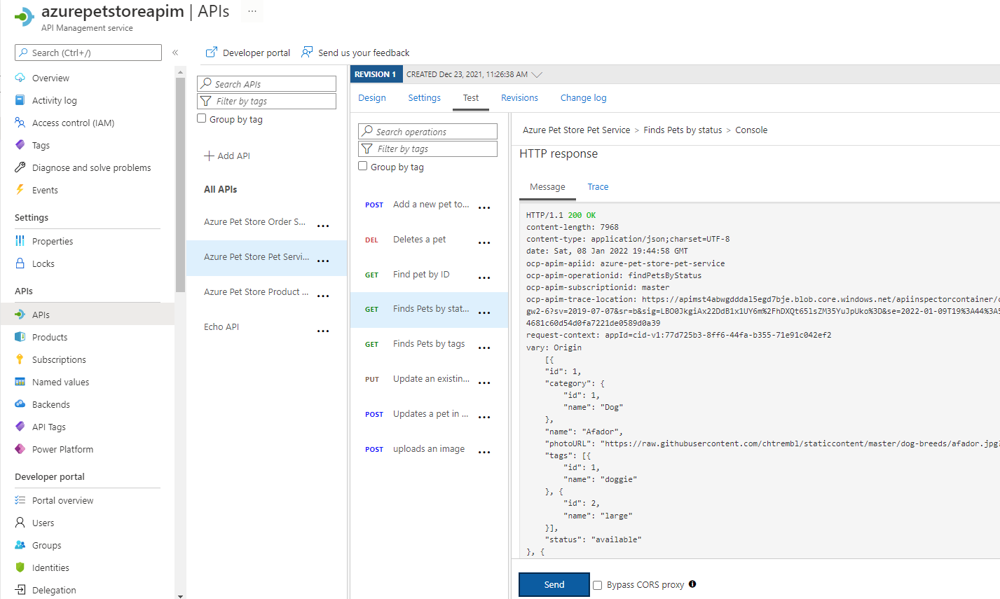
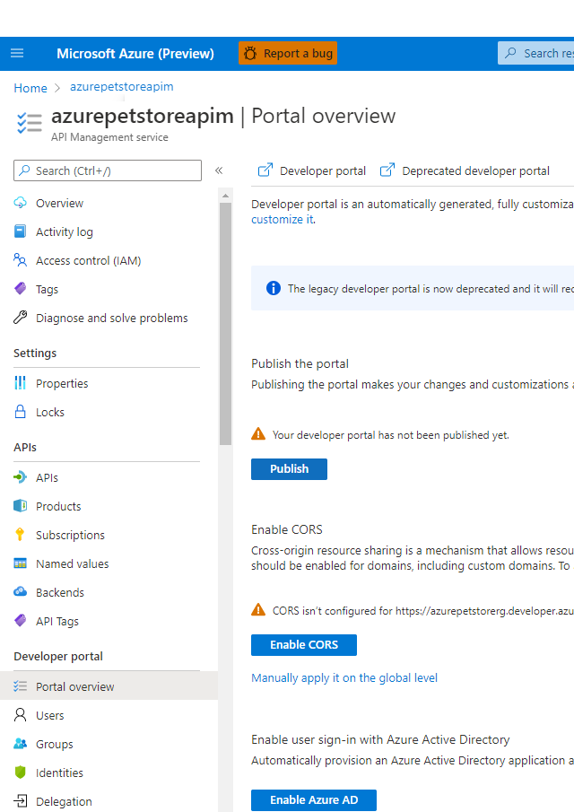
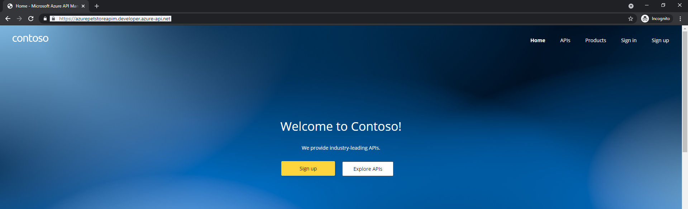
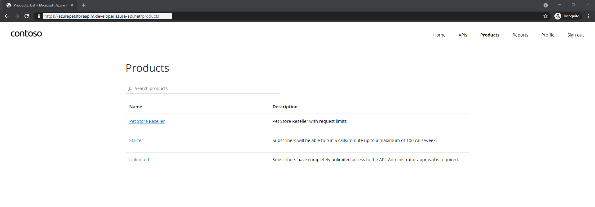
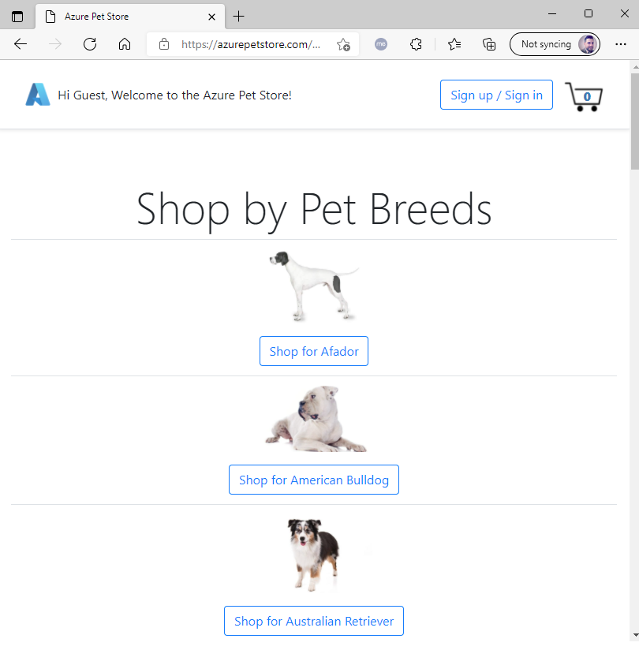

# 09 - Configure API Management in front of PetStoreService

**This guide is part of the [Azure Pet Store App Dev Reference Guide](../README.md)**

In this section, we'll import and Publish your API with Azure API Management using Products and Rate Limits

> 📝 **Please Note, As with the other guides, the code for this is already complete, it just needs to be enabled via application configuration. The objective of this guide is to walk you through the steps needed to enable & configure the Azure services and Pet Store Application code to make this all of this work.**

[**Azure API Management**](https://azure.microsoft.com/en-us/services/api-management/) is a fully managed service that enables you to publish, secure, transform, maintain, and monitor your API's. For the purpose of this demo I will use [openapi-petstore](https://github.com/OpenAPITools/openapi-petstore) API deployed to Azure as the API chosen to be published with Azure API Management. We will cover Products and Rate Limits and what the Developer experience is like when discovering/subscribing to API's.

> 📝 Please Note, more on monetizing, oAuth, VNet/App Gateway Integration, Deployments and Versioning to be covered in the future

> 📝 Please Note, We will assume you have forked the azure-cloud repository, it is the easiest way to get going (for instructions on this view the "**Forking the azure-cloud**" section in [00-setup-your-environment](../00-setup-your-environment/README.md). Also, both PetStoreApp and PetStoreService use a Spring Boot Application properties file named application.yml to drive the functionality/configuration of these applications which is located in src/main/resources/application.yml of both projects. By default, this file has all of the properties that are needed throughout the guides, and by default are commented out. This means that the applications will start automatically without having to configure anything. As you progress through the guides, each guide will inform you of what properties to uncomment and configure within your environment. If you have not already done so, login to your GitHub account, head to https://github.com/chtrembl/azure-cloud, and fork.

## 1. Deploy an Open API and ensure its accessible.

By now you should have PetStorePetService, PetStoreProductService & PetStoreOrderService running in your Azure Kubernetes Cluster. These 3 services were built using [[openapi-petstore](https://github.com/OpenAPITools/openapi-petstore) ](https://petstore.swagger.io/) We are going to walk through the steps to configure API Management in front of this Azure Kubernetes Cluster.

Verify your Azure Cluster is still up and running, if so you will be able to access the AKS cluster via the Service Load Balancer. Since this is dynamic, run the following

`kubectl --namespace ingress-petstoreservices get services -o wide -w ingress-nginx-controller`

This will output the ingress-nginx-controller Load Balancer External IP address, 40.88.201.193 for example...

Then access the services, for example via the ipaddress (40.88.201.193 in my case)

```
curl http://40.88.201.193/petstorepetservice/v2/pet/info | json_pp
```

```
curl http://40.88.201.193/petstoreproductservice/v2/product/info | json_pp
```

```
curl http://40.88.201.193/petstoreorderservice/v2/store/info | json_pp
```

We are going to configure PetStoreApp to integrate with the new Pet Store API's that we create with API Management. The steps to create the API will be the same for all three services PetStorePetService, PetStoreProductService & PetStoreOrderService. Let's look at how to do this for PetStorePetService below.

## 2. Create and Configure Azure API Management Service

Head to Azure Portal and Search for API Management Services and Create a New Instance using the following data, the defaults for the remaining tabs are fine. Select Review + create.

> 📝 **Please Note, azurepetstoreapim is already taken, you will need to choose another one for your purposes.**

You should see something similar to the below image:


Below shows the newly created API Management Service Dashboard

You should see something similar to the below image:


Select API's, + Add API and click OpenAPI (Under Create From Definition)

> 📝 Please Note, you can create several different API types, here I will leverage Open API/Swagger to auto generate this API and meta data, automagically :)

You should see something similar to the below image:


Fill in the details and paste in your Open API specification from the Azure Kubernetes Service where your App Service is running (You will do this three times one for each service)

You can use the corresponding schema for each API. Remember these schemas are the contracts between service producer and service consumer. With a contract first approach, the producing services technically do not need to be developed prior to consumers (PetStoreApp) consuming them. We can generate the API's and mock data if that suits us.

PetStorePetService
https://github.com/chtrembl/azure-cloud/blob/main/petstore/petstorepetservice/petstorepetservice.json

PetStoreProductService
https://github.com/chtrembl/azure-cloud/blob/main/petstore/petstoreproductservice/petstoreproductservice.json

PetStoreOrderService
https://github.com/chtrembl/azure-cloud/blob/main/petstore/petstoreorderservice/petstoreorderservice.json

Below details PetStorePetService (Remember you need to do this for all three)

The other fields will prepopulate. I've added a v2 version to cross reference the openapipetstore version I built with the services. Click "Create"

You should see something similar to the below image:



Your API will automagically get generated!

As seen below, all of your API operations are available. Notice Backend HTTP(s) endpoints is blank?

You should see something similar to the below image:


Click on the Settings tab for each of your newly imported API's and update (Doing this in settings will update globally for all HTTP operations, if you need to change this per operation you can do so but for our implementation all operation will go to the same back end) the backend Web Service URL of your Azure Kubernetes NGINX Load Balancer IP Address and click Save.

You should see something similar to the below image:


Select and Operation and Test it out... 

> 📝 Please Note, I've chosen the GET Operation for Find Pets by status "available"

You'll need to pass the status parameter "available" and the 2 required headers "Accept" and "Content-Type" both of which are "application/json". APIM will automagically insert the subscription headers for us at this point.

click "Send"

You should see something similar to the below image:



You should see something similar to the below image:



> 📝 Please Note, At this point we are able to interact with our Azure Kubernetes PetStoreService via API Management using a generic Test Subscription. There is much more we can do with policies, tranformations, mocks etc... We are just scratching the surface

## 3. Create and Configure a Product

Products are special containers that combine one or more API's, group visibility settings and rate limits or quotas. We will create a Pet Store Reseller Product, with Rate Limits that we impose for the consumers of this product. For example, just imagine we had Reseller Pet Stores that consume this API for Pet Store Information. We may want to limit those resellers and/or monetize it based on those limits etc.. We can accomplish this with Products. We will configure the PetStoreApp to use this Product and integrate with this Product/Subscription in API Management instead of integrating directly with Azure Kubernetes Service.

Select Products and Add a Product, fill in the meta data and click "Select API"

> 📝 Please Note, This product will require a subscription (we cover that below) and will be tied to the OpenAPI Petstore API.

You should see something similar to the below image:


Select the newly created Product, Access Control and Add Group

> 📝 Please Note, Let's add developers and guests, that way new consumers (pet shop developers in the word) can discover the API's/Products and subscribe

You should see something similar to the below image:


Under Policies edit the XML to impose a rate limit of 5 calls per 30 seconds

> 📝 Please Note, Obviously this is drastic, but the idea it to keep it simple to test, after 5 calls to the API we will get a 429 error, showing us how rate limits work. Policies are a compelling feature of API Management. Here we can do all sorts of manipulation to the request/response more on this here [https://docs.microsoft.com/en-us/azure/api-management/api-management-policies](https://docs.microsoft.com/en-us/azure/api-management/api-management-policies)

You should see something similar to the below image:


Under Portal Overview, you can view the Publisher Portal (here you can also customize the look and feel of the externally facing Developer Portal that developers will see when discovering your API's/Products) once complete click "Publish"

The Publish will make all changes in Products available as well, which we will want to do to ensure public users can view this new Reseller Product and subscribe to use it.

You can go ahead and click Publish, and you will want to do this whenever you make changes.

You should see something similar to the below image:



Make sure your Pet Store Reseller Product is Published

You should see something similar to the below image:


Below shows Developer Portal View (This is the default skinned Portal, this can be customized/themed to your liking, this is the view where API developers/owners developing API's will work)

You should see something similar to the below image:


## 4. Discover Products and Subscribe to an API

Head to the Developer Portal in a new browser (perhaps incognito mode, we are looking to experience the public view, what public developers consuming your API will see and make sure to use use your URL) [https://azurepetstoreapim.developer.azure-api.net/](https://azurepetstoreapim.developer.azure-api.net/)

> 📝 Please Note, This is where public users/developers will go to view/subscribe to API's, also in the Publisher Portal this can be skinned to look and feel however you desire.

You should see something similar to the below image:



Here, as a guest, (potential developer consumer of the API, such as a PetStoreApp Developer) you can search for API's and view information on them

> 📝 Please Note, we haven't yet signed up or subscribed to anything yet, we are in "Discovery Mode"\*

At this point, go ahead and Sign up, you will get an email confirmation once complete

You should see something similar to the below image:


Still in the incognito tab/newly signed up consumer/developer, select the Pet Store Reseller Product, and subscribe, in this example "Pet Store Petstore" will be the developer/company that will be subscribing to this Product/API

> 📝 Please Note, Products aren't required, we are just showing how they can be used to impose rate limits and quotas. There could be many products 1 API, all with different policies etc...

You should see something similar to the below image:



You should see something similar to the below image:


Once subscribed you will see your Developer Profile and Subscription Keys for calling the API's

> 📝 Please Note, at this point, we will be using subscription keys as our only form of authentication to the service. Depending on where these calls to the API are being made, subscription key could be compromised. OAuth is recommended for more protection, we will cover that later. Also our Azure Kubernetes Service is still publicly available, we could protect that with VNets and Ingress Controllers etc... however that is something not being covered at this time and out of the scope for these guides.

You should see something similar to the below image:


Test out the API as a consuming/subscribed developer using one of your Subscription keys seen above against your Gateway URL.

Make a GET request 5 times within 30 seconds to https://azurepetstoreapim.azure-api.net/v2/pet/findByStatus?status=available once again through just as you did earlier with the test and you'll see the rate limit policy take effect.

> 📝 Please Note, use your Gateway URL

You should see something similar to the below image:


Now update your App Service App Configuration to specify the API Management Gateway URL and the API Management Subscription ID so that Pet Store App can pass this data to API Management instead of Azure Kubernetes Service directly. You can use the same subscription key for all 3 services.

```
PETSTORESERVICES_URL
PETSTOREPETSERVICE_SUBSCRIPTION_KEY
PETSTOREPRODUCTSERVICE_SUBSCRIPTION_KEY
PETSTOREORDERERVICE_SUBSCRIPTION_KEY
```

You should see something similar to the below image:


Now visit the PetStoreApp and hit the Dog Breeds URL, should be business as usual...

You should see something similar to the below image:



Now refresh the page 6 times within 30 seconds, you should get a 529

You should see something similar to the below image:


Pretty cool huh? Now head over to Azure Portal > Application Insights Failures and lets check the Telemetry to see what happens. As you can see, the 429 Exception gets indexed. (alerts etc... can be configured to act on this)

You should see something similar to the below image:


Things you can now do now with this guide

☑️ Configuring API Management & Importing Open API's

☑️ Creating Products/Subscriptions with Rate Limits

☑️ Verifying Rate Limit Exhaustion

☑️ N-Tier Correlated Telementry including these Rate Limit Exceptions

➡️ Next guide: [10 - Configure B2C for PetStoreApp Identity Management](../10-configure-b2c-for-petstoreapp-identity-management/README.md)
