# 09 - Configure API Management in front of PetStoreService

__This guide is part of the [Azure Pet Store App Dev Reference Guide](../README.md)__

# Import and Publish your API with Azure API Management using Products and Rate Limits

[**Azure API Management**](https://azure.microsoft.com/en-us/services/api-management/) is a fully managed service that enables you to publish, secure, transform, maintain, and monitor your API's. For the purpose of this demo I will use [openapi-petstore](https://github.com/OpenAPITools/openapi-petstore) API deployed to Azure as the API chosen to be published with Azure API Management. We will cover Products and Rate Limits and what the Developer experience is like when discovering/subscribing to API's.

***Note, more on monetizing, oAuth, Deployments and Versioning to be covered in the future***

> 📝 Please Note, We will assume you have forked the azure-cloud repository, it is the easiest way to get going. Also, your application.yml for both PetStoreApp and PetStoreService, located in src/main/resources/application.yml of both projects, should now have only the Azure Application Insight properties uncommented as well as the petstore properties. All of the other Azure properties should be commented out. They may be uncommented becasue I am using the full deployment against this repository. You will want to comment them for now and slowly uncomment them as we progress through the guides, each guide will inform you. If you have not already done so, login to your GitHub account, head to https://github.com/chtrembl/azure-cloud, select Fork, select your GitHub account.

```
petstore:
  service:
    url: ${PETSTORESERVICE_URL}
    subscription:
      key: ${PETSTORESERVICE_SUBSCRIPTION_KEY}

azure:
  application-insights:
      instrumentation-key: ${PETSTOREAPP_AI_INSTRUMENTATION_KEY}
```

## 1. Deploy an Open API and ensure its accessible.

By now we have PetStoreService running in our Azure Kubernetes Cluster, and PetStoreService was built using [[openapi-petstore](https://github.com/OpenAPITools/openapi-petstore) ](https://petstore.swagger.io/) We are going to walk through the steps to configure API Management in front of this Azure Kubernetes Cluster.

Verify your Azure Cluster is still up and running, if so you will be able to access the AKS cluster via the Service Load Balancer. Since this is dynamic, run the following

`kubectl get services -o jsonpath={.items[*].status.loadBalancer.ingress[0].ip} --namespace=default`

This will output the Service Load Balancer IP address, 40.88.201.193 for example...

Then access petstoreservice via the ipaddress (40.88.201.193 in my case)

```
    curl http://40.88.201.193/v2/pet/findByStatus?status=available | json_pp
```
We are going to configure PetStoreApp to integrate with the new PetStore API that we create with API Management below.

## 2. Create and Configure Azure API Management Service

Head to Azure Portal and Search for API Management Services and Create a New Instnace using the following data, the defaults for the remaining tabs are fine. Select Review + create.
 
You should see something similar to the below image:

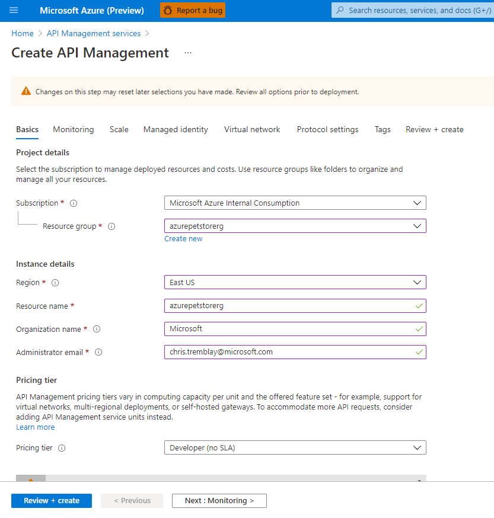

Below shows the newly created API Management Service Dashboard

You should see something similar to the below image:

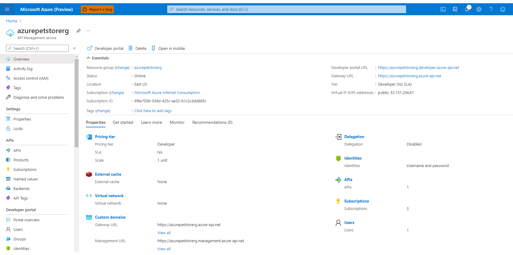

Select API's, + Add API and click OpenAPI (Under Create From Definition)

> 📝 Please Note, you can create several different API types, here I will leverage Open API/Swagger to auto generate this API and meta data, automagically :)	

You should see something similar to the below image:

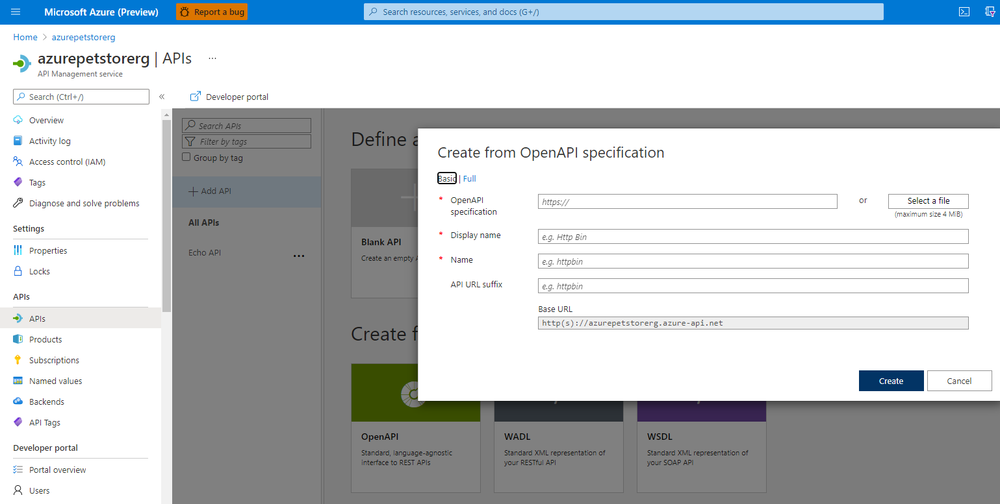

Fill in the details and paste in your Open API specification from the Azure Kubernetes Service where your App Servicd is running

You can use the following URL https://petstore.swagger.io/v2/swagger.json if you would like

The other fields will prepopulate. I've added a v2 version to cross reference the openapipetstore version I built with PetStoreService. Click "Create"

You should see something similar to the below image:

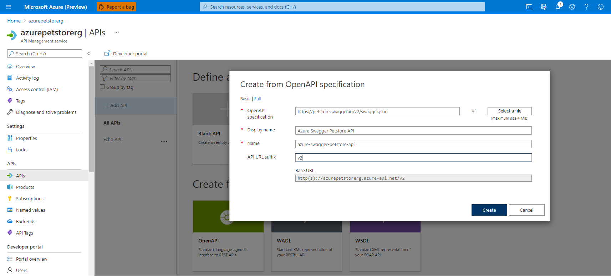

Your API will automagically get generated!

As seen below, all of your API operations are available. Notice Backend HTTP(s) endpoints is blank?

You should see something similar to the below image:

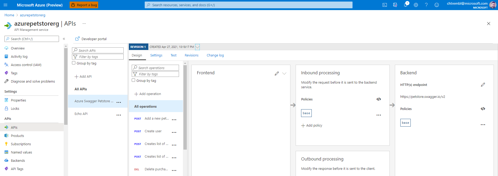
		
Click on the edit button next to HTTP(s) Backend and update that to point to your Azure Kubernetes PetStoreService Load Balancer and click Save.

You should see something similar to the below image:

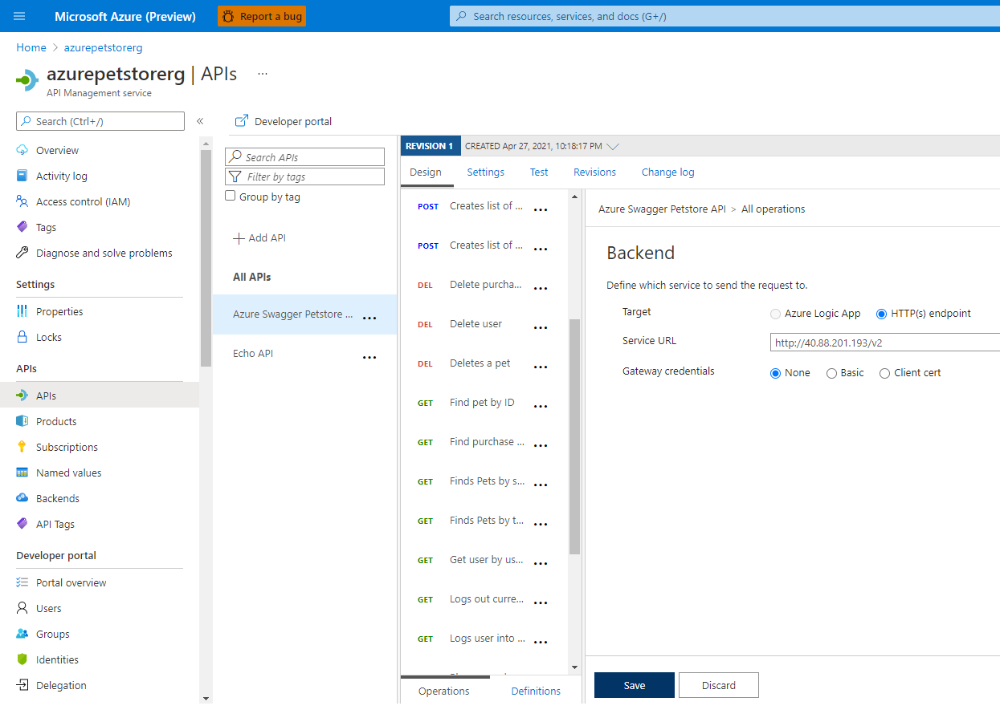
		
Select and Operation and Test it out... click "Send"

> 📝 Please Note, I've chosen the GET Operation for Find Pets by status "available"

You should see something similar to the below image:

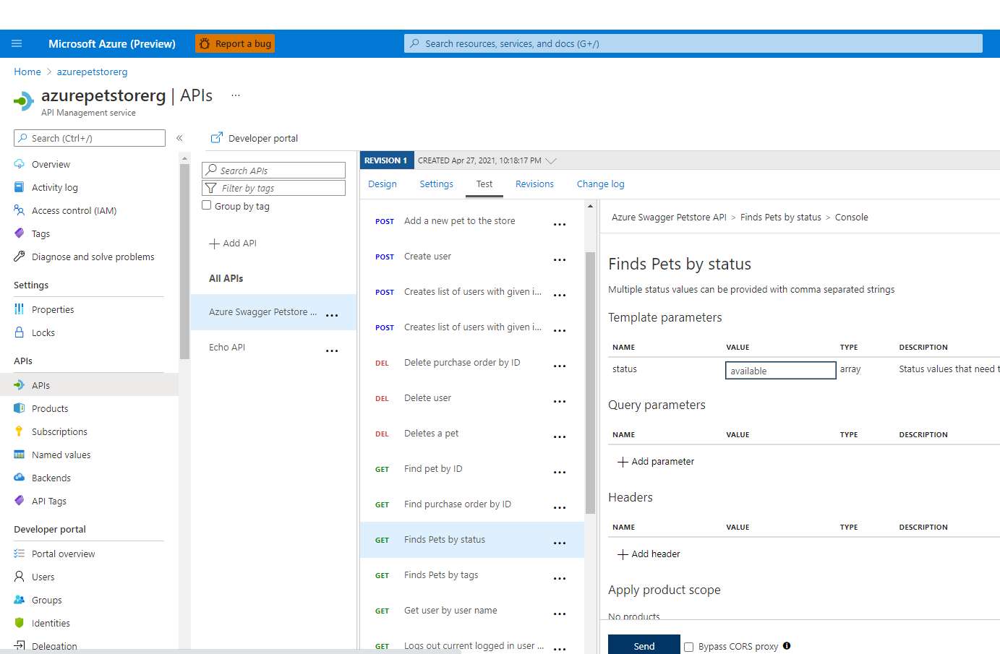

You should see something similar to the below image:

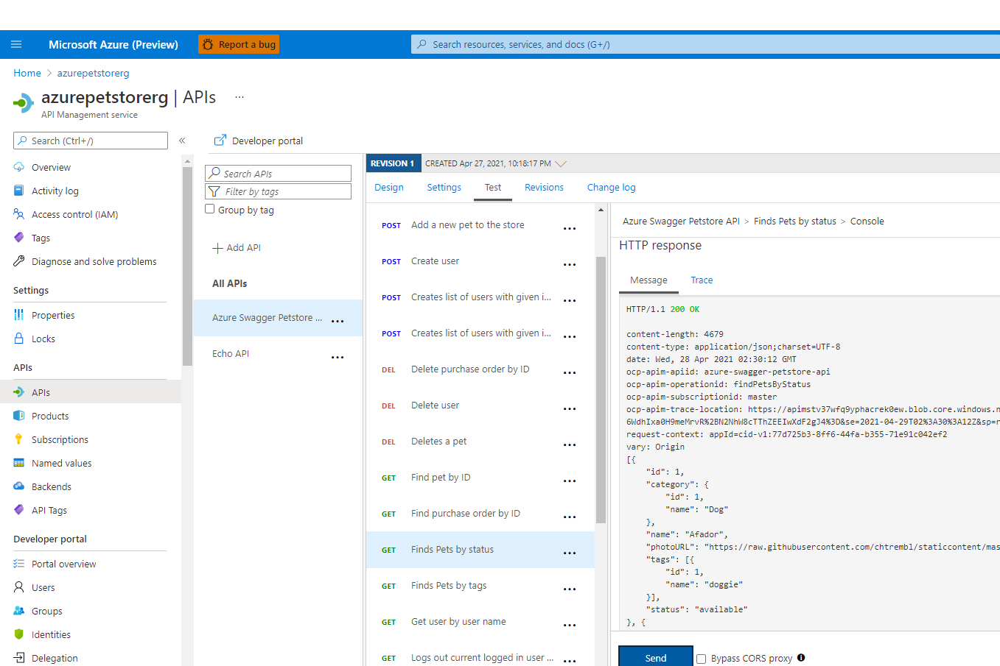

> 📝 Please Note, At this point we are able to interacti with our Azure Kubernetes PetStoreService via API Management using a generic Test Subscription. There is much more we can do with policies, tranformations, mocks etc... We are just scratching the surface
  
## 3. Create and Configure a Product

Products are special containers that combine one or more API's, group visibility settings and rate limits or quotas. We will create a Pet Store Reseller Product, with Rate Limits that we impose for the consumers of this product. For example, just imagine we had Reseller Pet Stores that consume this API for Pet Store Information. We may want to limit those resellers and/or monetize it based on those limits etc.. We can accomplish this with Products. We will configure the PetStoreApp to use this Product and integrate with this Product/Subscription in API Management instead of integrating directly with Azure Kubernetes Service.

Select Products and Add a Product, fill in the meta data and click "Select API"

> 📝 Please Note, This product will require a subscription (we cover that below) and will be tied to the OpenAPI Petstore API.
	
You should see something similar to the below image:

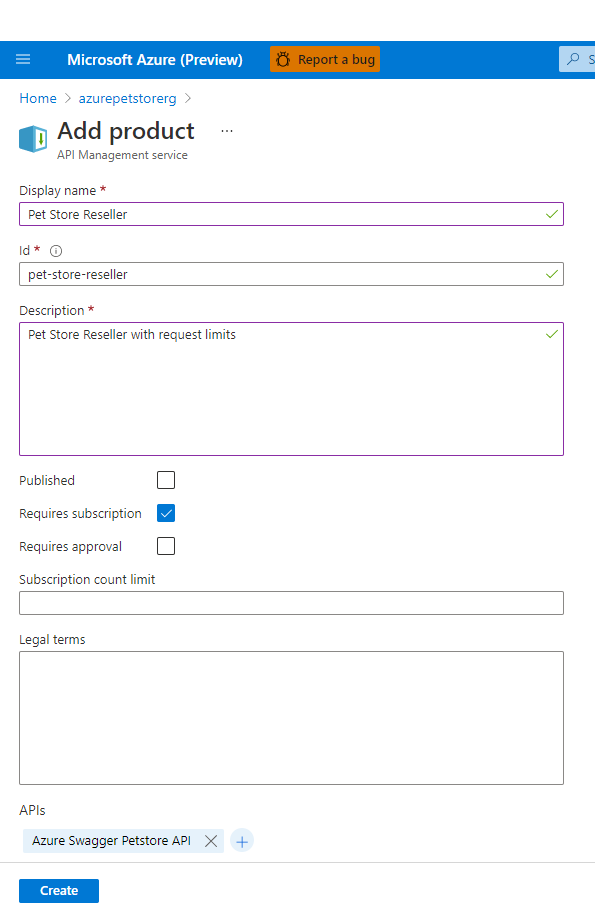

Select the newly created Product, Access Control and Add Group

> 📝 Please Note, Let's add developers and guests, that way new consumers (pet shop developers in the word) can discover the API's/Products and subscribe	

You should see something similar to the below image:

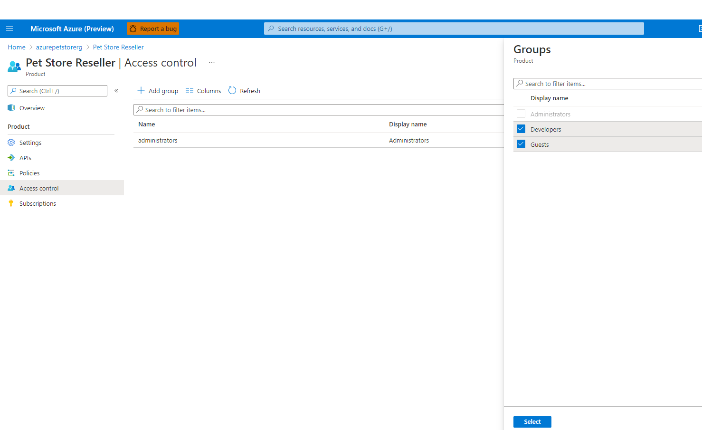

Under Policies edit the XML to impose a rate limit of 5 calls per 30 seconds

> 📝 Please Note, Obviously this is drastic, but the idea it to keep it simple to test, after 5 calls to the API we will get a 429 error, showing us how rate limits work. Policies are a compelling feature of API Management. Here we can do all sorts of manipulation to the request/response more on this here [https://docs.microsoft.com/en-us/azure/api-management/api-management-policies](https://docs.microsoft.com/en-us/azure/api-management/api-management-policies)*		


You should see something similar to the below image:

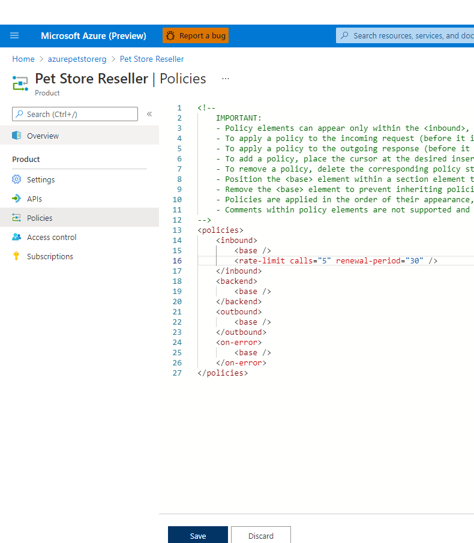

Under Portal Overview, you can view the Publisher Portal (here you can also customize the look and feel of the externally facing Developer Portal that developers will see when discovering your API's/Products) once complete click "Publish"

The Publish will make all changes in Products available as well, which we will want to do to ensure public users can view this new Reseller Product and subscribe to use it.		

You can go ahead and click Publish, and you will want to do this whenever you make changes.

You should see something similar to the below image:

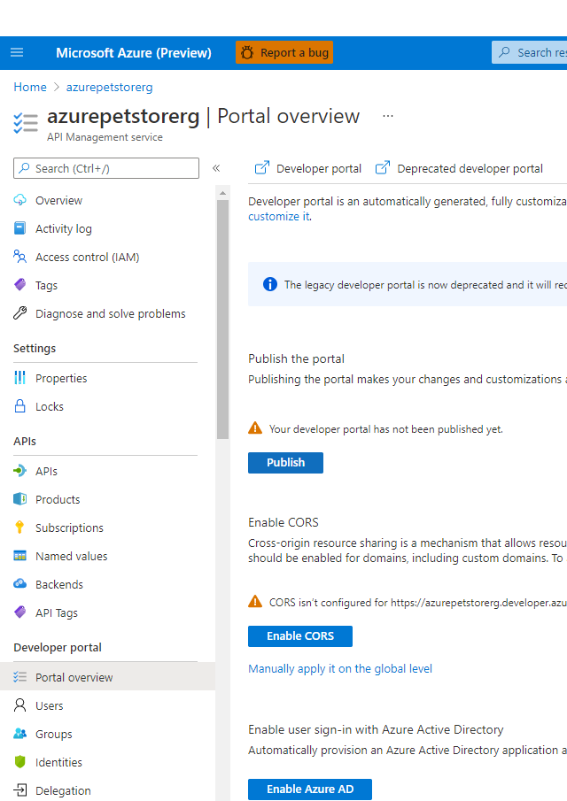

Make sure your Pet Store Reseller Product is Published

You should see something similar to the below image:

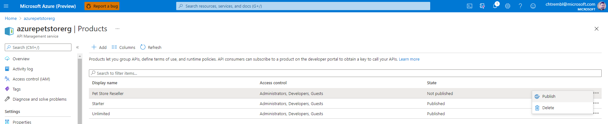

Below shows Developer Portal View (This is the default skinned Portal, this can be custoized/themed to your liking, this is the view where API developers/owners developing API's will work)

You should see something similar to the below image:

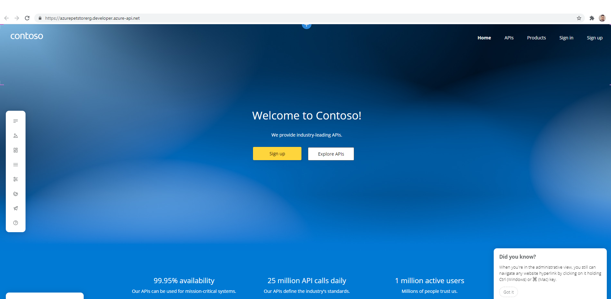

## 4. Discover Products and Subscribe to an API 

Head to the Developer Portal in a new browser (perhaps incognito mode, we are looking to experience the public view, what public developers consuming your API will see and make sure to use use your URL) [https://azurepetstorerg.developer.azure-api.net/](https://azurepetstorerg.developer.azure-api.net/)	

> 📝 Please Note, This is where public users/developers will go to view/subscribe to API's, also in the Publisher Portal this can be skinned to look and feel however you desire.

You should see something similar to the below image:

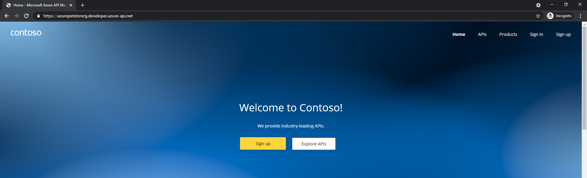

Here, as a guest, (potential developer consumer of the API, such as a PetStoreApp Developer) you can search for API's and view information on them

> 📝 Please Note, we haven't yet signed up or subscribed to anything yet, we are in "Discovery Mode"*		

At this point, go ahead and Sign up, you will get an email confirmation once complete

You should see something similar to the below image:

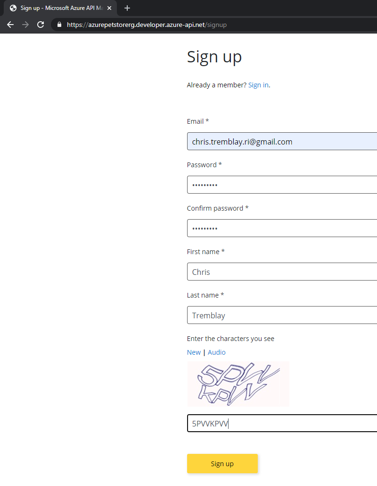

Still in the incognito tab/newly signed up consumer/developer, select the Pet Store Reseller Product, and subscribe, in this example "Pet Store Petstore" will be the developer/company that will be subscribing to this Product/API	

> 📝 Please Note, Products aren't required, we are just showing how they can be used to impose rate limits and quotas. There could be many products 1 API, all with different policies etc...

You should see something similar to the below image:

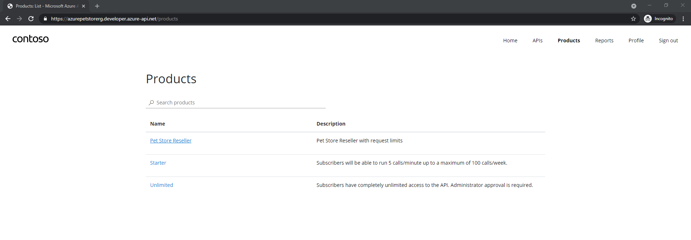

You should see something similar to the below image:

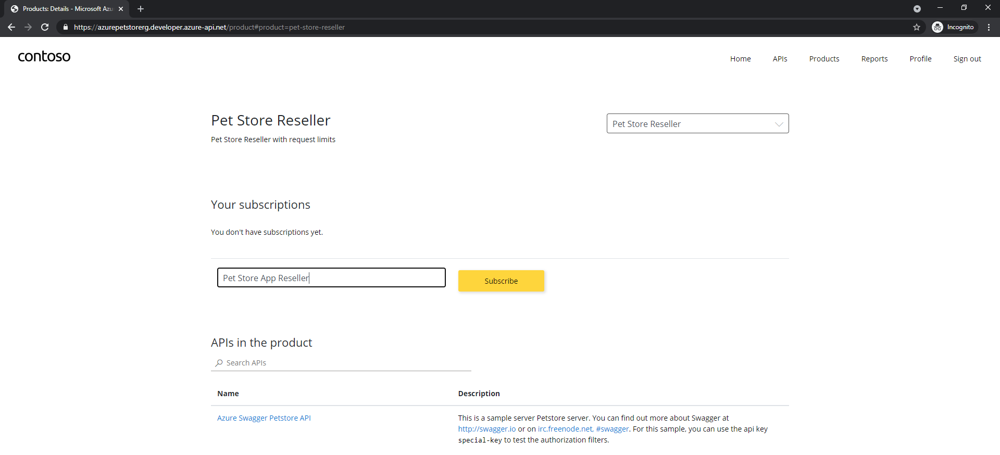

Once subscribed you will see your Developer Profile and Subscription Keys for calling the API's

> 📝 Please Note, at this point, we will be using subscription keys as our only form of authentication to the service. Depending on where these calls to the API are being made, subscription key could be compromised. OAuth is recommended for more protection, we will cover that later. Also our Azure Kubernetes Service is still publicly available, we could protect that with VNets and Ingress Controllers etc... however that is something not being covered at this time and out of the scope for these guides.

You should see something similar to the below image:

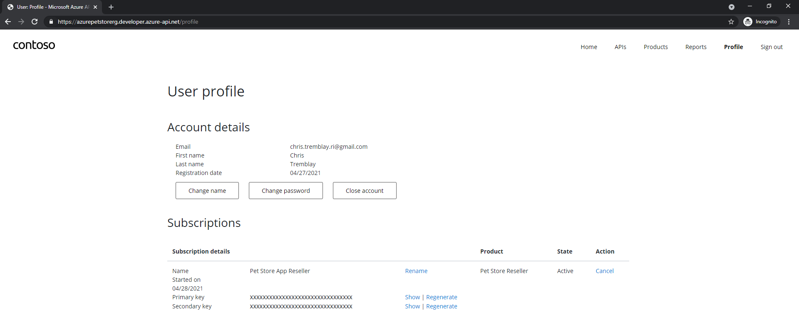

Test out the API as a consuming/subscribed developer using one of your Subscription keys seen above against your Gateway URL.

Make a GET request 5 times within 30 seconds to https://azurepetstorerg.azure-api.net/v2/pet/findByStatus?status=available&subscription-key=.... 

> 📝 Please Note, use your Gateway URL

You should see something similar to the below image:

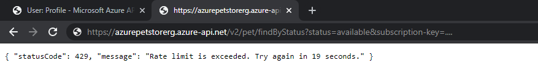

Now update your App Service App Configuration to specify the API Management Gateway URL and the API Management Subscription ID so that Pet Store App can pass this data to API Management instead of Azure Kubernetes Service directly.

---
➡️ Next guide: [10 - Configure B2C for PetStoreApp Identity Management](../10-configure-b2c-for-petstoreapp-identity-management/README.md)
