# 10 - Configure B2C for PetStoreApp Identity Management

**This guide is part of the [Azure Pet Store App Dev Reference Guide](../README.md)**

In this section, we'll use Azure Identity and Access Management to secure your Spring Boot Pet Store Application with Azure Active Directory B2C Spring Boot Starter

> 📝 **Please Note, As with the other guides, the code for this is already complete, it just needs to be enabled via application configuration. The objective of this guide is to walk you through the steps needed to enable & configure the Azure services and Pet Store Application code to make this all of this work.**

Often times, web applications (or parts of web applications) will need to be protected and will require authentication for access. There are many ways to implement identity management, here we will be showing how to achieve this by using Azure Identity and Access management to protect resources in your Spring Boot Pet Store Application. OpenID Connect is an authentication protocol, built on top of OAuth 2.0, that can be used to securely sign users in to web applications. By using the Azure Active Directory B2C (Azure AD B2C) implementation of OpenID Connect, you can **outsource** sign-up, sign-in, and other identity management experiences in your web applications to Azure Active Directory (Azure AD). In this guide we will configure the Pet Store Application to use the Azure Active Directory B2C Spring Boot Starter to receive and process the OAuth 2.0 tokens allowing us to easily construct Spring Authenticated Security Principals that are managed in Azure Active Directory B2C.

Live application can be found here [http://azurepetstore.azurewebsites.net/](http://azurepetstore.azurewebsites.net/)

> 📝 Please Note, We will assume you have forked the azure-cloud repository, it is the easiest way to get going (for instructions on this view the "**Forking the azure-cloud**" section in [00-setup-your-environment](../00-setup-your-environment/README.md). Also, both PetStoreApp and PetStoreService use a Spring Boot Application properties file named application.yml to drive the functionality/configuration of these applications which is located in src/main/resources/application.yml of both projects. By default, this file has all of the properties that are needed throughout the guides, and by default are commented out. This means that the applications will start automatically without having to configure anything. As you progress through the guides, each guide will inform you of what properties to uncomment and configure within your environment. If you have not already done so, login to your GitHub account, head to https://github.com/chtrembl/azure-cloud, and fork.

To enable, From your PetStoreApp, update src/main/resources/application.yml to uncomment the following. By uncommenting, this tells the Spring Boot Java Runtime to look for all of the B2C properties and if you set `PETSTOREAPP_B2C_TENANT`, `PETSTOREAPP_B2C_CLIENT_ID`, `PETSTOREAPP_B2C_CLIENT_SECRET`, `PETSTOREAPP_B2C_REPLY_URL` and `PETSTOREAPP_B2C_LOGOUT_URL` as container settings, they will get injected at runtime initialization. This enables PetStoreApp to authenticate users with B2C. 

```
azure:
  activedirectory:
    b2c:
      tenant: ${PETSTOREAPP_B2C_TENANT}
      oidc-enabled: true
      client-id: ${PETSTOREAPP_B2C_CLIENT_ID}
      client-secret: ${PETSTOREAPP_B2C_CLIENT_SECRET}
      reply-url: ${PETSTOREAPP_B2C_REPLY_URL}
      logout-success-url: ${PETSTOREAPP_B2C_LOGOUT_URL}
      user-flows:
        sign-up-or-sign-in: B2C_1_signupsignin
        profile-edit: B2C_1_profileediting
        password-reset: B2C_1_passwordreset
```

Below we will walk through the process of getting things configured for this to work.

## Objectives

1. Create an Azure Active Directory B2C Tenant and configure an App Registration

2. Configure the Spring Boot Pet Store Application to properly authenticate sign-up, sign-in and edit users

3. Demo

4. Create an Azure Active Directory B2C Tenant and configure an App Registration

> 📝 Please Note, I've called my tenant "RHODYPETSTORE" (rhody being short for Rhode Island, and the original name of the Azure Pet Store). You can however use anything you prefer.

Head to Azure Portal https://ms.portal.azure.com and search for Azure Active Directory B2C and select Create. This will allow us to create a new Directory/Tenant which we will use to manage our user's of the Azure Pet Store Spring Boot Application.

You should see something similar to the below image:

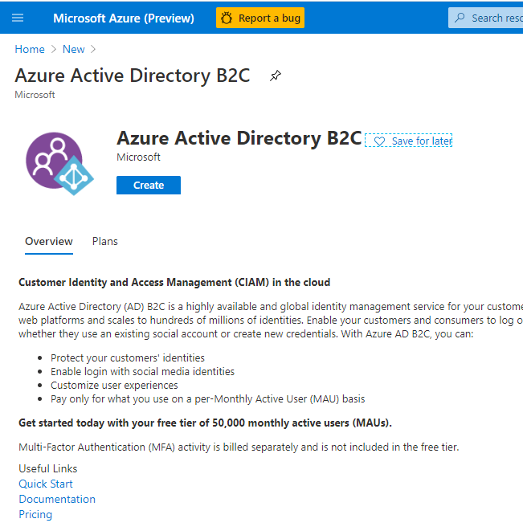

Select the first option Create a new Azure AD B2C Tenant. (In this tutorial, we will want to manage our users in a separate isolated tenant)

You should see something similar to the below image:


Select Create a directory. You can give your tenant an Organization Name and a Domain, that will be used in the user flows that we mentioned above (Sign In, Sign out etc...)

You should see something similar to the below image:


Confirm your settings and select Create, this will take a few minutes to provision

You should see something similar to the below image:


In the top right, toggle directories and select your newly created Directory/Tenant

You should see something similar to the below image:

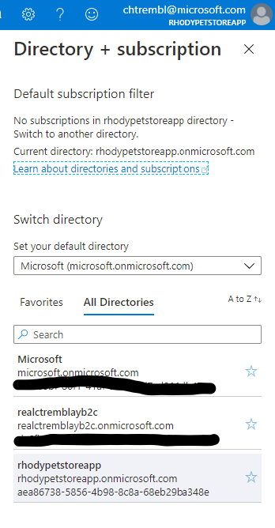

Once you are in the new directory, search for Azure Active Directory

You should see something similar to the below image:

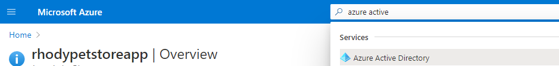

This will show you the details of your newly created Directory/Tenant

You should see something similar to the below image:


Select App Registrations

You should see something similar to the below image:


Register the Azure Pet Store Application that we are building. Notice the redirect URI, this is Spring Boot Pet Store Application that Azure will send request(s) to. You may want to use http://localhost:8080 if you are testing locally. I have the Azure Pet Store Application running in an Azure Container already, hence the reason for not using localhost.

You should see something similar to the below image:

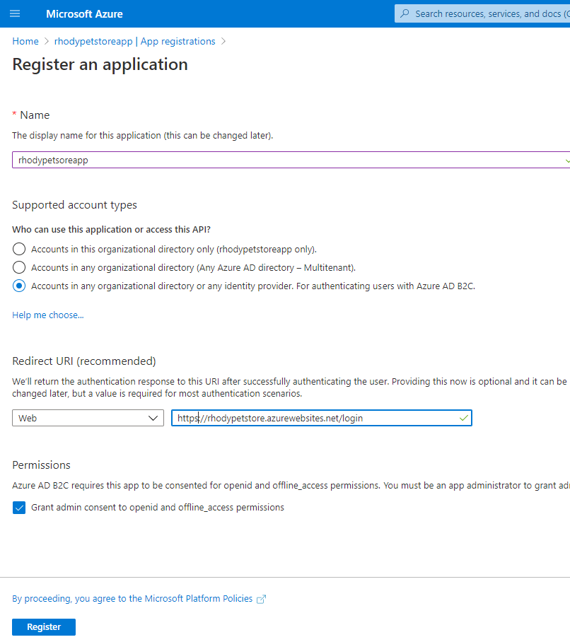

> 📝 Please Note, After registering, take note of the meta data, you will need this when configuring the Spring Boot Application

You should see something similar to the below image:


To further configure and view users etc... search for Azure AD B2C (Note, you could of also done the previous registration through this flow as well)

You should see something similar to the below image:


Select Applications (Legacy)

You should see something similar to the below image:

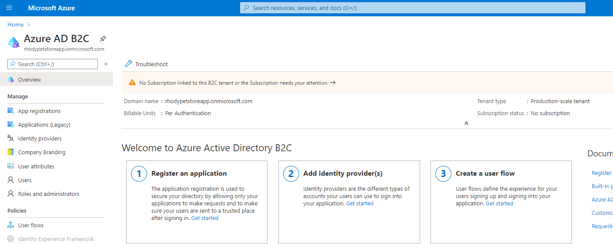

You will notice the application "rhodypetstoreapp" from the registration previously created above. Select it.

You should see something similar to the below image:

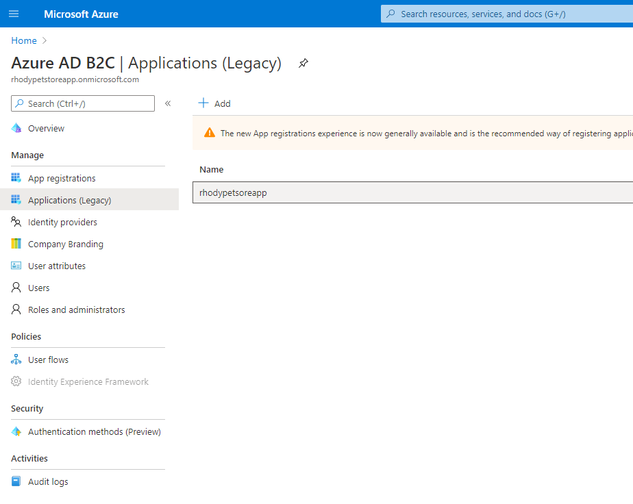

Select Yes for Web App (We are configuring for an externally facing Spring Boot Pet Store Application) and Yes for implicit flow to ensure our Spring Boot Pet Store Application can use Open Id Connect to Sign In.

You should see something similar to the below image:


Select Keys and Generate Key

> 📝 Please Note, Keep your newly generated key handy, you will not see it again, and will need it when configuring the Azure Pet Store Spring Boot Application

You should see something similar to the below image:

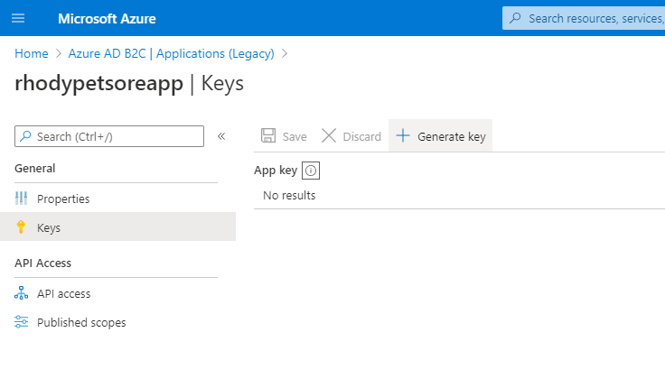

Select User Flows, here you will create 3 flows (Sign Up/Sign In, Profile Editing and Password Reset) These are the flows that are being offloaded to Azure Identity Management.

You should see something similar to the below image:


Go through all three flows below, and select the User Claims necessary. This is the meta data associated with each user. I have selected all, for tutorial purposes, and display all claims within the Azure Pet Store Spring Boot Application.

You should see something similar to the below image:


Enter a name for each flow and create, here we are using "signupsignin", this will get referenced in the Azure Pet Store Application

You should see something similar to the below image:

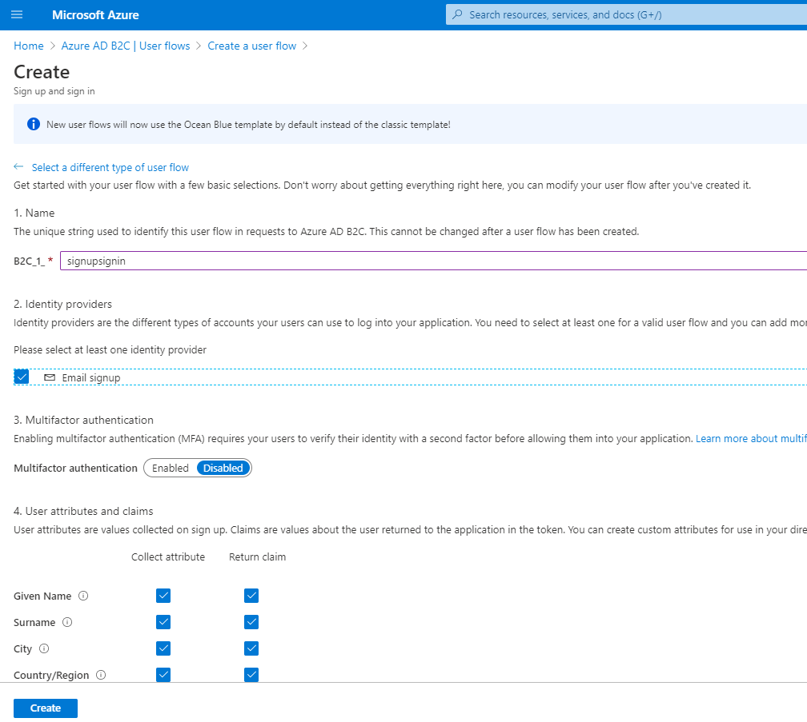

Enter a name for each flow and create, here we are using "profileediting", this will get referenced in the Azure Pet Store Application

You should see something similar to the below image:

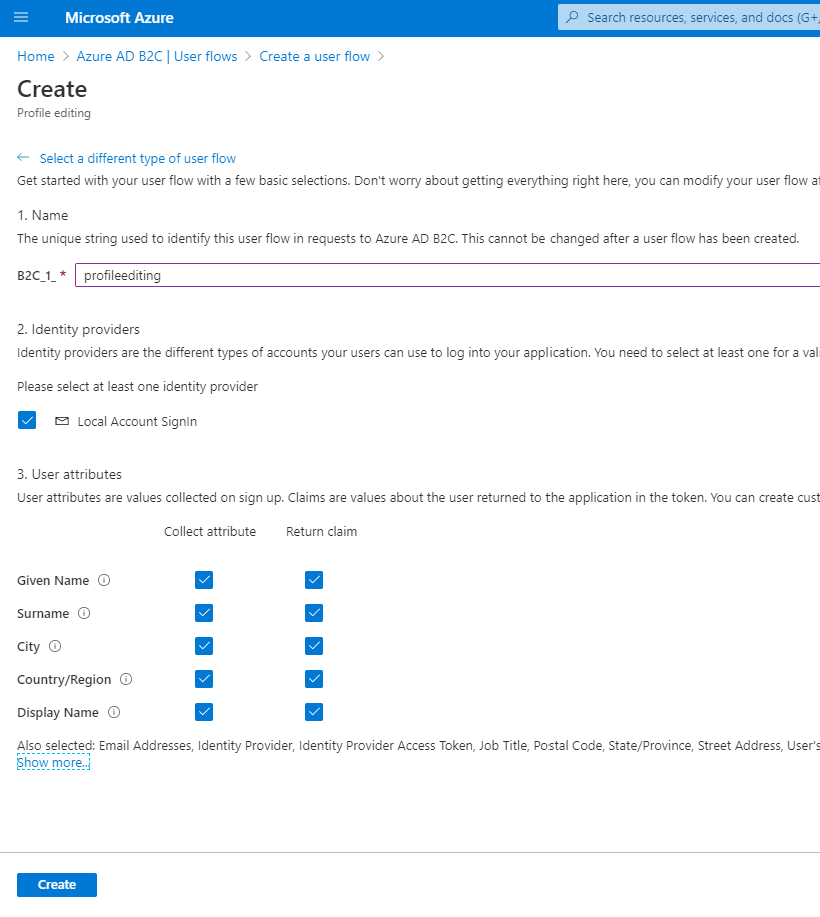

Enter a name for each flow and create, here we are using "passwordreset", this will get referenced in the Azure Pet Store Application

You should see something similar to the below image:


## 3. Configure the Spring Boot Application to properly authenticate sign-up, sign-in and edit users

Since we are not managing identity ourselves, we can avoid configuring Spring Security to use Pre Authentication and configuring an Authentication Manager ourselves etc... Instead we can just @EnableSpringSecurity and wire up the and AADB2COidcLoginConfigurer
inside our WebSecurityConfigurerAdapter. By doing so, on successful Sign Ins, Azure will send along grant type and code to our Azure Pet Store Application and the Spring Security/Filter Chain Flow will grab these values and request/construct tokens for us. With the JWT token, we have access to the claims managed by Azure Active Directory.

In no particular order, you will want to add the following to your newly generated Petstore Pet Store Spring Boot Application.

You can also fork/clone the completed project from [https://github.com/chtrembl/azure-cloud/tree/main/petstore/petstoreapp](https://github.com/chtrembl/azure-cloud/tree/main/petstore/petstoreapp)

Create WebSecurityConfiguration.java as seen below. This will wire up the Microsoft AADB2COidcLoginConfigurer as our security configurer and resolve our Azure flows for us. The other unique thing to notice is the configure methods. Our Azure Pet Store Application will have 2 publicly accessible pages (login landing page and the dogbreeds page configured in our HttpSecurity) and all others will require authentication. We also need to permit all access to our static resources (configured in our WebSecurity) as they are used by the publicly accessible login landing page. The Azure Pet Store Presentation was built with Bootstrap, hence the need to permit that. CSRF is disabled for this tutorial, however it is not advised to disable CSRF in a real live application (internal or external).

```java
package com.chtrembl.petstoreapp.security;

import org.slf4j.Logger;
import org.slf4j.LoggerFactory;
import org.springframework.beans.factory.annotation.Autowired;
import org.springframework.security.config.annotation.web.builders.HttpSecurity;
import org.springframework.security.config.annotation.web.builders.WebSecurity;
import org.springframework.security.config.annotation.web.configuration.EnableWebSecurity;
import org.springframework.security.config.annotation.web.configuration.WebSecurityConfigurerAdapter;

import com.chtrembl.petstoreapp.model.ContainerEnvironment;

@EnableWebSecurity
public class WebSecurityConfiguration extends WebSecurityConfigurerAdapter {
	private static Logger logger = LoggerFactory.getLogger(WebSecurityConfiguration.class);

	@Autowired(required = false)
	private AADB2COidcLoginConfigurerWrapper aadB2COidcLoginConfigurerWrapper = null;

	@Autowired
	private ContainerEnvironment containeEnvironment;

	@Override
	public void configure(WebSecurity web) throws Exception {
		if (this.aadB2COidcLoginConfigurerWrapper != null
				&& this.aadB2COidcLoginConfigurerWrapper.getConfigurer() != null) {
			web.ignoring().antMatchers("/content/**");
		}
	}

	@Override
	protected void configure(HttpSecurity http) throws Exception {

		if (this.aadB2COidcLoginConfigurerWrapper != null
				&& this.aadB2COidcLoginConfigurerWrapper.getConfigurer() != null) {

			http.authorizeRequests().antMatchers("/dogbreed*").permitAll().antMatchers("/login").permitAll()
					.anyRequest().authenticated().and().apply(this.aadB2COidcLoginConfigurerWrapper.getConfigurer())
					.and().oauth2Login().loginPage("/login").and().csrf().disable();

			this.containeEnvironment.setSecurityEnabled(true);
		} else {
			logger.warn(
					"azure.activedirectory.b2c.tenant, azure.activedirectory.b2c.client-id, azure.activedirectory.b2c.client-secret and azure.activedirectory.b2c.logout-success-url must be set for Azure B2C Authentication to be enabled, considering configuring Azure B2C App Registration if you would like to authenticate users.");
		}
	}
}
```

Create WebController.java as seen below. There are 2 GET request mapping handlers, login (public landing) and everything else, that in this case, will just route to the home Thymeleaf view. We also use @ModelAttribute to initializeModel on each Threads incoming GET Request. This will ensure that each Thymeleaf view has User Claims, if they exist.

```java
package com.chtrembl.petstoreapp.controller;

import org.springframework.security.oauth2.client.authentication.OAuth2AuthenticationToken;
import org.springframework.security.oauth2.core.user.OAuth2User;
import org.springframework.stereotype.Controller;
import org.springframework.ui.Model;
import org.springframework.web.bind.annotation.GetMapping;
import org.springframework.web.bind.annotation.ModelAttribute;

@Controller
public class WebController {

	@ModelAttribute
	public void initializeModel(Model model, OAuth2AuthenticationToken token) {
		if (token != null) {
			final OAuth2User user = token.getPrincipal();

			model.addAttribute("grant_type", user.getAuthorities());
			model.addAllAttributes(user.getAttributes());
		}
	}

	@GetMapping(value = "/login")
	public String login() {
		return "login";
	}

	@GetMapping(value = "/*")
	public String home(Model model, OAuth2AuthenticationToken token) {
		return "home";
	}
}
```

You will also notice header.html that presents a Welcome Guest, and prompts visitors to sign/up sign in, along with any other public accessible content. There is a home.html that is used for all authenticated requests, which presents user claims for this tutorial, among other links to Update Profile, Reset Password and Logout. Since we know about authenticated users, we can display a friendly message.

```
<nav class="my-2 my-md-0 mr-md-3">
    Welcome <span th:text="${userName}">
</nav>
<div th:if="${user} != null">
    <a class="p-2 text-dark"
        href="/oauth2/authorization/B2C_1_profileediting">Edit Profile</a>
    <a class="p-2 text-dark"
        href="/oauth2/authorization/B2C_1_passwordreset">Reset Password</a>
    <a class="p-2 text-dark" href="/claims">View AD Claims</a>
    <form style="display: inline" method="post" action="/logout">
        <button class="btn btn-outline-primary" type="submit">Log
            out</button>
    </form>
</div>
<div th:if="${user} == null">
    <div th:if="${containerEnvironment.securityEnabled}">
        <a class="btn btn-outline-primary" href="/oauth2/authorization/B2C_1_signupsignin">Sign up / Sign in</a>
    </div>
</div>
```

Lastly, you will need to update your application.properties or application.yml, this is the place where your configurations lives (ideally we would externalize this in a real application such as Spring Cloud Config). You can use the snippet below filling in the blanks. Use tenant. client-id from the screenshots above. client-secret will be the generated key that you saved earlier. The url's will be localhost for local development or fully qualified for Cloud deployments.

```yaml
#logging:
#  level:
#    org.springframework.security: DEBUG
azure:
  activedirectory:
    b2c:
      tenant: ${PETSTOREAPP_B2C_TENANT}
      oidc-enabled: true
      client-id: ${PETSTOREAPP_B2C_CLIENT_ID}
      client-secret: ${PETSTOREAPP_B2C_CLIENT_SECRET}
      reply-url: ${PETSTOREAPP_B2C_REPLY_URL}
      logout-success-url: ${PETSTOREAPP_B2C_LOGOUT_URL}
      user-flows:
        sign-up-or-sign-in: B2C_1_signupsignin
        profile-edit: B2C_1_profileediting
        password-reset: B2C_1_passwordreset
```

Update your Azure Pet Store App Configuration to reflect these new properties as well.

You should see something similar to the below image:

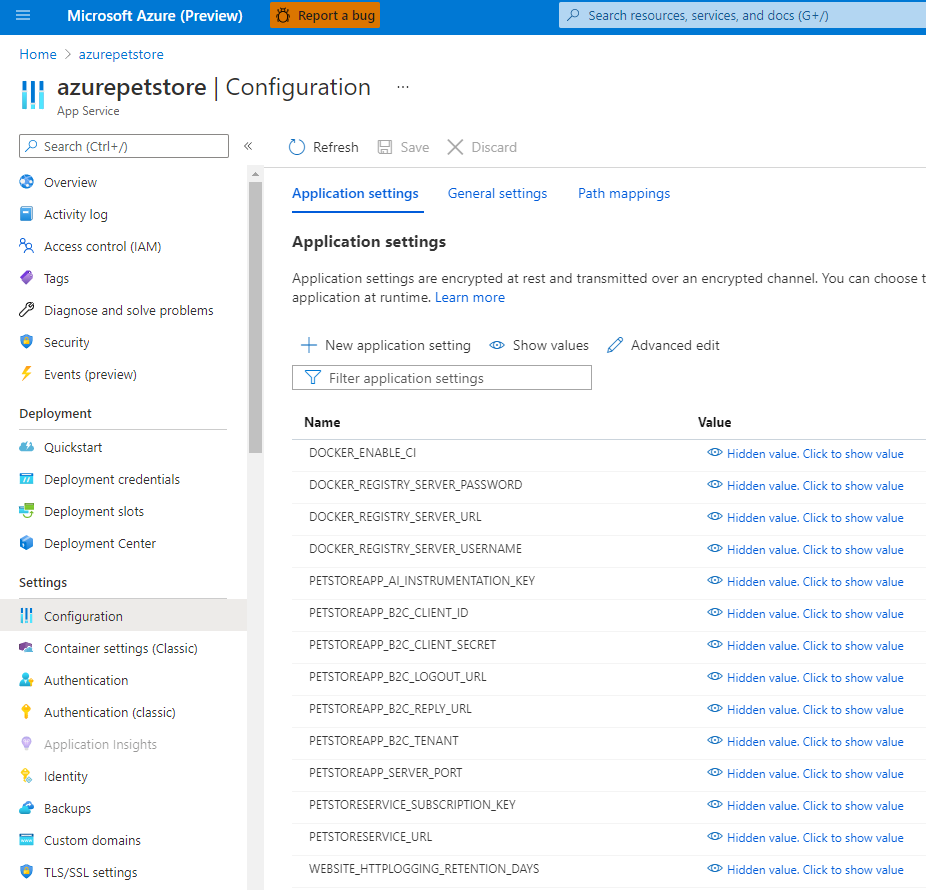

## 4. Demo

Head to your Azure Pet Store App

You should see something similar to the below image:

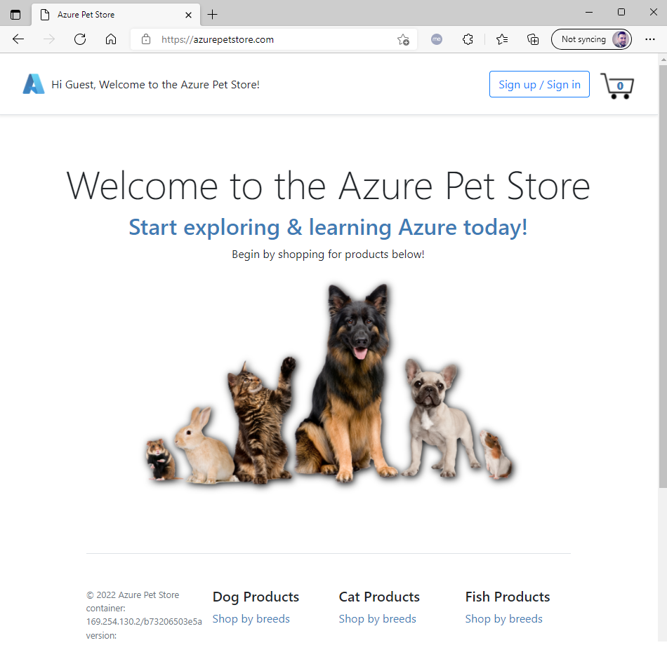

Sign in flow (new user registration as well)

> 📝 Please Note, you can customize this in Azure to use your own .css etc...

Fill out and submit...

You should see something similar to the below image:

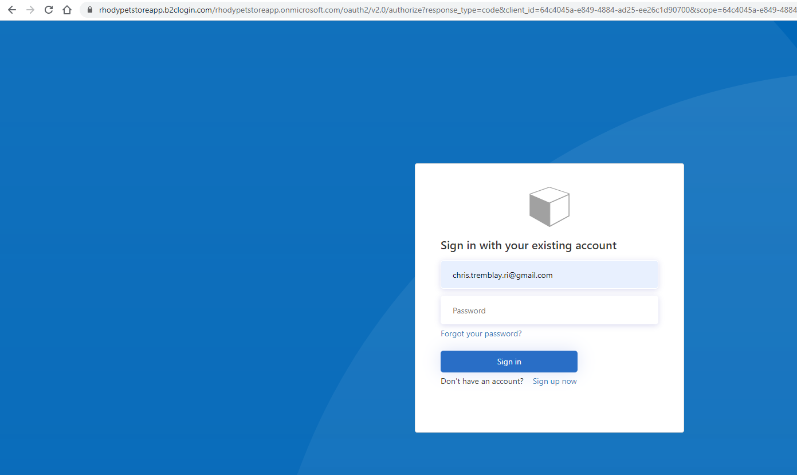

You should see something similar to the below image:

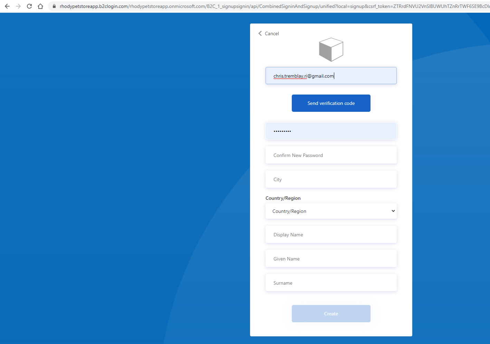

You should see something similar to the below image:

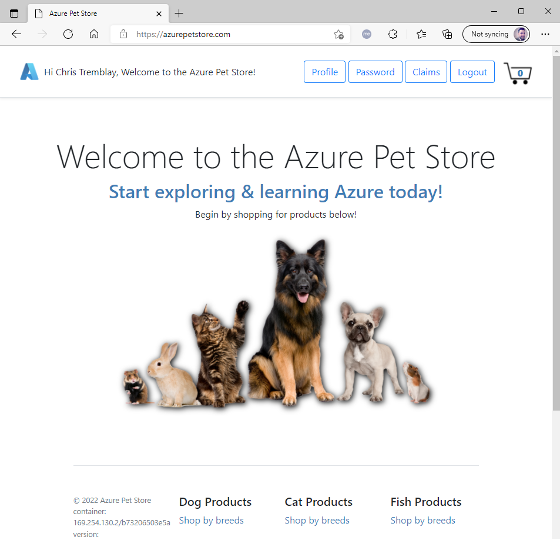

Back in Azure Portal you can view the registered users in your App Registration

You should see something similar to the below image:

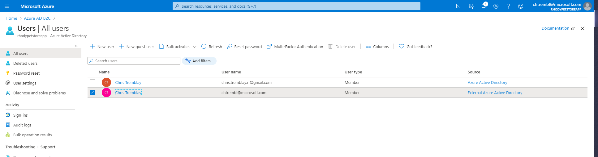

Things you can now do now with this guide

☑️ Configuring Azure Active Directory B2C within your application

➡️ Next guide: [11 - Configure Azure DevOps Pipeline for CI/CD into Azure Databricks](../11-configure-ado-pipeline-for-ci-cd-into-databricks/README.md)
