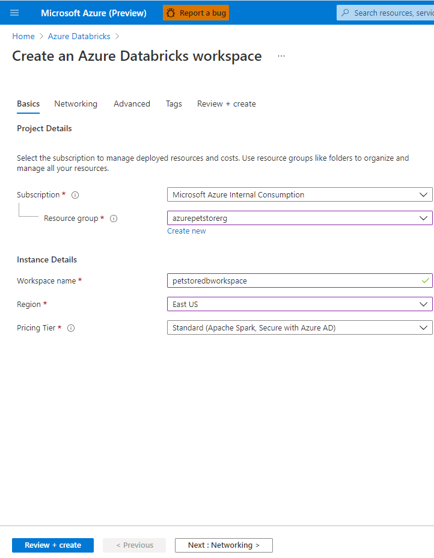

# 11 - Configure Azure DevOps Pipeline for CI/CD into Azure Databricks

__This guide is part of the [Azure Pet Store App Dev Reference Guide](../README.md)__

In this section, we'll Configure Azure DevOps Pipeline for CI/CD into Azure Databricks

> 📝 Please Note, We will assume you have forked the azure-cloud repository, it is the easiest way to get going (for instructions on this view the "**Forking the azure-cloud**" section in [00-setup-your-environment](../00-setup-your-environment/README.md). Also, both PetStoreApp and PetStoreService use a Spring Boot Application properties file named application.yml to drive the functionality/configuration of these applications which is located in src/main/resources/application.yml of both projects. By default, this file has all of the properties that are needed throughout the guides, and by default are commented out. This means that the applications will start automatically without having to configure anything. As you progress through the guides, each guide will inform you of what properties to uncomment and configure within your environment. If you have not already done so, login to your GitHub account, head to https://github.com/chtrembl/azure-cloud, and fork.

Into Here

> 📝 Please Note

You should see something similar to the below image:

Things you can now do now with this guide

☑️ Configuring Azure Active Directory B2C within your application
