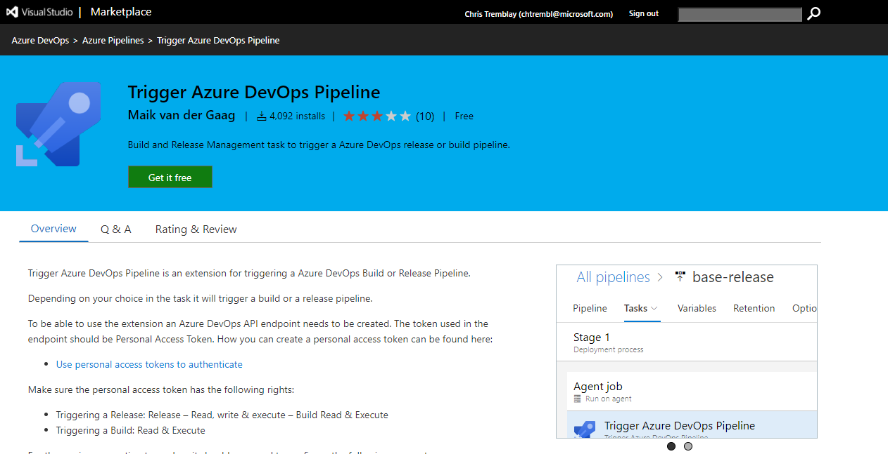
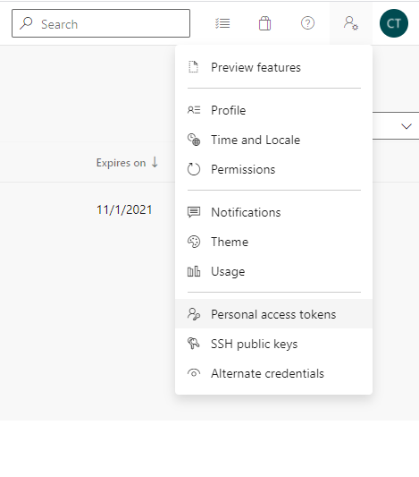
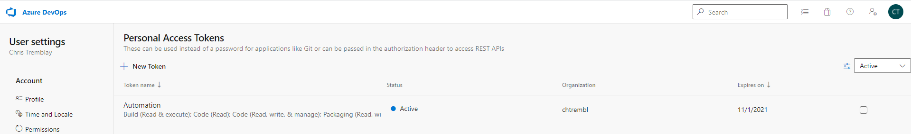
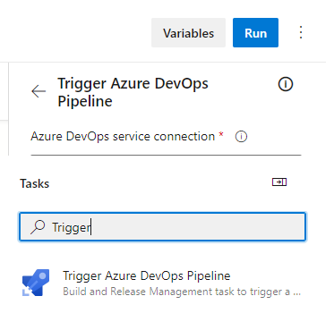
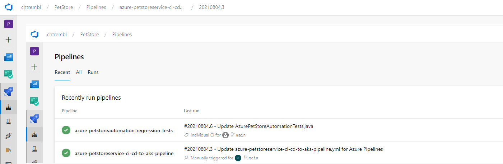
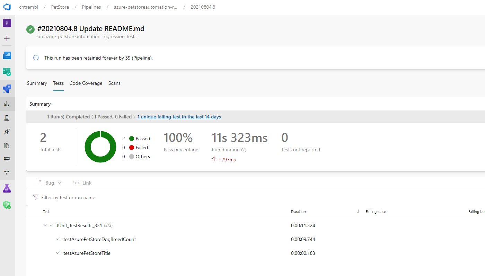

# 12 - Configure Azure DevOps pipelines to execute automated regression tests

**This guide is part of the [Azure Pet Store App Dev Reference Guide](../README.md)**

> 📝 **Please Note, As with the other guides, the code for this is already complete, it just needs to be enabled via application configuration. The objective of this guide is to walk you through the steps needed to enable & configure the Azure services and Pet Store Application code to make this all of this work.**

In the previous guides we've looked at the steps needed to deploy our live Pet Store Application which can be found here [https://azurepetstore.com/](https://azurepetsore.com/). However, we haven't yet looked at automated regression testing and how that fits into this application. Suppose there is a QA team responsible for testing this Pet Store Application. Perhaps this team is responsible for writing end to end tests which smoke test the application, perform synthetic monitoring and/or verify the UI and all of the functionality of the web application and down stream service(s) is in fact working as expected. This guide will look at the steps needed to write tests (using Selenium & JUnit) and execute upon successful deployment of the Pet Store Application, acting as the automated regression suite after each and every deployment. For thus we will create a separate project that will trigger independently of the production Pet Store Application code.

> 📝 Please Note, this automation tests can be written in many different languages, the objective of this guide is to walk through the steps needed to execute your tests from an Azure DevOps Pipeline upon success of an application deployment, You can also execute these regression tests on a schedule if you prefer, for example, you may want to execute daily/hourly etc... to ensure your application is performing as expected, all of which is possible with Azure DevOps as well. For the sake of this guide, we will be triggering upon success of an application deployment.

**Step 1**
The following petstoreautomation project https://github.com/chtrembl/azure-cloud/tree/main/petstore/petstoreautomation contains the tests needed for Pet Store Application. If you inspect https://github.com/chtrembl/azure-cloud/blob/main/petstore/petstoreautomation/src/test/java/petstore/automation/AzurePetStoreAutomationTests.java you will see the following:

```java
package petstore.automation;

import static org.junit.Assert.assertEquals;

import org.junit.Test;
import org.openqa.selenium.By;
import org.openqa.selenium.WebElement;
import org.openqa.selenium.htmlunit.HtmlUnitDriver;

/**
 * Automation Tests for Azure Pet Store
 */
public class AzurePetStoreAutomationTests {

	private HtmlUnitDriver unitDriver = new HtmlUnitDriver();

	private String URL = "https://azurepetstore.com/";

	private String DOG_BREEDS = "Afador,American Bulldog,Australian Retriever,Australian Shepherd,Basset Hound,Beagle,Border Terrier,Boston Terrier,Bulldog,Bullmastiff,Chihuahua,Cocker Spaniel,German Sheperd,Labrador Retriever,Pomeranian,Pug,Rottweiler,Shetland Sheepdog,Shih Tzu,Toy Fox Terrier";

	@Test
	// Test the Azure Pet Store App Title
	public void testAzurePetStoreTitle() {
		this.unitDriver.get(this.URL);
		System.out.println("Title of the page is -> " + this.unitDriver.getTitle());
		assertEquals("Azure Pet Store", this.unitDriver.getTitle());
	}

	@Test
	// Test the Azure Pet Store App Dog Breed Page and Downstream Azure Pet Store
	// Service / Dog Breed API
	public void testAzurePetStoreDogBreedCount() {
		this.unitDriver.get(this.URL + "dogbreeds?category=Dog");
		WebElement element = this.unitDriver.findElement(By.className("table"));
		String dogBreedsFound = new String(element.getText()).trim().replaceAll("\n", ",");
		System.out.println("Dog Breeds found in the page -> " + dogBreedsFound);
		assertEquals(this.DOG_BREEDS, dogBreedsFound);
	}
}
```

Using the Junit framework, we can run assertions on various scenarios and HtmlUnitDriver will allow us to execute web requests in a headless browser and easily inspect HTML. For the sake of this guide, I have written two tests:

**testAzurePetStoreTitle**
**testAzurePetStoreDogBreedCount**

Both of these tests will assert (true/false) based on the condition that has been written.

**testAzurePetStoreTitle** will assert that the https://azurepetstore.com homepage returns with an expected title.

**testAzurePetStoreDogBreedCount** will assert that the https://azurepetstore.com/ page will return with the expected 20 dog breeds, which effectively asserts that the application is running along with the downstream service that is responsible for providing the dog breeds.

> 📝 Please Note, ideally you would have a full suite of tests here meeting all of your business acceptance test criteria etc...

We could certainly ask maven to execute these tests locally

```
mvn clean test
[INFO] Tests run: 2, Failures: 0, Errors: 0, Skipped: 0, Time elapsed: 7.521 s - in petstore.automation.AzurePetStoreAutomationTests
[INFO]
[INFO] Results:
[INFO]
[INFO] Tests run: 2, Failures: 0, Errors: 0, Skipped: 0
[INFO]
[INFO] ------------------------------------------------------------------------
[INFO] BUILD SUCCESS
[INFO] ------------------------------------------------------------------------
[INFO] Total time:  13.842 s
[INFO] Finished at: 2021-08-04T10:35:35-04:00
[INFO] ------------------------------------------------------------------------
```

However, we can take this further by way of automation and trigger these automagically.

**Step 2**
Install/Configure the Trigger Plugin within Azure DevOps

Head to Azure DevOps Marketplace and install the Trigger Plugin Task to your organization, if you have not already done so.

You should see something similar to the below image:



Create a Personal Access Token, this will be needed for the Service Connection that we will be creating.

You should see something similar to the below image:



I've named mine "Automation" and expires in 90 days.

You should see something similar to the below image:



Within your organization create a new Service Connection, this will allow the Pet Store Application CI/CD build "Trigger" the Pet Store Automation Build.

You should see something similar to the below image:


Create the azure-petstore-automation-tests.yml pipeline manifest as seen here https://github.com/chtrembl/azure-cloud/blob/main/manifests/azure-petstore-automation-tests.yml (or use the following from your fork/clone)

```yml
# Deploy to Azure Kubernetes Service
# Build and push image to Azure Container Registry; Deploy to Azure Kubernetes Service
# https://docs.microsoft.com/azure/devops/pipelines/languages/docker

trigger:
  branches:
    include:
    - main
  paths:
    include:
    - petstore/petstoreautomation/*

resources:
- repo: self

stages:
- stage: Build
  displayName: Build & Test Stage
  jobs:
  - job: Automation
    displayName: Build & Execute Automated Regression Tests
    pool:
      vmImage: 'ubuntu-latest'
    steps:
    - task: Maven@3
      continueOnError: true
      displayName: Build & Execute Automated Regression Tests
      inputs:
        mavenPomFile: 'petstore/petstoreautomation/pom.xml'
        mavenOptions: '-Xmx3072m'
        javaHomeOption: 'JDKVersion'
        jdkVersionOption: '8'
        jdkArchitectureOption: 'x64'
        publishJUnitResults: true
        testResultsFiles: 'petstore/petstoreautomation/target/surefire-reports/TEST-*.xml'
        codeCoverageToolOption: 'jaCoCo'
        goals: 'package'

```

On any changes to petstore/petstoreautomation/\* this pipeline will execute, we will also configure it to execute "Trigger" during CI/CD as well. Essentially this pipeline just executes our Maven package which runs our Automation suite.

Update https://github.com/chtrembl/azure-cloud/blob/main/manifests/azure-petstoreservice-ci-cd-to-aks-pipeline.yml to include the Trigger task. You can use the (fork/clone) or create one by searching for the Trigger task. This task will contain the service connection that was previously created and the meta data (project/build/manifest/branch) needed to execute during the CI/CD Application Build.

You should see something similar to the below image:




Prefix this Trigger Task with an Automation Stage. As you will see, their is a 3rd and final stage in the CI/CD Application Build, this stage will "Trigger" the https://github.com/chtrembl/azure-cloud/blob/main/manifests/azure-petstore-automation-tests.yml Pipeline

```yml
- stage: Automation
  displayName: Automation stage
  jobs:
  - job: Automation
    displayName: Automation Testing
    pool:
      vmImage: 'windows-latest'
    steps:
        - task: TriggerPipeline@1
          inputs:
            serviceConnection: 'Automation'
            project: '6b3206dd-90b3-40f6-a611-e5a1e5a13593'
            Pipeline: 'Build'
            buildDefinition: 'azure-petstoreautomation-regression-tests'
            Branch: 'main'
```

Once the CI/CD Pipeline kicks off (manually or automatically when code is submitted to the - petstore/petstoreservice/\* branch the 3 stages will execute. (Notice the new Automation stage)

You should see something similar to the below image:


The Automation stage will then execute the https://github.com/chtrembl/azure-cloud/blob/main/manifests/azure-petstore-automation-tests.yml pipeline manifest.

You should see something similar to the below image:



Once complete you can inspect the Automation Pipeline and view the test report.

You should see something similar to the below image:



Things you can now do now with this guide

☑️ Configure Azure DevOps pipelines to execute automated regression tests

➡️ Next guide: [13 - Build and Deploy Azure Functions](../13-build-deploy-azure-functions/README.md)
