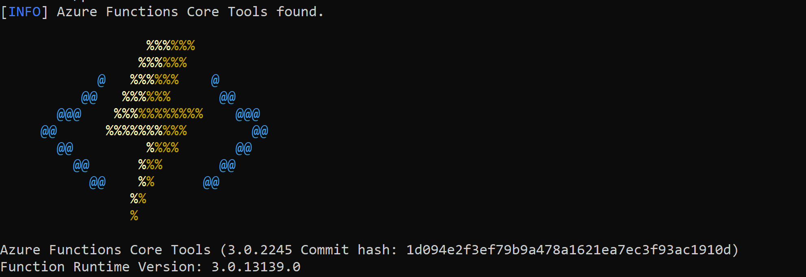

# 13 - Build and Deploy Azure Functions

__This guide is part of the [Azure Pet Store App Dev Reference Guide](../README.md)__

In this section we'll look at how to develop an Azure Function App with Java and Build/Deploy it to Azure Container Registry/Function App Service.

Azure Functions is a serverless solution that allows you to write less code, maintain less infrastructure, and save on costs. Instead of worrying about deploying and maintaining servers, the cloud infrastructure provides all the up-to-date resources needed to keep your applications running. In this guide we will build an Azure function to pull/transform data to be used by other components within the Azure Pet Store.

We will add a method called getApplicationInsightsTelemetry that pulls ApplicationInsights Telemetry and transforms/reduces it to data that a Power App can consume. We will build this method to consume data based in a time interval passed to it.

> 📝 **Please Note, we assume you have completed the  [Configure Apps to use Application Insights](https://stackedit.io/08-configure-apps-to-use-application-insights/README.md)  guides and have a working Application Insights service that can be used by this Azure Function App.**

> **📝 Please Note, as a prerequisite you will want to install the Azure Functions Core Tools to provide a local development experience for creating, developing, testing, running, and debugging Azure Functions. https://github.com/Azure/azure-functions-core-tools At the time of this document I am using v3.** 

## 1. Use Maven to create the scaffolding for our new Azure Function App project

 Using [azure-functions-archetype](https://github.com/microsoft/azure-maven-archetypes/tree/develop/azure-functions-archetype) we can instruct Maven to generate a fully functional Java project that contains all of the scaffolding needed to get started with developing Azure Functions. This document assumes you already have [Azure Functions Core Tools](https://github.com/Azure/azure-functions-core-tools) installed, which is needed for local testing. We will also generate a Dockerfile here as well.

   ```xml
    mvn archetype:generate -B \
    -DarchetypeGroupId="com.microsoft.azure" \
    -DarchetypeArtifactId="azure-functions-archetype" \
    -Dversion="1.0-SNAPSHOT" \
    -DgroupId="com.chtrembl.petstore" \
    -DartifactId="petstorefunctions"
    -Ddocker
   ```

## 2. Import this project into your IDE of choice. If you inspect the pom.xml you will notice the Azure plugins that allow us to test our function code locally, executing as we would normally within Azure.

  ```xml
    <plugin>
        <groupId>com.microsoft.azure</groupId>
        <artifactId>azure-functions-maven-plugin</artifactId>
        <version>${azure.functions.maven.plugin.version}</version>
        ...

  ```
  If you inspect Function.java you will see a scaffolded Java class with an auto generated function for you to get started with.  This interface com.microsoft.azure.functions.annotation.FunctionName, allows us to start writing our code that will ultimately be managed as an Azure Function App. This example function is using an HttpTrigger, which tells Azure Function App to execute it on any incoming, anonymous HTTP GET or POST request.
  
   ```java
    @FunctionName("HttpExample")
    public HttpResponseMessage run(
            @HttpTrigger(
                name = "req",
                methods = {HttpMethod.GET, HttpMethod.POST},
                authLevel = AuthorizationLevel.ANONYMOUS)
                HttpRequestMessage<Optional<String>> request,
            final ExecutionContext context) {
        context.getLogger().info("Java HTTP trigger processed a request.");

        // Parse query parameter
        final String query = request.getQueryParameters().get("name");
        final String name = request.getBody().orElse(query);

        if (name == null) {
            return request.createResponseBuilder(HttpStatus.BAD_REQUEST).body("Please pass a name on the query string or in the request body").build();
        } else {
            return request.createResponseBuilder(HttpStatus.OK).body("Hello, " + name).build();
        }
    }
  ```
 
 ## 3. Let's use the the maven plugin to build/run our Azure Function App locally.
 
  ```
  mvn clean package
  mvn azure-functions:run
  ```
  You should see the following:
  

  
   ```
   curl http://localhost:7071/api/HttpExample?name=Hello%20PetStore%20Shopper
   Hello, Hello PetStore Shopper
   ```
   
 ## 4. Let's build a Docker Image for our Azure Function App

Create a Docker file in the root of your project with the following contents:

```docker
ARG JAVA_VERSION=11
# This image additionally contains function core tools – useful when using custom extensions
#FROM mcr.microsoft.com/azure-functions/java:3.0-java$JAVA_VERSION-core-tools AS installer-env
FROM mcr.microsoft.com/azure-functions/java:3.0-java$JAVA_VERSION-build AS installer-env

COPY . /src/java-function-app
RUN cd /src/java-function-app && \
    mkdir -p /home/site/wwwroot && \
    mvn clean package && \
    cd ./target/azure-functions/ && \
    cd $(ls -d */|head -n 1) && \
    cp -a . /home/site/wwwroot

# This image is ssh enabled
FROM mcr.microsoft.com/azure-functions/java:3.0-java$JAVA_VERSION-appservice
# This image isn't ssh enabled
#FROM mcr.microsoft.com/azure-functions/java:3.0-java$JAVA_VERSION

ENV AzureWebJobsScriptRoot=/home/site/wwwroot \
    AzureFunctionsJobHost__Logging__Console__IsEnabled=true

COPY --from=installer-env ["/home/site/wwwroot", "/home/site/wwwroot"]
```

Build the Docker Image  
```
docker build -t petstorefunctions .
   ```

Now you should have your Docker Image locally for your Azure Function App

```bash
chtrembl@12549493-0302:/git/azure-cloud/petstore/petstorefunctions$ docker image ls
REPOSITORY              TAG                     IMAGE ID            CREATED              SIZE
petstorefunctions       latest                  e69bf617db33        33 seconds ago       1.09GB
```

Run/Test the Docker Image.

```
docker run -p 8080:80 -it petstorefunctions:latest
 
curl http://localhost:8080/api/HttpExample?name=Hello%20PetStore%20Shopper
Hello, Hello PetStore Shopper
```

 ## 5. Let's add some meaningful logic to our Azure Function App, something we can use within the Azure Pet Store Architecture
 
We will add a method called getApplicationInsightsTelemetry that pulls ApplicationInsights Telemetry and transforms/reduces it to data that a Power App can consume.  We will build this method to consume data based in a time interval passed to it.
 
 > 📝 Please Note,  we assume you have completed the [Configure Apps to use Application Insights](../08-configure-apps-to-use-application-insights/README.md) guides and have a working Application Insights service that can be used by this Azure Function App.

Create a Application Insights App Key and make not if it along with your app

  You should see the following:
  
  
  
  
  
```
protected String getApplicationInsightsTelemetry(String minsAgo) {

		String sessionsJson = "";

		Map<Object, Object> data = new HashMap<>();
		data.put("query",
				"traces | where timestamp > ago(2m) | summarize Traces = count() by tostring(customDimensions.session_Id)");

		HttpRequest request = HttpRequest.newBuilder()
				.POST(BodyPublishers.ofString("{\"query\":\"traces | where timestamp > ago(" + minsAgo
						+ ") | summarize Traces = count() by tostring(customDimensions.session_Id)\"}"))
				.uri(URI.create("https://api.applicationinsights.io/v1/apps/" + Function.APP_ID + "/query"))
				.setHeader("x-api-key", Function.API_KEY).setHeader("Content-Type", "application/json").build();

		HttpResponse<String> response = null;
		String responseBody = "";
		try {
			response = Function.HTTP_CLIENT.send(request, HttpResponse.BodyHandlers.ofString());
			responseBody = response.body();
		} catch (IOException | InterruptedException e) {
			e.printStackTrace();
			return "{\"error\":\"Exception getting response body\"}";
		}

		try {
			JsonNode root = Function.OBJECT_MAPPER.readTree(responseBody);
			JsonNode sessions = root.path("tables").findPath("rows");

			Map<String, Integer> payload = new HashMap<>();

			sessions.forEach(jsonNode -> {
				String sessionId = ((ArrayNode) jsonNode).get(0).toString().trim();
				Integer requestCount = Integer.valueOf(((ArrayNode) jsonNode).get(1).toString());

				// session id's are 34 characters in length
				if (sessionId.length() == 34) {
					payload.put(sessionId, requestCount);
				}
			});

			sessionsJson = Function.OBJECT_MAPPER.writeValueAsString(payload);
		} catch (JsonProcessingException e) {
			e.printStackTrace();
			return "{\"error\":\"Exception mapping response body\"}";
		}

		System.out.println(sessionsJson);

		return sessionsJson;
	}
```

 > 
 - Push the Docker Image to your Azure Container Registry.
  ```
  az acr build --file Dockerfile --registry petstorecr --image petstorefunctions .
  ``` 
  If you head to the Azure Portal Container Registry you will see your image.
  
 
 - Create a Resource Group for your Functions.
  ```
  az group create --name PetStoreFunctionsRG  --location eastus
  ``` 
 - Create a Plan for your Functions, you can ready about Function [pricing here](az%20functionapp%20plan%20create%20--resource-group%20PetStoreFunctionsRG%20--name%20PetStoreFunctionsPlan%20--location%20eastus%20--number-of-workers%201%20--sku%20EP1%20--is-linux), I am using Elastic Premium 1 on a Linux Container. You may choose to run with the Servlerless option if cold starts are acceptable for your scenario.
  ```
  az functionapp plan create --resource-group PetStoreFunctionsRG --name PetStoreFunctionsPlan --location eastus --number-of-workers 1 --sku EP1 --is-linux
  ``` 
 - Create a Storage Account.
  
  ***Note, On any plan, a function app requires a general Azure Storage account, which supports Azure Blob, Queue, Files, and Table storage. This is because Azure Functions relies on Azure Storage for operations such as managing triggers and logging function executions...***

  ```
  az storage account create --name petstorestorage --location eastus --resource-group PetStoreFunctionsRG --sku Standard_LRS
  ``` 
 -  Create and Configure your Function App.
   ```
   az functionapp create --name PetStoreFunctions --storage-account petstorestorage --resource-group PetStoreFunctionsRG --plan PetStoreFunctionsPlan --deployment-container-image-name petstorefunctions:latest
   ```
 - You can then head to the Azure Portal to review your Function App. You can also configure Continuous Delivery here as well.

   
 - Head to Overview and grab the URL for your Function App.
 
    
 - Test your Function App.
   ```
  curl https://petstorefunctions.azurewebsites.net/api/HttpExample?name=Hello%20PetStore%20Shopper
  Hello, Hello PetStore Shopper
  ```

Things you can now do now with this guide

☑️ Configure 
