# 15 - Build a Logic App to send an email when a message is received in a Service Bus topic

**This guide is part of the [Azure Pet Store App Dev Reference Guide](../README.md)**

In this section we'll look at how to develop a Logic App that emails consumers when a message is received in a Service Bus topic. We will be using Service Bus topics to pub/sub messages from the PetStoreOrderService. Once an order is complete, the PetStoreOrderService will publish the order to an "order" topic. The Logic App subscribed to this topic will compose an email with the details and notify the consumer.

> 📝 **Please Note, As with the other guides, the code for this is already complete, it just needs to be enabled via application configuration. The objective of this guide is to walk you through the steps needed to enable & configure the Azure services and Pet Store Application code to make this all of this work.**

First let's set things up in Azure

Head over to https://ms.portal.azure.com/ and sign in.

Lets setup and configure the Service Bus

Search for Service Bus and select "Create" or "Create service bus namespace"

You should see the following:


Give your namespace a name and fill in the other meta data requested. The namespace will be used to locate your Service Bus instance via FQDN. Select "Review and create"

You should see the following:

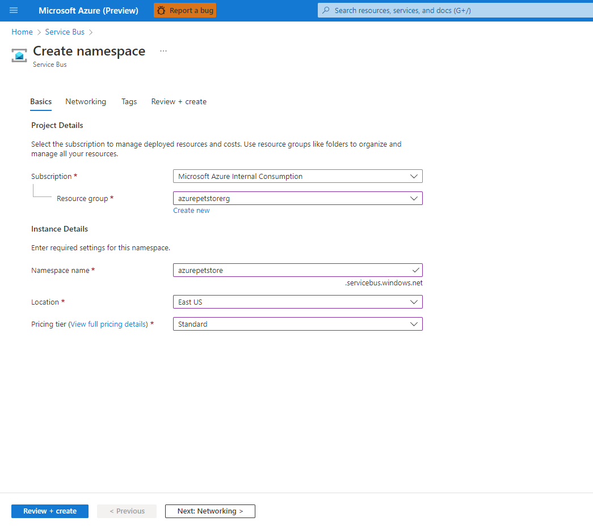

Select "Create"

You should see the following:

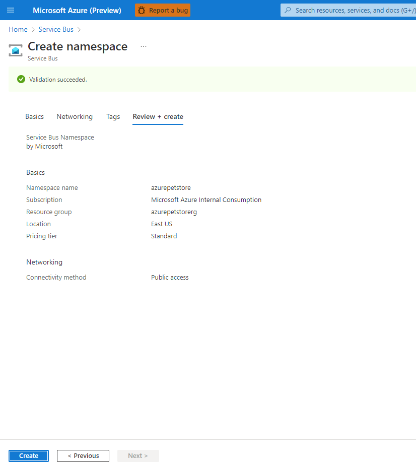

Create a topic for your Service Bus. This is the way in which our PetStorOrderService will communicate with other system(s) (1 to many communication). We are using a topic instead of message queue (1 to 1 communication). Just imagine an order is placed, your PetStoreOrderService may want to use a topic as a way of informing many systems (more than 1) of an order being placed, for example, the logic app needs to send an email, perhaps a fulfillment center system needs to know as well so it can pull the products and so on... Give it a name "orders" and the meta data for which is should need such as message sizing and TTL. For this guide the defaults are fine. Select "Create"

You should see the following:


Create a subscription. This is used for the subscribers, and in our case this is the subscription our Logic App will be using. We will call this "email". You can also specify a max delivery count. In this guide we will choose 1. One message will be sent and that is it. If the Logic App receives it, perfect, it can process it. Otherwise no other attempt will be made. For this guide this is sufficient because we know the logic app will send an email to the consumer every time it has received a message. In a production example you may want to use a higher number, perhaps you have subscribers that are not responding to messages in a timely manner and/or are experiencing technical issues and cannot respond (perhaps the logic app is down etc...), perhaps you'll want to try sending multiple times, at which point when the max attempts has occurred these messages can be moved and inspected/troubleshooted etc... The other defaults are fine.  Select "Create"

You should see the following:

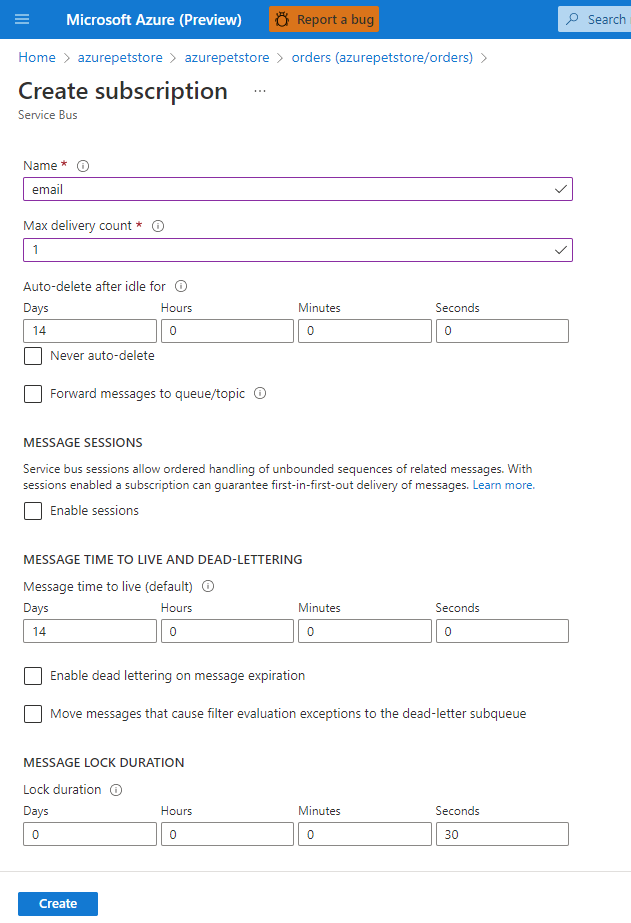

Let's now add a Shared Access Policy (SAS). We need this to establish our connections for the publisher (PetStoreOrderService) and consumer (Logic App).

You should see the following:


Give the SAS a name. I am using "azurepetstore". You can use whichever name you would like. This is where we can control permissions (Send, Receive, Listen). Select "Create"

You should see the following:

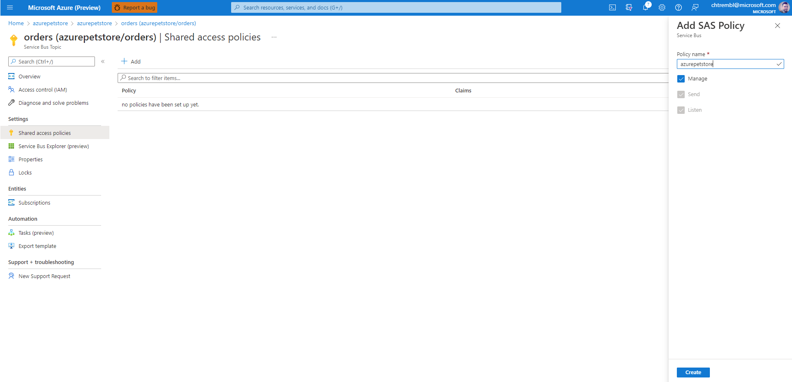

Copy the Connection Strings off somewhere, you will need one of them when you configure your PetStoreOrderService.

You should see the following:


Head back to the Overview page and make note of your Subscription ID, you will need them when you configure your PetStoreOrderService.

You should see the following:

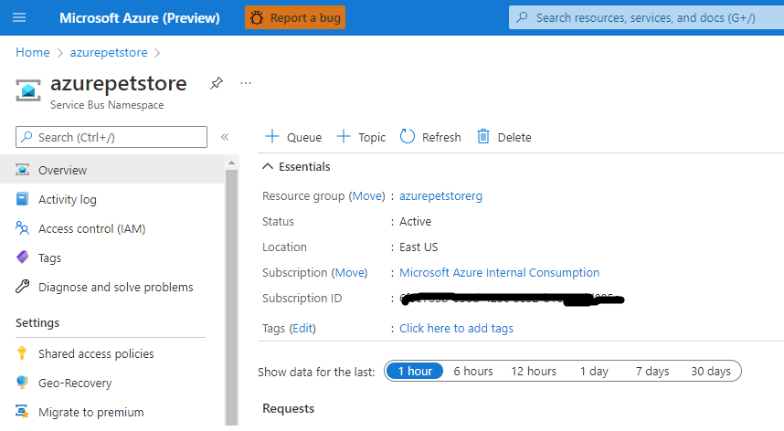

Next you can configure your AKS Cluster and PetStoreOrderService

Locate your petstoreorderservice-deployment-everything-enabled.yml and inspect it. For reference here is the file I am using https://github.com/chtrembl/azure-cloud/blob/main/manifests/petstoreorderservice-deployment-everything-enabled.yml. 

You will need to make sure your passing in ``` ${PETSTOREORDERSERVICE_EMAIL_TOPIC_CONNECTION_STRING}``` and ```${PETSTOREORDERSERVICE_SUBSCRIPTION_ID}``` accordingly. 

You will need to make sure you have 2 more env variables

```yml
    - name: PETSTOREORDERSERVICE_EMAIL_TOPIC_CONNECTION_STRING
    valueFrom:
        secretKeyRef:
        name: emailtopicconnstring
        key: secret
    - name: PETSTOREORDERSERVICE_SUBSCRIPTION_ID
    valueFrom:
        secretKeyRef:
        name: subscriptionid
        key: secret
```

As you recall from previous guides you can create secrets as followed

```kubectl create secret generic emailtopicconnstring --from-literal=secret="<your connection string from earlier>"```

```kubectl create secret generic subscriptionid --from-literal=secret=<your subscription id from earlier>```

> 📝 **Please Note, emailtopicconnstring will need to be wrapped in quotes to protect the connection string.**

Once these secrets are created and you have committed your petstoreorderservice-deployment-everything-enabled.yml changes you can update the application.yml below, as seen below.

Inspect https://github.com/chtrembl/azure-cloud/blob/main/petstore/petstoreorderservice/pom.xml 

This is the Azure Service Bus Spring Boot Starter, based on a couple of application properties this Spring starter will wire up a jmsTemplate bean for you to use and post messages with.

Notice the following:

```xml
<dependency>
    <groupId>com.azure.spring</groupId>
    <artifactId>azure-spring-boot-starter-servicebus-jms</artifactId>
    <version>3.10.0</version>
</dependency>
```

Inspect your application.ynl and make a couple of changes. For reference you can view https://github.com/chtrembl/azure-cloud/blob/main/petstore/petstoreorderservice/src/main/resources/application.yml

You can now comment out the autoconfigure exclude properties abd uncomment the jms properties

Your application.yml should have the following

```yml
spring:
  application:
    name: petstoreorderservice
  #autoconfigure:
    #exclude: com.azure.spring.autoconfigure.jms.ServiceBusJMSAutoConfiguration,org.springframework.boot.autoconfigure.jms.JmsAutoConfiguration,com.azure.spring.#autoconfigure.jms.NonPremiumServiceBusJMSAutoConfiguration,com.microsoft.azure.spring.autoconfigure.jms.ServiceBusJMSAutoConfiguration
  jms:
    servicebus:
      connection-string: ${PETSTOREORDERSERVICE_EMAIL_TOPIC_CONNECTION_STRING}
      pricing-tier: Standard
      topic-client-id: ${PETSTOREORDERSERVICE_SUBSCRIPTION_ID}  
```

With these changes above, these new application properties ``` ${PETSTOREORDERSERVICE_EMAIL_TOPIC_CONNECTION_STRING}``` and ```${PETSTOREORDERSERVICE_SUBSCRIPTION_ID}``` will need to be passed to the container at runtime. Once you make these changes you will need to commit them and take a build/deploy.

Next we will be creating the Logic App. Before we do so, it's important to understand what data we are working with and why we are building the following.

If you inspect the StoreAPIController.java class from the PetStoreOrderService https://github.com/chtrembl/azure-cloud/blob/main/petstore/petstoreorderservice/src/main/java/com/chtrembl/petstore/order/api/StoreApiController.java You will notice the following code:

```java
    if (order.isComplete() && jmsTemplate != null && order.getEmail() != null
            && order.getEmail().trim().toLowerCase().endsWith("microsoft.com")) {
        jmsTemplate.convertAndSend("orders", orderJSON);
    }
```

If the PetStoreOrderService receives a complete order, JMS (Java Messaging Service) has been enabled and the email is one from the Microsoft domain, the PetStoreOrderService will the send the following JSON (schema and sample payload below) as a message to the "order" topic we set up earlier.

```json
{
    "properties": {
        "email": {
            "type": "string"
        },
        "id": {
            "type": "string"
        },
        "products": {
            "items": {
                "properties": {
                    "id": {
                        "type": "integer"
                    },
                    "name": {
                        "type": "string"
                    },
                    "photoURL": {
                        "type": "string"
                    },
                    "quantity": {
                        "type": "integer"
                    }
                },
                "required": [
                    "id",
                    "quantity",
                    "name",
                    "photoURL"
                ],
                "type": "object"
            },
            "type": "array"
        }
    },
    "type": "object"
}
```

```json
{
   "id":"8B43F106224AFA53FE27B9BC567007EB",
   "email":"chris.tremblay@microsoft.com",
   "products":[
        {
            "id": 4,
            "quantity": 3
        }
   ],
   "complete" : true
}
```

We will be building out the following steps, below is our end result so you can get an idea of what we are solving for.


Now lets create the Logic App to receive and compose an email when these messages are sent.

> 📝 **Please Note, we will be referencing the Logic Apps Designer below, however the source code for this Logic App can also be viewed here https://github.com/chtrembl/azure-cloud/blob/main/petstore/15-build-logic-app-to-send-email-when-message-received-in-service-bus/lacode.json**

From the Azure Portal, search for Logic Apps and select "Create"

You should see the following:


We will start with a blank Logic App.

You should see the following:

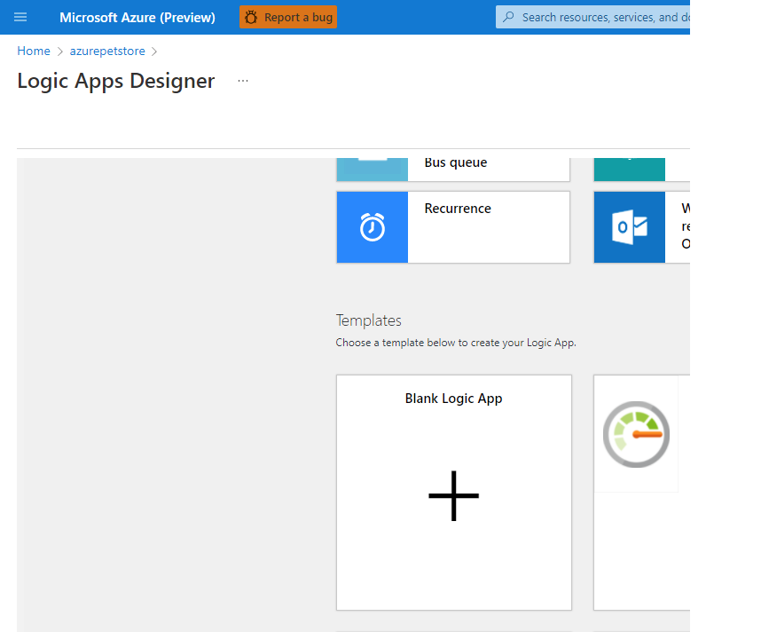

First Step in our new Logic App is to receive the message, Search for the "Service Bus" operation for your first step.

You should see the following:

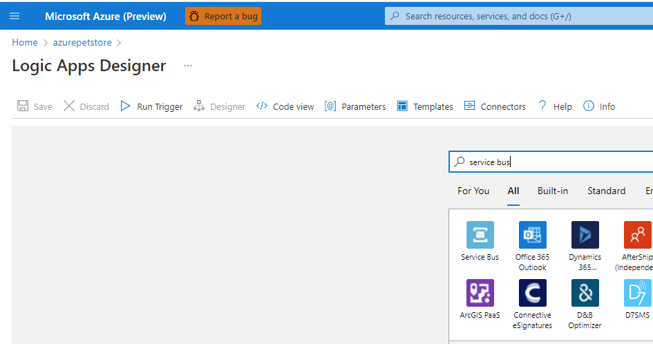

Select "When a message is received in a topic subscription (auto-complete)" to inform the entry point step of the Logic App, which is when a new message arrives to the specified topic.

You should see the following:

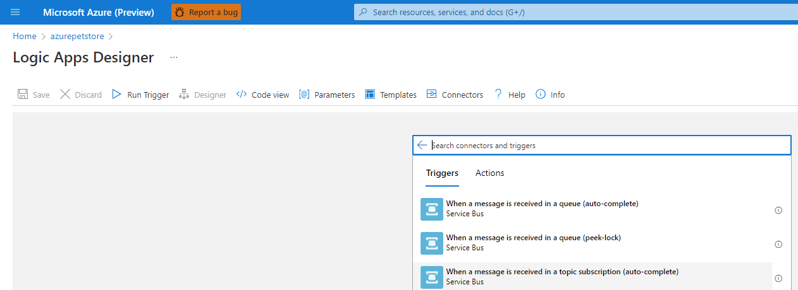

> 📝 **Please Note, You may need to create a new service bus connection using the SAS Level key from the service bus service, to get this connector to activate**

Specify the meta data requested. "orders" is the topic we created earlier and the topic PetStoreOrderService is sending to. Also paste in your connection string, you can use the primary one from the SAS policy.

You should see the following:

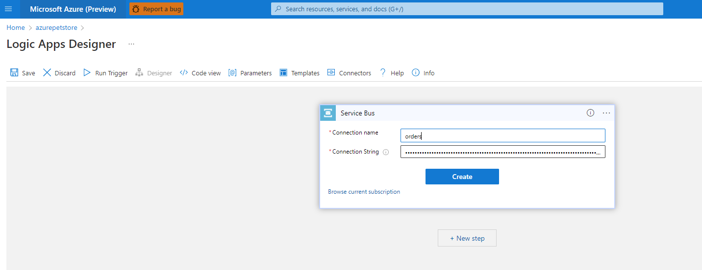

Specify the subscription "email" to use and how often you want to check the topic for new messages.

You should see the following:

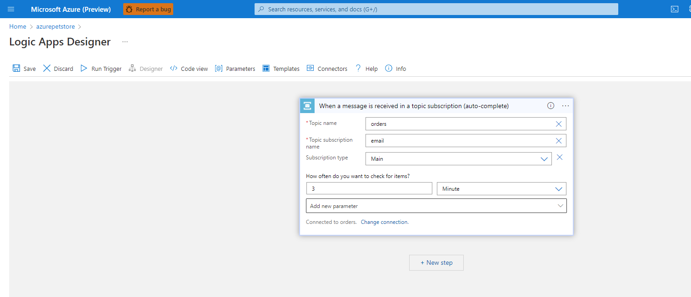

Next create 4 more steps, by selecting "Create Step" below your current one from above. Use the "Variables" operation. We will use these 4 operations to transform the JSON that arrives in the message and assign the transformations to instance variables we can then use in our subsequent steps/operations. The first variable step is an "Initialize Variable", the second variable step is a "Set Variable" and the third and fourth are both "Initialize Variable".

You should see the following:

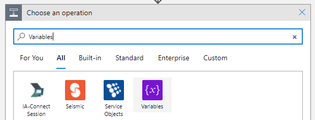

> 📝 **Please Note, If you select the Ellipse to the right of the steps you can bring up the associated meta data and modify it**

Give your Variable steps a name.

I named he first variable step "Initialize variable - jsonBody", gave it a variable name "jsonBody" and set the value to Dynamic Content "Content" which will be the incoming message body content (our JSON from the PetStoreOrderService)

You should see the following:

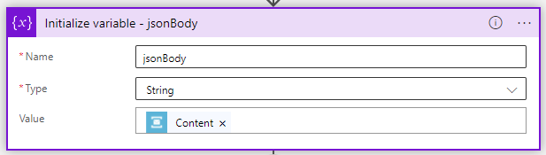

I named he second variable step "Set variable - remove body quotes", gave it a variable name "jsonBody" and set the value to Expression which you can paste the following, which strips out the escape characters from the body contents (not sure why these get included, the bytestream from the PetStoreOrderService does not send these that I know of)

```
    replace(actions('Initialize_variable_-_jsonBody').inputs.variables[0].value, '\"', '"')
```

You should see the following:

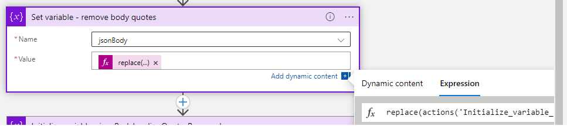

I named he third variable step "Initialize variable - jsonBodyLeadingQuotesRemoved", gave it a variable name "jsonBodyLeadingQuotesRemoved" (can't override the existing mutable variable in this context) and set the value to Expression which you can paste the following, which strips out the leading quotes the body contents (not sure why these get included, the bytestream from the PetStoreOrderService does not send these that I know of)

```
    replace(variables('jsonBody'), '"{', '{')
```

You should see the following:

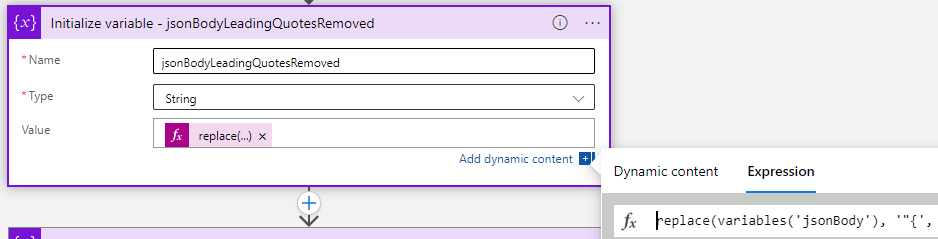

I named he fourth variable step "Initialize variable - jsonBodyTrailingQuotesRemoved", gave it a variable name "jsonBodyTrailingQuotesRemoved" (can't override the existing mutable variable in this context) and set the value to Expression which you can paste the following, which strips out the trailing quotes the body contents (not sure why these get included, the bytestream from the PetStoreOrderService does not send these that I know of) ```jsonBodyTrailingQuotesRemoved``` is now ready to be parsed up.

```
    replace(variables('jsonBodyLeadingQuotesRemoved'), '}"', '}')
```

You should see the following:


At this point you should have 5 steps.

You should see the following:


Next create a "Parse JSON" Step. This step will use the Content from above (JSON String) which is the value of the ```jsonBodyLeadingQuotesRemoved```` variable, you also need to specify the schema to ensure the Logic Apps processor can parse it and so that the value can be referenced accordingly. You can paste the schema from below.

```json
{
    "properties": {
        "email": {
            "type": "string"
        },
        "id": {
            "type": "string"
        },
        "products": {
            "items": {
                "properties": {
                    "id": {
                        "type": "integer"
                    },
                    "name": {
                        "type": "string"
                    },
                    "photoURL": {
                        "type": "string"
                    },
                    "quantity": {
                        "type": "integer"
                    }
                },
                "required": [
                    "id",
                    "quantity",
                    "name",
                    "photoURL"
                ],
                "type": "object"
            },
            "type": "array"
        }
    },
    "type": "object"
}
```

You should see the following:


Next create a "Create HTML Table" step. This step is pretty cool, automagically Logic Apps can generate a table from our JSON. Based on the schema we can get an autogenerated table of products from our order ```jsonBodyLeadingQuotesRemoved``` This step will iterate through the Products array for us and generate a structure to our liking. You can specify the From to use Dynamic JSON data, "products" and in this case on each iteration we would like to display 2 more pieces of dynamic data "name" and "quantity"

You should see the following:

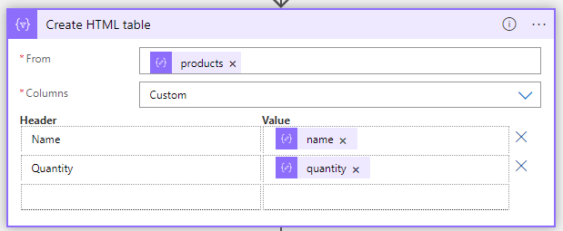

Next create a "Compose" step. Here we can construct the HTML contents for our email. For the inputs field you can paste in your HTML. I've already generated a sample 
HTML page that I would like consumers to receive when an order is complete.

Copy the raw contents of the following into your Inputs field of the Compose step.
 
https://github.com/chtrembl/azure-cloud/blob/main/petstore/15-build-logic-app-to-send-email-when-message-received-in-service-bus/email.html

You should see the following:

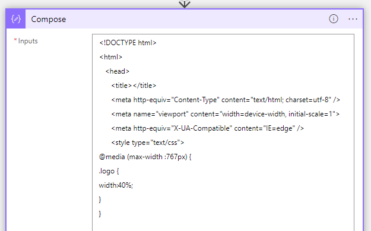

Update the two placeholders in this HTML, "<ORDER HERE>" and "<PRODUCTS HERE>" with the dynamic data that you have been building above. ```id``` from the Dynamic JSON that was parsed and ```Output``` from the "Create HTML table" step above.
 
You should see the following:

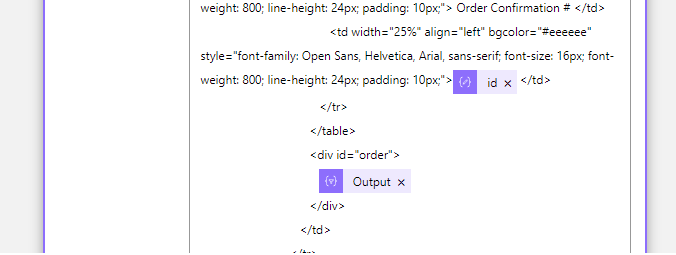

Last but not least, create a "Send an email (V2)" step. Here we can send off the email to the person who completed their order.

For the Body: field of the email you can use ```Outputs``` from the Compose step above. You can place the JSON parsed dynamic order ```id``` in the Subject: field and the JSON parsed dynamic order ```email``` in the To: field.

You should see the following:

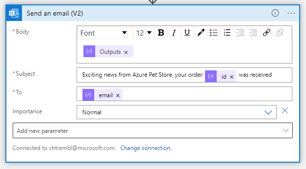

Test it out! Complete an order and you should see an email!

You should see the following:


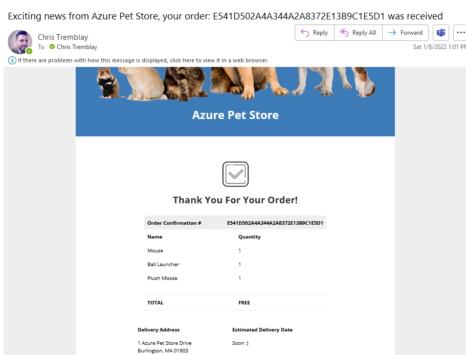

If for some reason things do not look right and/or you see failures, head to the Overview and view the status's of your runs, you can inspect all of the steps of your Logic App runs that have failed and fix accordingly.

You should see the following:


Things you can now do now with this guide

☑️ Configure Service Bus

☑️ Configure PetStoreOrderService to use Spring Boot Starter and send messages to a Service Bus topic

☑️ Build an awesome Logic App to notify consumers when a message arrives

➡️ Next guide: [16 - Build a Bicep IaC Template and Configure a DevOps Pipeline for Self Service Deployment of Azure Infrastructure](../16-build-bicep-iac-template-configure-devops-pipeline-self-service-deployment-azure-infrastructure/README.md)
