# 16 - Build a Bicep IaC Template and Configure a DevOps Pipeline for Self Service Deployment of Azure Infrastructure

**This guide is part of the [Azure Pet Store App Dev Reference Guide](../README.md)**

Just imagine you're a developer for the [azurepetstore.com](https://azurepetstore.com) e-commerce website. Your code will have a dependency on infrastructure. For example, you may need an Azure Kubernetes Cluster to orchestrate your API's, a Service Bus to facilitate your message distribution or perhaps a Cosmos DB to persist order data. Sure you can head over to the Azure Portal (as we did in the previous guides) and provision your infrastructure manually and/or use the Azure CLI. But there are challenges with this approach. How does this scale? What about state changes? Version Control? Automatic Deployments?

In this section we'll look at IaC (Infrastructure as Code) and see how to build a Bicep Template that can be used to provision Azure Infrastructure, specifically an Azure Cosmos DB. We will then build an Azure DevOps Pipeline to deploy this Bicep Template via Self Service / On Demand that has a manual Approval Check before any deployment begins. We will then configure the existing Logic App, from the previous guide, to push [azurepetstore.com](https://azurepetstore.com) orders into this Cosmos DB.

Think of Bicep as an abstraction layer on top of ARM (Azure Resource Manager), it is a domain-specific language (DSL) that uses declarative syntax to deploy Azure resources. In a Bicep file, you define the infrastructure you want to deploy to Azure, and then use that file throughout the development lifecycle to repeatedly deploy your infrastructure. Built Bicep templates will generate ARM Json that we will use to deploy to Azure.

More on [Bicep](https://docs.microsoft.com/en-us/azure/azure-resource-manager/bicep/overview?tabs=bicep)

More on [ARM](https://docs.microsoft.com/en-us/azure/azure-resource-manager/templates/overview)

You can create your own Bicep Templates from scratch and/or leverage pre built Azure Quickstart Templates that are available from the community to help jumpstart your IaC efforts.

More on [Quickstart Templates](https://azure.microsoft.com/en-us/resources/templates)

## Step 1 Create your Bicep Template ##

Within VS Code, install the Bicep Extension

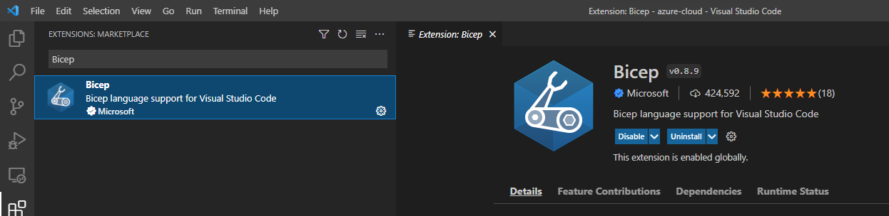

If you cloned/forked this repository you will notice a ```iac/bicep/db``` folder containing a parameters file, Bicep file and the built main.json ARM Template. It does not matter where these files reside and/or the naming conventions of them. You may even have a parameters file for each environment you are deploying to (dev, qa, prod, perf etc...) where you alter different things like sku's and scale settings etc... The point is this allows for extensibility. You will specify file names and locations when you deploy the ARM Template. You can create your own folder in ```iac/bicep/<newfoldername>``` and/or just follow ahead as is. I used ```db``` to indicate that this as for database infrastructure.

Within Visual Studio Code you can use Ctrl + Shift + P to help facilitate the creation of these files and/or you can create them manually.

I manually created the following two files:

```iac\bicep\db\azuredeploy.parameters.json```
```iac\bicep\db\main.bicep```

I populated these two files from the following [Cosmos DB Quickstart Template](https://github.com/Azure/azure-quickstart-templates/tree/master/quickstarts/microsoft.documentdb/cosmosdb-sql)

For my use case the defaults are fine, I am going to be externalizing the Cosmos Resource Group, Cosmos Account Name, Cosmos Region, Cosmos Database Name and Cosmos Container Name. There are may other parameters that we can externalize (pricing sku, partition key, througput etc... ) however for the sake of this guide, no additional parameters are is required. These parameters will allow you to deploy a Cosmos DB and a Cosmos Container to persist Azure Pet Store Orders in any Azure Region of choice using values you specify. You can read about the various configurations for the Azure resources corresponding to their versions [here](https://docs.microsoft.com/en-us/azure/templates/microsoft.documentdb/databaseaccounts?tabs=bicep) 

azuredeploy.parameters.json:

```json
{
  "$schema": "https://schema.management.azure.com/schemas/2019-04-01/deploymentParameters.json#",
  "contentVersion": "1.0.0.0",
  "parameters": {
    "cosmosAccountName": {
      "value": "AzurePetStore"
    },
    "cosmosPrimaryRegion": {
      "value": "East US 2"
    },
    "cosmosDatabaseName": {
      "value": "E-Commerce"
    },
    "cosmosContainerName": {
      "value": "Orders"
    }
  }
}
```

> 📝 Please Note, if/when you deploy with this parameter file, seen above, these parameters will be injected into the Bicep template during deployment. 

main.bicep:

```bicep
@description('Azure Cosmos DB account name')
param accountName string = 'sql-${uniqueString(resourceGroup().id)}'

@description('Location for the Azure Cosmos DB account.')
param location string = resourceGroup().location

@description('The name for the database')
param databaseName string = 'database1'

@description('The name for the container')
param containerName string = 'container1'

@description('The partition key for the container')
param partitionKeyPath string = '/partitionKey'

@description('The throughput policy for the container')
@allowed([
  'Manual'
  'Autoscale'
])
param throughputPolicy string = 'Autoscale'

@description('Throughput value when using Manual Throughput Policy for the container')
@minValue(400)
@maxValue(1000000)
param manualProvisionedThroughput int = 400

@description('Maximum throughput when using Autoscale Throughput Policy for the container')
@minValue(1000)
@maxValue(1000000)
param autoscaleMaxThroughput int = 1000

@description('Time to Live for data in analytical store. (-1 no expiry)')
@minValue(-1)
@maxValue(2147483647)
param analyticalStoreTTL int = -1

var locations = [
  {
    locationName: location
    failoverPriority: 0
    isZoneRedundant: false
  }
]
var throughput_Policy = {
  Manual: {
    throughput: manualProvisionedThroughput
  }
  Autoscale: {
    autoscaleSettings: {
      maxThroughput: autoscaleMaxThroughput
    }
  }
}

resource account 'Microsoft.DocumentDB/databaseAccounts@2022-05-15' = {
  name: toLower(accountName)
  location: location
  properties: {
    consistencyPolicy: {
      defaultConsistencyLevel: 'Session'
    }
    databaseAccountOfferType: 'Standard'
    locations: locations
    enableAnalyticalStorage: true
  }
}

resource database 'Microsoft.DocumentDB/databaseAccounts/sqlDatabases@2022-05-15' = {
  parent: account
  name: databaseName
  properties: {
    resource: {
      id: databaseName
    }
  }
}

resource container 'Microsoft.DocumentDB/databaseAccounts/sqlDatabases/containers@2022-05-15' = {
  parent: database
  name: containerName
  properties: {
    resource: {
      id: containerName
      partitionKey: {
        paths: [
          partitionKeyPath
        ]
        kind: 'Hash'
      }
      analyticalStorageTtl: analyticalStoreTTL
    }
    options: throughput_Policy[throughputPolicy]
  }
}
```

> 📝 Please Note, if/when you Build/Deploy this Bicep file/ARM Template, seen above, the parameters will be injected otherwise, defaults will be used. There are 3 resources being provisioned in this guide, all using version ```2021-10-15``` more on versions [here](https://docs.microsoft.com/en-us/azure/templates/microsoft.documentdb/databaseaccounts?tabs=bicep), a Cosmos Database Account, Cosmos Database and Cosmos Database Container. Since this is Bicep and it gets built, we can apply software design principles such as validation on our parameters/configuration to ensure our IaC is proper. We do this with the ```@minValue``` and ```@maxValue``` annotations, which is helpful when externalizing configurations and/or leveraging templates for re-use. We can also define our externalized parameters via ```param``` keyword and inject them accordingly. The intellisense baked within VSCode allows you to view all of the possible configuration options as you consider what to externalize and/or what you hard code. I went with the defaults and hard coded the pricing SKU ```Standard``` and the partionKey to ```/customer/zipcode``` (if you were persisting production workloads you would want to select a partition key that best suits your needs with respect to data distribution) both of which are options you may want to externalize in a real world example if this Cosmos DB IaC is going to be reused.

At this point you can right click on your Bicep ARM Template ```main.bicep``` and select Build Bicep File, VS Code/Bicep will generate a ```main.json``` ARM Template if successful.

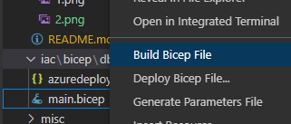

If you right click on your Bicep ARM Template ```main.json``` and select Deploy Bicep File, you can then walk through the UI selecting your parameters file and various other meta data for which VS Visual Studio Code will deploy.

You could optionally hop on the CLI and run the following which would also do the deployment to Azure

*Note if you right click on your Bicep ARM Template ```main.json``` and select select "Open Bicep Visualizer" the VS Code Bicep Extension will generate a nice diagram of your Azure IaC*

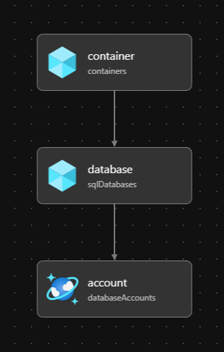

```
bash
az deployment group create \
                    --resource-group ${{ parameters.resourceGroup }} --template-file $(templateFile) --parameters accountName='${{ parameters.cosmosAccountName }}' location='${{ parameters.region }}' databaseName='${{ parameters.cosmosDatabaseName }}' containerName='${{ parameters.cosmosContainerName }}' partitionKeyPath='/partition' --verbose
```

However, we are going to take this a step further and make this Self Service via Azure DevOps

## Step 2 Configure a DevOps Pipeline to Deploy a Bicep Template (Azure Cosmos DB) as Self Service ##

First you need to ensure that you have a Service Connection to Azure Resource Manager to be able to successfully provision infrastructure, in this case an Azure Cosmos DB.

Head to Service Connections and create a new Service Connection, specify your Azure subscription, and give it a name. For reference I called mine "Azure", as seen below:

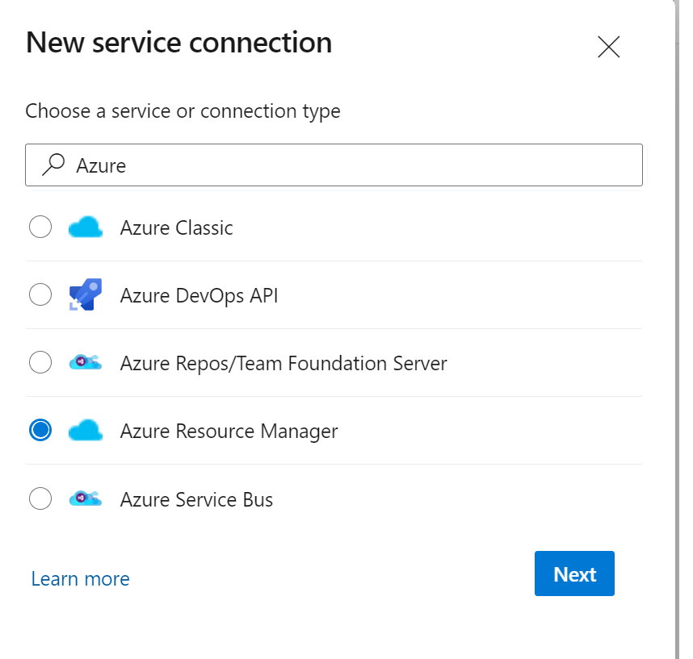

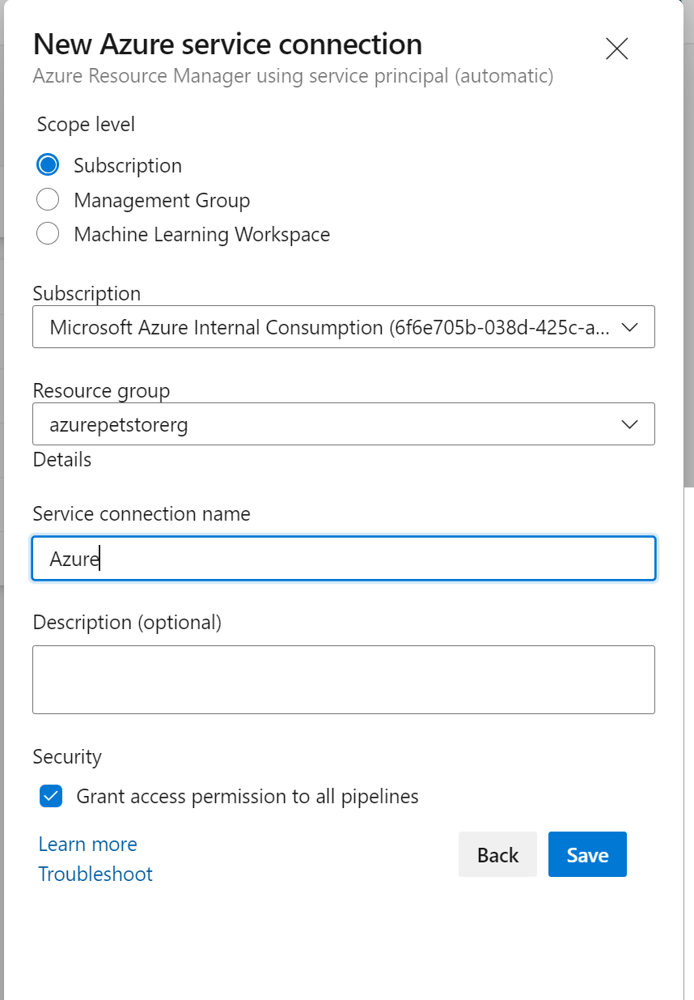

Head to the Environments section under Pipelines. You will want to create an Environment for your IaC Pipeline to deploy to, we will call this 'Development'. This is a logical concept in Azure DevOps, an Environment is a collection of resources that can be targeted by deployments from a pipeline, we will use this new Environment to apply Approvals before the Pipeline actually runs and deploys. There are many other things you can do as well such as Gates and Checks etc....

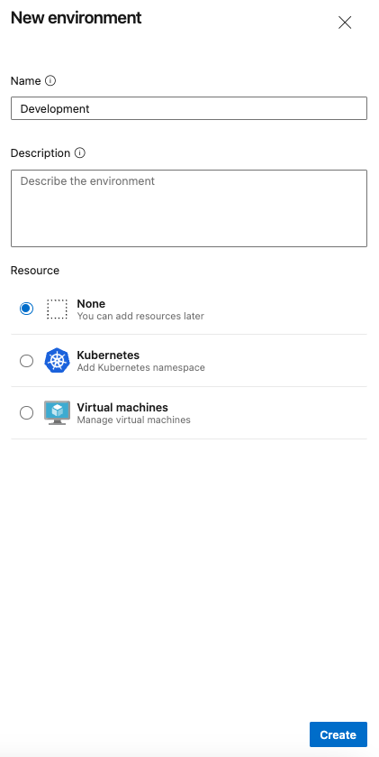

Once you have the Environment created you can then add an Approval and save that. I will select a user to approve this pipeline (myself) and click 'Create'. There are lots of possibilities here. Perhaps you would want to invoke a REST API to decide on the behavior (true/false) etc... on how to proceed.

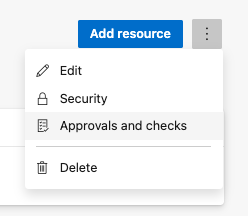

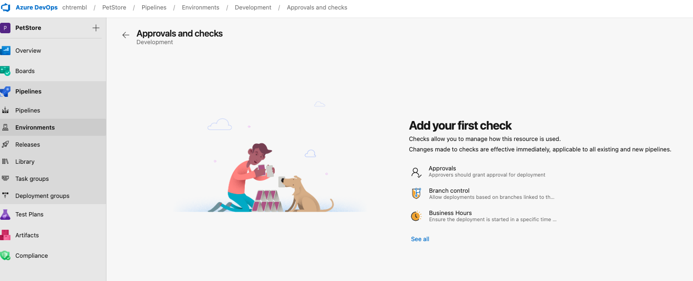

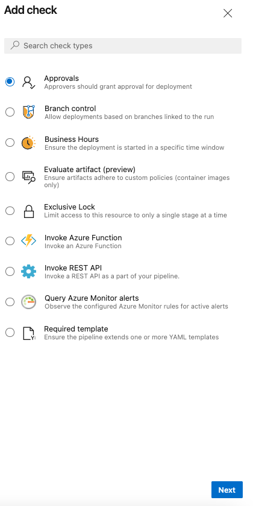

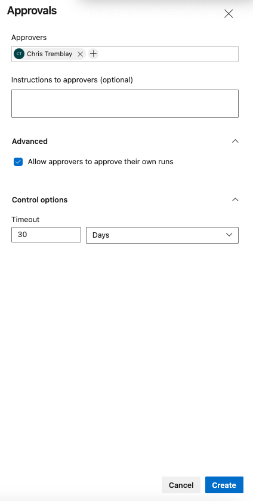

At this point your 'Development' Azure DevOps Environment is ready.

If you cloned/forked this repository you will notice a ```manifests/azure-petstore-db-iac.yml``` pipeline that you can import into your Azure DevOps Pipelines, as seen below. I gave my Pipeline a meaningful name "Deploy Database Infrastructure"

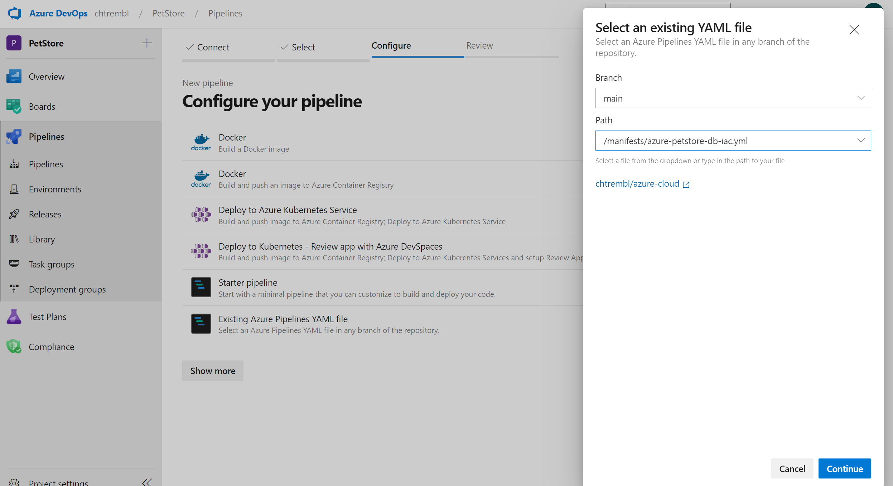

> 📝 Please Note, Below are the contents of ```manifests/azure-petstore-db-iac.yml``` if you wish to copy them into another pipeline as opposed to importing

```yaml
name: Deploy Database Infrastructure

parameters:
- name: resourceGroup
  displayName: Database Resource Group
  type: string
  default: Test
- name: region
  displayName: Database Region
  type: string
  default: East US 2
  values:
  - East US
  - East US 2
  - West US
  - West US 2
- name: cosmosAccountName
  displayName: Cosmos Account Name
  type: string
  default: AzurePetStore
- name: cosmosDatabaseName
  displayName: Cosmos Database Name
  type: string
  default: E-Commerce
- name: cosmosContainerName
  displayName: Cosmos Container Name
  type: string
  default: Orders

trigger: none

variables:
  vmImageName: 'ubuntu-latest'
  azureServiceConnection: 'Azure'
  templateFile: 'petstore/iac/bicep/db/main.bicep'

pool:
  vmImage: $(vmImageName)

stages:
- stage: Deploy
  displayName: Deploy Database Infrastructure Stage
  jobs:
  - deployment: Deploy
    displayName: Deploy Database Infrastructure Job
    pool:
      vmImage: 'ubuntu-latest'
    environment: 'Development'
    strategy:
      runOnce:
        deploy:
          steps:
            - checkout: self
            - task: AzureCLI@2
              inputs:
                azureSubscription: $(azureServiceConnection)
                scriptType: bash
                scriptLocation: inlineScript
                inlineScript: |
                  az --version
                  ls -l
                  if [ $(az group exists --name ${{ parameters.resourceGroup }}) = false ]; then
                    az group create --name ${{ parameters.resourceGroup }} --location 'eastus'
                  fi
                  az deployment group create \
                    --resource-group ${{ parameters.resourceGroup }} --template-file $(templateFile) --parameters accountName='${{ parameters.cosmosAccountName }}' location='${{ parameters.region }}' databaseName='${{ parameters.cosmosDatabaseName }}' containerName='${{ parameters.cosmosContainerName }}' partitionKeyPath='/partition' --verbose
```

As seen above, this pipeline does not have a trigger on source code commits, it gets executed manually (self service from Azure DevOps).

I am defining a parameters section with default values that can be overridden by the end user during self service.

We define the Azure Service Connection ```azureServiceConnection: 'Azure'``` (This is the Azure Resource Manager Service Connection we previously created)

We define the Azure Service Connection ```templateFile: 'petstore/iac/bicep/db/main.bicep'```

We then define the CLI scripts to run on demand 

```cli
 inlineScript: |
      az --version
      if [ $(az group exists --name ${{ parameters.resourceGroup }}) = false ]; then
        az group create --name ${{ parameters.resourceGroup }} --location 'eastus'
      fi
      az deployment group create \
        --resource-group ${{ parameters.resourceGroup }} --template-file $(templateFile) --parameters cosmosAccountName='${{ parameters.cosmosAccountName }}' cosmosPrimaryRegion='${{ parameters.region }}' cosmosDatabaseName='${{ parameters.cosmosDatabaseName }}' cosmosContainerName='${{ parameters.cosmosContainerName }}'
```
If the resource group does not exist, create it, then deploy the Bicep Template (Azure Cosmos DB)

Once you have your new pipeline saved you can head back to the Pipelines view and select your new Pipeline, as seen below:


Select "Run pipeline", as seen below:

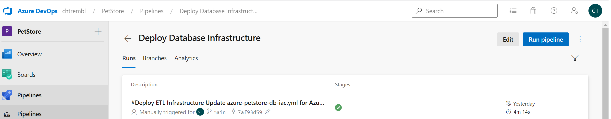

You can specify your resource group and parameters. I chose the default Cosmos Account Name, Cosmos DB and Cosmos Container and Region. I also specified an existing resource group that I wanted to deploy the Cosmos DB into, as seen below:

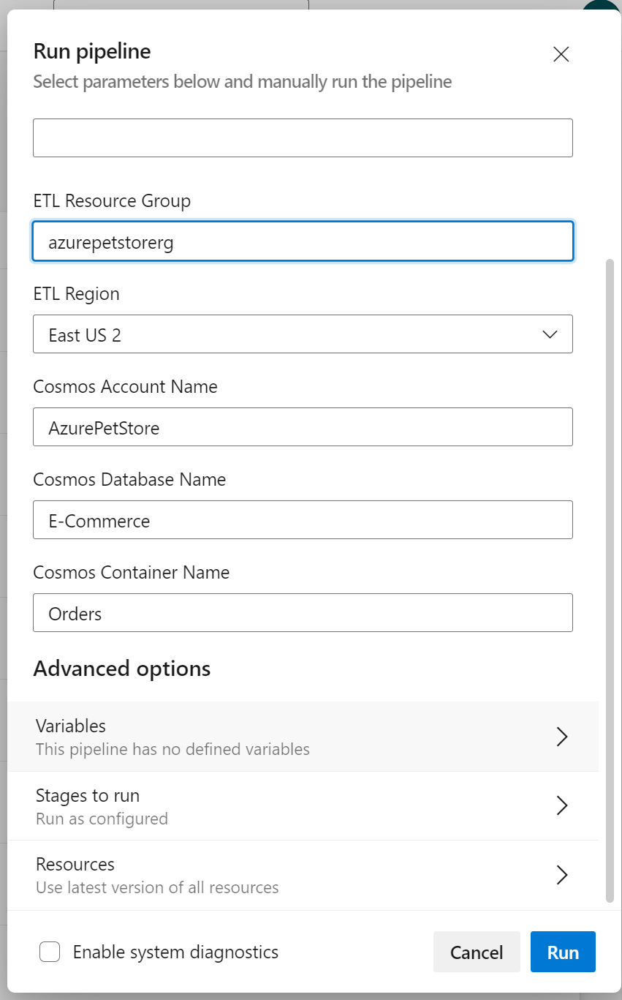

Once you click "Run" the Pipeline will initiate and the Approval will kick in.

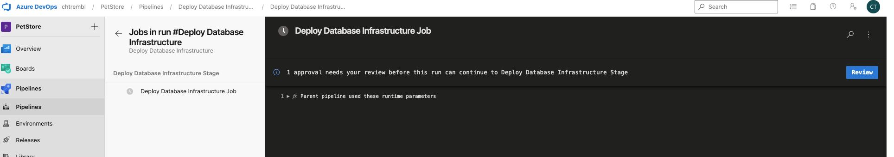

You can "Approve" or "Reject" (This would typically be a different user(s) than the one inititiating the Pipeline)

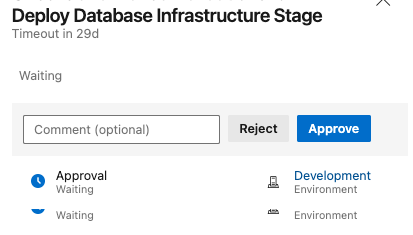

Once the Pipeline completes you will see the logs followed by an email as seen below:

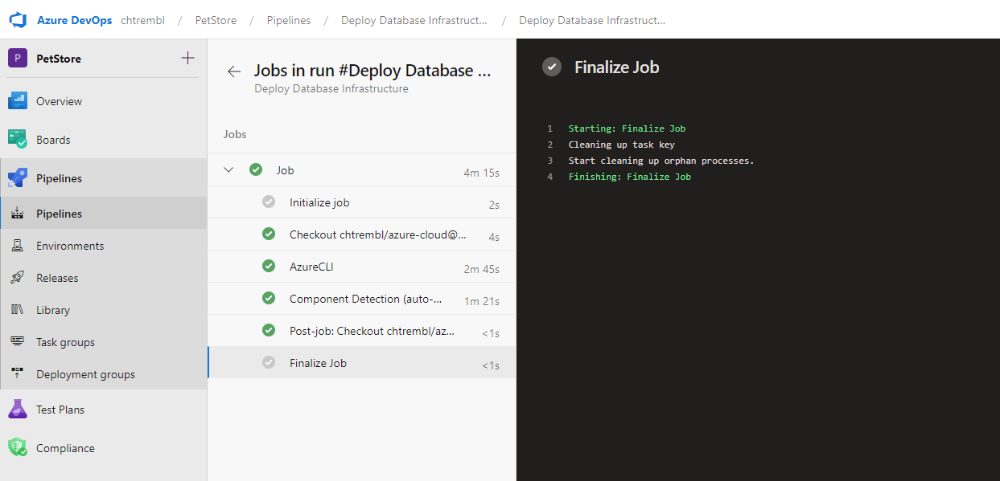


If you head to the Azure Portal you will now see your newly provisioned Cosmos DB.

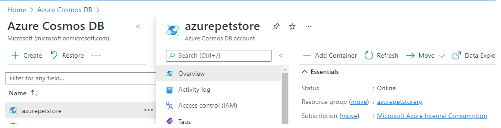

Now you are ready to use your Cosmos DB. We could always take this a step further and enhance the automation. We could add more checks to the Pipeline etc.. Or perhaps we could build a logic app to trigger on this pipeline when a DevOps Work Item moves to a specific state.  We could also grab the Cosmos connection strings needed for this new Developer to start consuming and send them to the Developer etc... In conclusion there are many possibilities and this process is very extensible. We also now have IaC sourced in GitHub and get the benefits of SDLC as we would with any other software.

## Step 3 Add step to Logic App to persist azurepetstore.com order into new Azure Cosmos DB ##

Head to your Logic App from the previous guide and add a New "Create or update document (V3)" step just after the "Send an email (V2)" that triggers when a new order is placed into the Service Bus, as seen below:

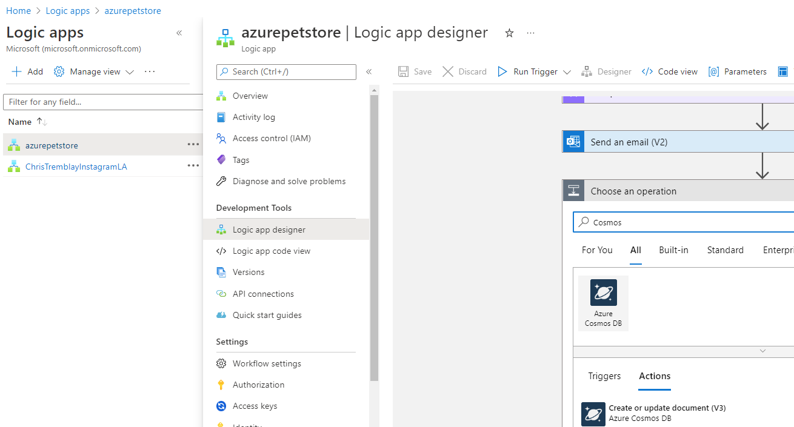

Authenticate to your Cosmos DB using Cosmos Access Keys or Managed Identities and populate the document meta data using the JSON from the Service Bus, as seen below:

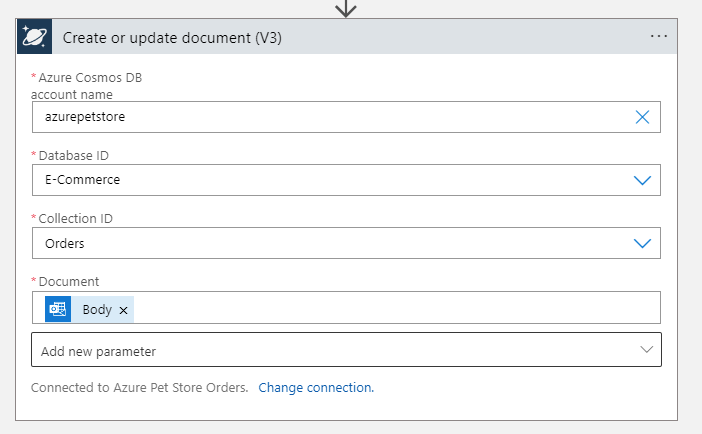

Place and order in your azurepetstore application and then head to Azure Portal, your Cosmos Database and refresh the Orders container, you should see a new order, as seen below:

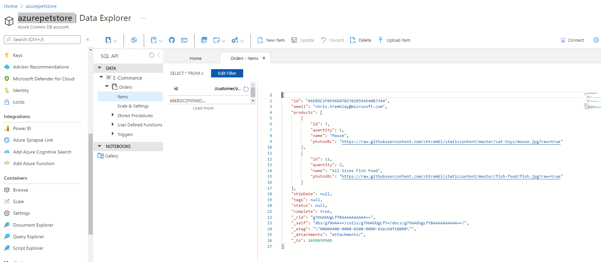

Things you can now do now with this guide

☑️ Build a Bicep Template

☑️ Configure a DevOps Pipeline to Deploy a Bicep Template (Azure Cosmos DB) as Self Service

☑️ Add step to Logic App to persist azurepetstore.com order into new Azure Cosmos DB

➡️ Next guide: [17 - Configure SignalR to send Real-Time Analytics to Client Browser](../17-configure-signalr-to-send-real-time-analytics-to-client-browser/README.md)
