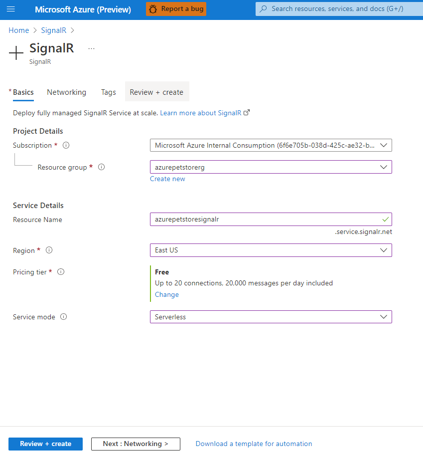
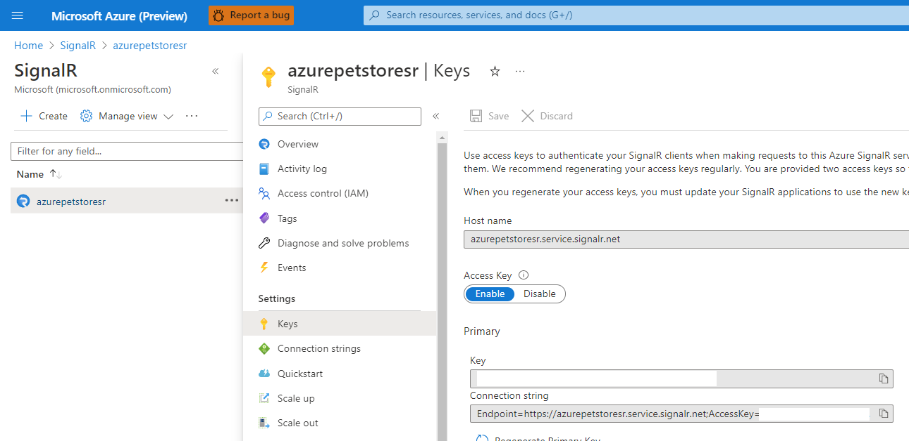
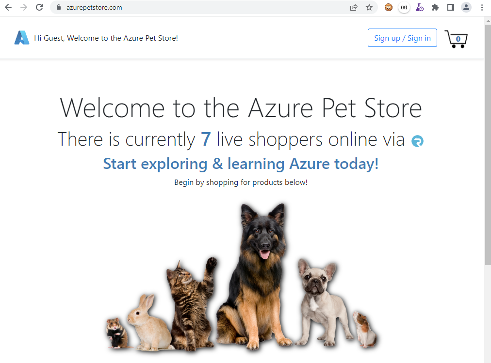
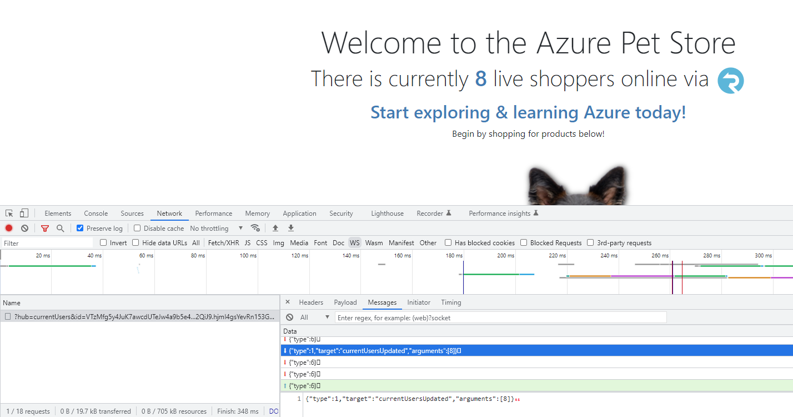
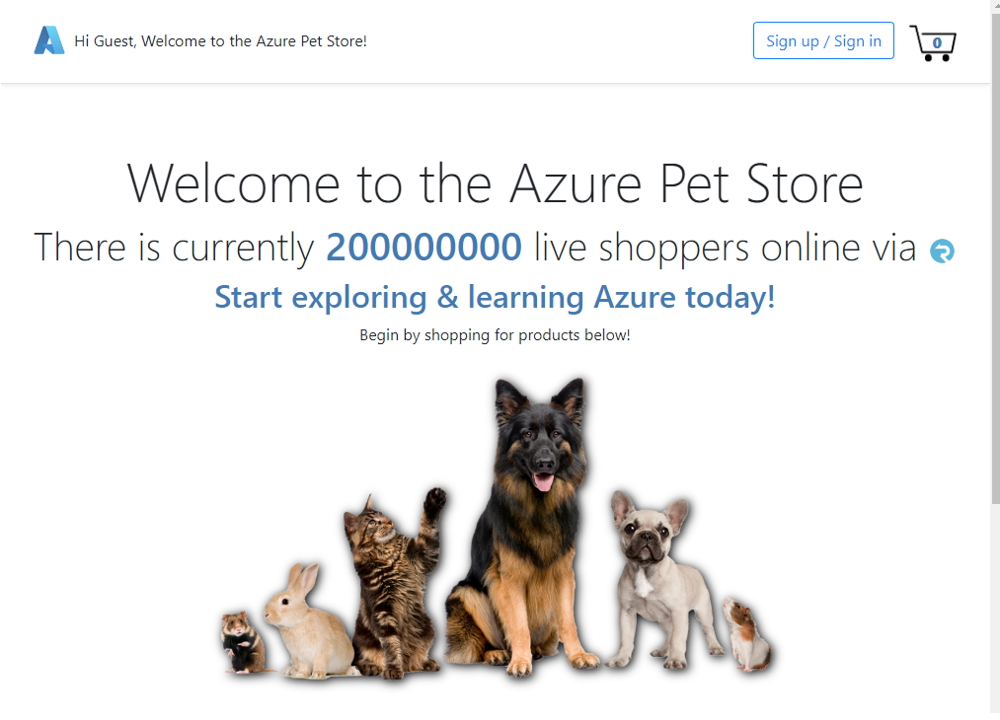

# 17 - Configure SignalR to send Real-Time Analytics to Client Browser

Just imagine you are developing a progressive/single page web application that requires real-time data. Sure you can have your end users refresh the page, and reload/re render the data and html, server side, but that would be a less than idea user experience. You could also build out the control plane to facilitate client/server invocations using WebSockets, but that would require you to integrate/write more pub/sub code to integrate with a centralized cache/hub. Another option is [SignalR](https://docs.microsoft.com/en-us/aspnet/signalr/overview/getting-started/introduction-to-signalr), a technology that simplifies the process of adding real-time web functionality to your application that allows your client & server code to send data back and forth, instantly as it becomes available, rather than having the server wait for a client to request new data, freeing up more time for you to be productive and more write code that provides business value.

In this guide we will configure the PetStoreApp to send real-time azurepetstore.com analytics to client browsers via SignalR. Customers visiting azurepetstore.com will initiate a SignalR connection and receive azurepetstore.com live shopper counts, real-time, as shoppers visit the application, this count will be displayed on the homepage without any page refreshes.

My colleague [Anthony Chu](https://github.com/anthonychu) has an awesome tutorial detailing how to implement a SingalR chat feature within a Spring Boot application, I have essentially followed his guidance as seen [Add Real-Time to a Java App with Azure SignalR Service](https://anthonychu.ca/post/java-spring-boot-azure-signalr-service/) and will recap the steps with some additional changes I have made this use case.

## Step 1 Create your Azure SignalR Service ##

From the Azure Portal you can create a new SignalR Service as seen below. I've decided to go with Serverless mode as the PetStoreApp will be using the REST API ([QuickStart Guide Here](https://docs.microsoft.com/en-us/azure/azure-signalr/signalr-quickstart-rest-api)) to send the messages (shopper counts) and will not require SignalR SDK/Default mode.



Make note of your Host Name and Key from the Settings > Keys Section



## Step 2 Changes in the PetStoreApp (Server Side) ##

Adding the following App Service Configuration / Runtime variables, will enable this feature in your forked/cloned application.

```config
SIGNALR_NEGOTIATION_URL=<your azure pet store URL, https://azurepetstore.com etc...>
SIGNALR_SERVICE_URL=<your SignalR Host name here>
SIGNALR_SERVICE_KEY=<your SignalR Access Key here>
```

Unrelated to SignalR I made a few updates to the PetStoreApp to implement a Live Shoppers Cache, ideally this would be done in a centralized store like Redis to handle scale (more than 1 container), but for the sake of this tutorial, I've decided to use an in memory cache as this will suffice, as long as azurepetstore.com is not scaling to more than 1 container.

 *If there is more than 1 container then the counts will not be accurate as each container will be aggregating shopper counts pertaining to the corresponding container via the in memory cache, hence the callout for ideally putting this in a centralized store*

App Config Updates:

https://github.com/chtrembl/azure-cloud/blob/main/petstore/petstoreapp/src/main/java/com/chtrembl/petstoreapp/AppConfig.java

New Caffeine Cache that holds sessions (users) for 5 minutes (300 seconds), each time a session (user) visits the PetStoreApp (azurepetstore.com) then the 5 minute interval resets. The goal is to send a message to the Serverless SignalR Hub each time a user hits the applications/and/or on a specified polling interval.

*5 minutes was the number I guessed to benchmark live shoppers, any sessions that have been active for 5 minutes...*

```java
	@Bean
	public Caffeine caffeineConfig() {
		return Caffeine.newBuilder().expireAfterAccess(300, TimeUnit.SECONDS);
	}

	@Bean
	public CacheManager currentUsersCacheManager(Caffeine caffeine) {
		CaffeineCacheManager caffeineCacheManager = new CaffeineCacheManager();
		caffeineCacheManager.setCaffeine(caffeine);

		return caffeineCacheManager;
	}
```

Web App Controller updates:

https://github.com/chtrembl/azure-cloud/blob/main/petstore/petstoreapp/src/main/java/com/chtrembl/petstoreapp/controller/WebAppController.java

*This logic should really be implemented in an interceptor/controller advice to accomodate controller scale but I have refactored it yet*

```java
    CaffeineCache caffeineCache = (CaffeineCache) this.currentUsersCacheManager
				.getCache(ContainerEnvironment.CURRENT_USERS_HUB);
		com.github.benmanes.caffeine.cache.Cache<Object, Object> nativeCache = caffeineCache.getNativeCache();

		// this is used for n tier correlated Telemetry. Keep the same one for anonymous
		// sessions that get authenticateds
		if (this.sessionUser.getSessionId() == null) {
			String sessionId = RequestContextHolder.currentRequestAttributes().getSessionId();
			this.sessionUser.setSessionId(sessionId);
			// put session in TTL cache so its there after initial login and count is accurate when the sendCurrentUsers() occurs
			caffeineCache.put(this.sessionUser.getSessionId(), this.sessionUser.getName());
			this.containerEnvironment.sendCurrentUsers();
		}

		// put session in TTL cache to refresh TTL
		caffeineCache.put(this.sessionUser.getSessionId(), this.sessionUser.getName());
```

Essentially on all PetStoreApp requests this modelAttribute will fire. If its a new user (shopper), and a new session, then put this into the Caffeine cache and send a message to the Serverless Hub (which will in turn notify all consumers, in our case browsers). On all other requests just refresh the Caffeine cache TTL (Time To Live) by invoking another .put() (The cache expired 5 minutes after last access.)

Container Environment updates:

https://github.com/chtrembl/azure-cloud/blob/main/petstore/petstoreapp/src/main/java/com/chtrembl/petstoreapp/model/ContainerEnvironment.java

```java
	public String generateJwt(String audience, String userId) {
		SignatureAlgorithm signatureAlgorithm = SignatureAlgorithm.HS256;

		long nowMillis = System.currentTimeMillis();
		Date now = new Date(nowMillis);

		long expMillis = nowMillis + (30 * 30 * 1000);
		Date exp = new Date(expMillis);

		byte[] apiKeySecretBytes = this.getSignalRKey().getBytes(StandardCharsets.UTF_8);
		Key signingKey = new SecretKeySpec(apiKeySecretBytes, signatureAlgorithm.getJcaName());

		JwtBuilder builder = Jwts.builder().setAudience(audience).setIssuedAt(now).setExpiration(exp)
				.signWith(signingKey);

		if (userId != null) {
			builder.claim("nameid", userId);
		}

		return builder.compact();
	}
```

Signal R Controller updates:

https://github.com/chtrembl/azure-cloud/blob/main/petstore/petstoreapp/src/main/java/com/chtrembl/petstoreapp/controller/SignalRController.java

```java
	@PostMapping(value = "/signalr/negotiate", produces = MediaType.APPLICATION_JSON_VALUE)
	public SignalRConnectionInfo negotiate() {
		if (this.signalRWebClient == null) {
			return null;
		}
		String hubUrl = this.containerEnvironment.getSignalRServiceURL() + "/client/?hub="
				+ ContainerEnvironment.CURRENT_USERS_HUB;
		String userId = this.sessionUser.getSessionId(); // optional
		String accessKey = this.containerEnvironment.generateJwt(hubUrl, userId);
		return new SignalRConnectionInfo(hubUrl, accessKey);
	}
```

*I borrowed Anthony's implementation along with the generateJwt method.*

Client browsers will first request a JWT Token/Access key from the PetStoreApp Server code as seen in the ```java @PostMapping(value = "/signalr/negotiate")``` method. Instead of returning the access keys that were assigned from Azure Portal, which would be a security vulnerability by exposing this sensitive data to all browsers across the world, we instead use those keys to sign a JWT Token and instead return that token to the browsers. Notice the JWT token is built with an audience, this audience is typically the resource server endpoint that can accept the token that is generated (knows how it was signed), which in our case will be the ```petstore.signalr.service-url``` injected value, something like https://azurepetstoresr.service.signalr.net, matching whatever you created in Step 1. We can optionally set claims (perhaps you want to interrogate these for other use cases) so we will set the ```nameid``` to the sessionId.

## Step 3 Changes in the PetStoreApp (Client Side) ##

footer.htnl updates:

https://github.com/chtrembl/azure-cloud/blob/main/petstore/petstoreapp/src/main/resources/templates/fragments/footer.html

```javascript
    <script src="https://cdn.jsdelivr.net/npm/@microsoft/signalr@3.0.0/dist/browser/signalr.min.js"></script>  
		<script src="https://cdn.jsdelivr.net/npm/axios@0.18.0/dist/axios.min.js"></script>
		
		<input type="hidden" id="signalRNegotiationURL" th:value="${signalRNegotiationURL}"/>
		
		<script>
			
			const apiBaseUrl = document.getElementById('signalRNegotiationURL').value;
		
			console.log(apiBaseUrl);
			
			if(apiBaseUrl.length > 0)
			{
				const data = {
				  currentUsersUpdated: '',
			      messages: [],
			      ready: false
			    }
			
			    const connection = new signalR.HubConnectionBuilder()
			      .withUrl(`${apiBaseUrl}/signalr`)
			      .withAutomaticReconnect()
			      .configureLogging(signalR.LogLevel.Information)
			      .build()
			
			    connection.on('currentUsersUpdated', currentUsersUpdated)
			
			    connection.start()
			      .then(() => data.ready = true)
			      .catch(console.error)
			
			    let counter = 0
			    function currentUsersUpdated(message) {
			    	document.getElementById('currentUsers').innerHTML=message;
			      	data.messages.unshift(message)
			    }
			}
		</script>
```

Pull in the SignalR JS Library, if the following properties were set, the JavaScript will execute.

```config
SIGNALR_NEGOTIATION_URL=<your azure pet store URL, https://azurepetstore.com etc...>
SIGNALR_SERVICE_URL=<your SignalR Host name here>
SIGNALR_SERVICE_KEY=<your SignalR Access Key here>
```

A connection to the negotiation server will be made to retrieve the JWT Token, the SignalR library will do the rest, it will open the websocket to the Azure SignalR Serverless Hub and whenever SignalR invokes ```currentUsersUpdated``` (server side in Azure) then then browser function for ```currentUsersUpdated``` will get called, and in our case the HTML DOM that represents the Shopper Count gets updated.

## Step 4 test it out ##

Head to your Pet Store Application and you should notice the current live shopper count.



View your browsers Developer Tools, inspect the Web Socket Tab, you will see all of the Signal R communication. Also open a new private tab and/or another browser and visit the Pet Store Application, you will see the Web Socket ```currentUsersUpdated``` message arrive and the count change.



SignalR also has the ability to send messages to groups and/or specific users. I built out a POST Method that allows you to specify a sessionId for which you want to send messages (counts) to.

Signal R Controller updates:

https://github.com/chtrembl/azure-cloud/blob/main/petstore/petstoreapp/src/main/java/com/chtrembl/petstoreapp/controller/SignalRController.java

```java
@PostMapping("/signalr/test")
	public void sendCurrentUsers(@RequestParam(required = false) String userId,
			@RequestParam(required = false) String mockSize) {
		if (this.signalRWebClient == null) {
			return;
		}
		String uri = "/api/v1/hubs/" + ContainerEnvironment.CURRENT_USERS_HUB;

		if (StringUtils.isNoneEmpty(userId)) {
			uri += "/users/" + userId;
		}

		String hubUrl = this.containerEnvironment.getSignalRServiceURL() + uri;

		String accessKey = this.containerEnvironment.generateJwt(hubUrl, null);

		CaffeineCache caffeineCache = (CaffeineCache) this.currentUsersCacheManager.getCache(ContainerEnvironment.CURRENT_USERS_HUB);
		com.github.benmanes.caffeine.cache.Cache<Object, Object> nativeCache = caffeineCache.getNativeCache();
		int size = nativeCache.asMap().keySet().size();

		if (StringUtils.isNoneEmpty(mockSize) && Integer.valueOf(mockSize) >= 0) {
			size = Integer.valueOf(mockSize);
		}

		logger.info("test sending current users of size " + size);

		this.signalRWebClient.post().uri(uri)
				.body(BodyInserters.fromPublisher(
						Mono.just(new SignalRMessage("currentUsersUpdated", new Object[] { size })),
						SignalRMessage.class))
		.accept(MediaType.APPLICATION_JSON)
		.header("Content-Type", MediaType.APPLICATION_JSON_VALUE)
		.header("Cache-Control", "no-cache")
		.header("Authorization", "Bearer " + accessKey).retrieve()
				.bodyToMono(Object.class).block();
	}
```

This test method will will you to POST in a sessionId and mockSize to send to a client. You can grab your session id from the footer of the Pet Store Application homepage and test it out, notice the live shopper count change.

*The SignalR Serverless Hub will send the count to this session only (browser connection) and the count will be short lived until the next message arrives, effectively overwriting this test one*

```bash
curl -d "userId=20FCE47617B5EBFA7706150BCB354C6B&mockSize=200000000" -X POST https://azurepetstore.com/signalr/test
```



**This guide is part of the [Azure Pet Store App Dev Reference Guide](../README.md)**

Things you can now do now with this guide

☑️ SignalR Server & Client communication
