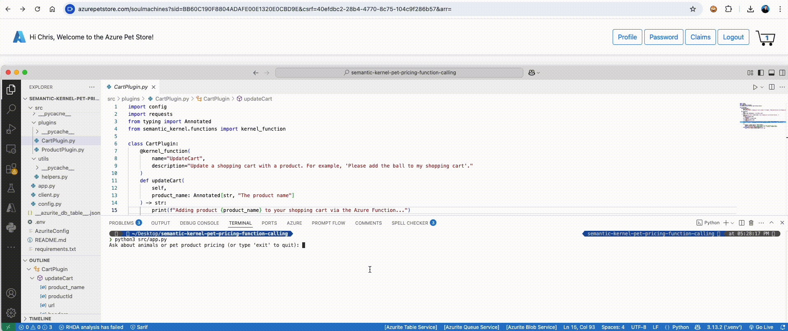

# 19 - Function Calling with Semantic Kernel and Azure Open AI

**This guide is part of the [Azure Pet Store App Dev Reference Guide](../README.md)**

### Before we get into Function Calling let's recap ###

In the [petstoreassistant](../petstoreassistant/README.md) project, I built an Azure Bot Service leveraging the Bot Framework SDK to facilitate an intelligent shopping experience ([video demo here](https://www.linkedin.com/posts/chris-tremblay-0536a23_accessibilityforall-msftadvocate-azurecloud-activity-7158928027031101443-yWqO?utm_source=share&utm_medium=member_desktop&rcm=ACoAAACir78Bv9hjMiSkRR_S5gv-_3loGYUXyvU)) When this Bot Service was built, I used the LLM for Intent Classification to classify prompts and based on classifications from the LLM I would programmatically decide what to do (call the LLM again for info, update a shopping cart, get product information, essentially do things programmatically that wasn't possible via the LLM) 

Fast forward two years, 2025, and Semantic Kernel now has some fantastic improvements for Function Calling ([Python SK](https://github.com/microsoft/semantic-kernel/tree/main/python/samples/concepts/auto_function_calling) 1.24 at the time of writing this) that will help reduce the code we need to write and and offer a more extensible implementation. 

### Semantic Kernel Function Calling ###

There have been several significant updates to Semantic Kernel function calling in the latest version for Python that will simplify the petstoreassistant and other code we write going forward. 

Some of the the new Function Calling features I like:

* The latest version of Semantic Kernel revisits how developers handle function calling in their AI applications, providing a more unified and powerful approach

* The default behavior in Semantic Kernel is now auto function calling, which simplifies the process of using function calling by automatically describing functions and their parameters to the model.

* Developers can now define function signatures with clear inputs and outputs, allowing the model to choose when to use these tools and fill in the necessary arguments (***NO MORE JSON DECLARATIONS!!!***)

* Function calls and their results are now seamlessly integrated into the chat history, allowing the model to understand the context of the conversation and generate subsequent responses more effectively

* **Plugins** are groups of functions that can be exposed to AI applications and services, allowing developers to encapsulate existing APIs into collections usable by AI. Functions within Semantic Kernel are essentially AI prompts or native code defined in your application that the kernel can customize and call as needed, enabling AI models to perform actions they wouldn't be able to do otherwise. Semantic Kernel provides factories to create functions from native code, REST API endpoints, or gRPC endpoints, and these functions can be invoked by the kernel during prompt rendering or through function calling, allowing LLMs to retrieve relevant information or perform actions on behalf of the user.

### Lets see some code ###

* If you pull this repo, and shell to [azure-cloud/petstore/petstoreskfunctioncalling](../petstoreskfunctioncalling/README.md) You can run this locally script locally and get going. 

* To run locally, you will need an Azure Open AI deployment. Make sure you have a .env file in your project root with the following contents. 

```
AZURE_OPENAI_ENDPOINT=<your azure open ai model deployment endpoint here | https://ai-services-chtrembl.openai.azure.com>
AZURE_OPENAI_API_KEY=<model deployment api key here>
AZURE_OPENAI_DEPLOYMENT_NAME=<deployment name here| gpt-4o-mini>
AZURE_OPENAI_SERVICE_VERSION=<deployment version here | 2025-01-01-preview
AZURE_PETSTORE_SESSIONID=<azure petstore session id here>
AZURE_PETSTORE_CSRF=<azure petstore csrf token here>
```

> 📝 **Please Note, If you visit https://azurepetstore.com/soulmachines you will be able to get your sessionid and csrf token in the location bar, this allows Semantic Kernel to administer changes to your Azure Pet Store session (with Semantic Kernel Plugins we can do anything programmatically!)**

### Plugins ###

In the Plugins directory you'll notice a CartPlugin and a ProductPlugin, these plugins contain the relevant functions related to the Plugin. 

**CartPlugin.py:**

Leveraging annotations in our Plugin, SemanticKernel will recognize these declarations and construct the JSON needed for our completion request payload, reducing the need for classification based on an informative description that we provide. Really cool! Based on our prompts to the LLM SK will send this meta data and decide if the function should be called. For the sake of this demo, I am hardcoding product id's and making a REST call to update the Azure Pet Store Shopping card. (Demo .gif below)

```python
import config
import requests
from typing import Annotated
from semantic_kernel.functions import kernel_function

class CartPlugin:   
    @kernel_function(
        name="UpdateCart",
        description="Update a shopping cart with a product. For example, 'Please add the ball to my shopping cart'."
    )
    def updateCart(
        self,
        product_name: Annotated[str, "The product name"]
    ) -> str:
        print(f"Adding product {product_name} to your shopping cart via the Azure Function...")
        ## ideally the product_name would be cross referenced to the producr_id (Cosmos etc... for this demo just hardcoding)
        productId = 4
        if "ball" in product_name:
            productId = 1 
        elif "launcher" in product_name:
            productId = 2
        elif "lamb" in product_name:
            productId = 3
        
        # Azure Pet Store Endpoint that allows you to externally administer shopping cart
        url = "https://azurepetstore.com/api/updatecart"+"?csrf=" + config.AZURE_PETSTORE_CSRF + "&productId=" + str(productId)
        headers = {"Cookie": "JSESSIONID="+config.AZURE_PETSTORE_SESSIONID, "Content-Type": "text/html"}
        
        # update shopping cart with http call...
        try:
            response = requests.get(url, headers=headers)
            response.raise_for_status()  # Raise HTTPError for bad responses (4xx or 5xx)
            return f"Successfully added {product_name} to cart.  Response: {response.text}"
        except requests.exceptions.RequestException as e:
            return f"Error adding {product_name} to cart: {e}"
```

**ProductPlugin.py:**

Leveraging annotations in our Plugin, SemanticKernel will recognize these declarations and construct the JSON needed for our completion request payload, reducing the need for classification based on an informative description that we provide. Really cool! Based on our prompts to the LLM SK will send this meta data and decide if the function should be called. For the sake of this demo, I am hardcoding a randomized price, instead of doing a real lookup. 

```python
from typing import Annotated
import random
from semantic_kernel.functions import kernel_function

class ProductPlugin:   
    @kernel_function(
        name="Price",
        description="Get price for a specific product by product name. For example, 'Get price for the dog bone'."
    )
    def price(
        self,
        product_name: Annotated[str, "The product name"]
    ) -> float:
        print(f"Fetching price for {product_name} via the Azure Function...")
        ## ideally this price would be referenced from (Cosmos etc... for this demo just randomizing)
        return random.uniform(10.0, 100.0)
```

***Client.py***

This is where we construct our Kernel, add our Plugins and send prompts off to Azure Open AI. With ```FunctionChoiceBehavior.Auto``` SK will interact with LLM and decide what functions, if any, need to be called to satisfy the user's request. Just really cool.  You can see the JSON that is being sent to Azure Open AI if you uncomment the logging statementd and try this locally. 

```python
import config
import logging
import semantic_kernel as sk
from plugins.ProductPlugin import ProductPlugin
from plugins.CartPlugin import CartPlugin
from semantic_kernel.connectors.ai.open_ai import AzureChatCompletion
from semantic_kernel.contents import ChatHistory
from semantic_kernel.connectors.ai.open_ai import AzureChatCompletion, AzureChatPromptExecutionSettings
from semantic_kernel.connectors.ai.function_choice_behavior import FunctionChoiceBehavior
from semantic_kernel.functions import KernelArguments

#uncomment this to grab debug logs including REST Body to Azure Open AI
#logging.basicConfig(level=logging.DEBUG, format='%(asctime)s - %(levelname)s - %(name)s - %(message)s')
#httpcore_logger = logging.getLogger("httpcore.http11")
#httpcore_logger.setLevel(logging.DEBUG)
#h11_logger = logging.getLogger("h11")
#h11_logger.setLevel(logging.DEBUG)

kernel = sk.Kernel()

# Azure OpenAI Chat Completion
chat_service = AzureChatCompletion(
    service_id="azure_openai",
    deployment_name=config.AZURE_OPENAI_DEPLOYMENT_NAME,
    endpoint=config.AZURE_OPENAI_ENDPOINT.rstrip("/openai"), ## not sure why/how extra openai is getting appended
    api_key=config.AZURE_OPENAI_API_KEY,
    api_version=config.AZURE_OPENAI_SERVICE_VERSION
)
kernel.add_service(chat_service)

# Register custom plugins...
product_plugin = ProductPlugin()
cart_plugin = CartPlugin()
kernel.add_plugin(product_plugin, plugin_name="ProductPlugin")
kernel.add_plugin(cart_plugin, plugin_name="CartPlugin")

# chat history can be persisted...
chat_history = ChatHistory()
chat_history.add_system_message("You are a helpful Pet Store Sales Assistant. Use Semantic Kernel Functions when needed.")

# template for LLM and logical grouping for plugin/function that will facilitate our chat experience
chat_function = kernel.add_function(
    prompt="{{$chat_history}}{{$user_input}}",
    plugin_name="AzurePetStoreAssistant",
    function_name="Chat",
)

request_settings = AzureChatPromptExecutionSettings()
request_settings.service_id = "azure_openai"
request_settings.function_choice_behavior = FunctionChoiceBehavior.Auto(filters={"excluded_plugins": ["AzurePetStoreAssistant"]})

# arguments for LLM
arguments = KernelArguments(settings=request_settings)

#invoke LLM
async def process_prompt(prompt: str) -> str:
    arguments["user_input"] = prompt
    arguments["chat_history"] = chat_history
    response = await kernel.invoke(chat_function, arguments=arguments)
    chat_history.add_user_message(prompt)
    return response
```

***Payload JSON***

```json
{
   "messages":[
      {
         "role":"system",
         "content":"You are a helpful Pet Store Sales Assistant. Use Semantic Kernel Functions when needed."
      },
      {
         "role":"user",
         "content":"do dogs like to play?"
      },
      {
         "role":"user",
         "content":"how much is the ball?"
      },
      {
         "role":"user",
         "content":"please add the ball to my cart"
      },
      {
         "role":"assistant",
         "tool_calls":[
            {
               "id":"call_K3tsTKshA8T6krOPGO00gnzQ",
               "type":"function",
               "function":{
                  "name":"ProductPlugin-Price",
                  "arguments":"{\"product_name\": \"ball\"}"
               }
            },
            {
               "id":"call_U8ur1nWvMB6Zuqeq1hWZHumj",
               "type":"function",
               "function":{
                  "name":"CartPlugin-UpdateCart",
                  "arguments":"{\"product_name\": \"ball\"}"
               }
            }
         ]
      },
      {
         "role":"tool",
         "content":"36.10015817139414",
         "tool_call_id":"call_K3tsTKshA8T6krOPGO00gnzQ"
      },
      {
         "role":"tool",
         "content":"Successfully added ball to cart.",
         "tool_call_id":"call_U8ur1nWvMB6Zuqeq1hWZHumj"
      }
   ],
   "model":"gpt-4o-mini",
   "stream":false,
   "tool_choice":"auto",
   "tools":[
      {
         "type":"function",
         "function":{
            "name":"ProductPlugin-Price",
            "description":"Get price for a specific product by product name. For example, 'Get price for the dog bone'.",
            "parameters":{
               "type":"object",
               "properties":{
                  "product_name":{
                     "type":"string",
                     "description":"The product name"
                  }
               },
               "required":[
                  "product_name"
               ]
            }
         }
      },
      {
         "type":"function",
         "function":{
            "name":"CartPlugin-UpdateCart",
            "description":"Update a shopping cart with a product. For example, 'Please add the ball to my shopping cart'.",
            "parameters":{
               "type":"object",
               "properties":{
                  "product_name":{
                     "type":"string",
                     "description":"The product name"
                  }
               },
               "required":[
                  "product_name"
               ]
            }
         }
      }
   ]
}
```

***Demo***



***Summary***

Here we looked at how to enhance our code to leverage Semantic Kernel with Plugins and Function Calling. We saw how Semantic Kernel will generate our JSON for us. We can control the chat history. Notice that these request can get bloated so you will want to consider leveraging classification if you have a great number of functions and/or chat history which can reduce your tokens and bloat. 

Things you can now do now with this guide

☑️ Build a Semantic Kernetl Program

☑️ Configure Plugins and reuse your existing Ffunctions and APIS.