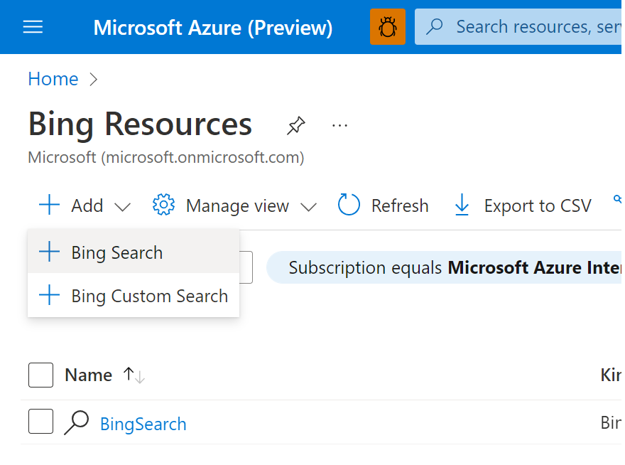
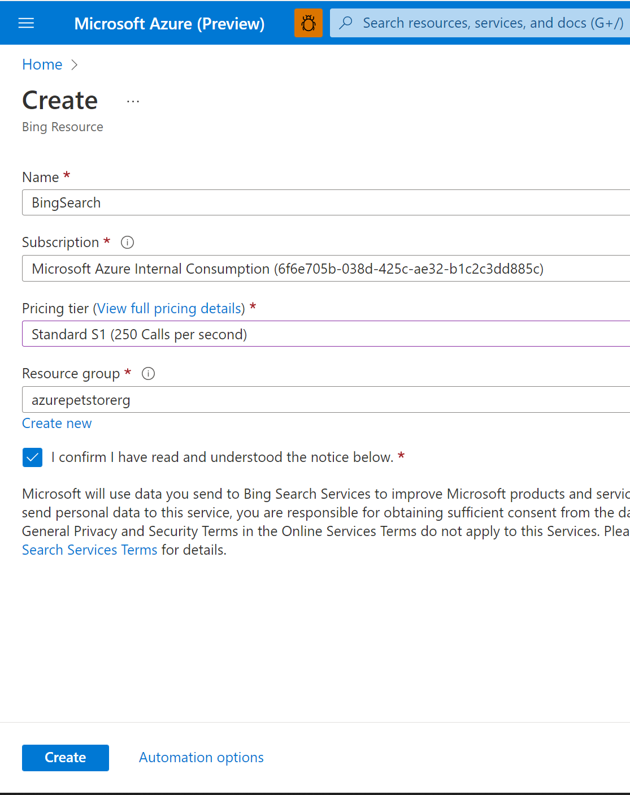
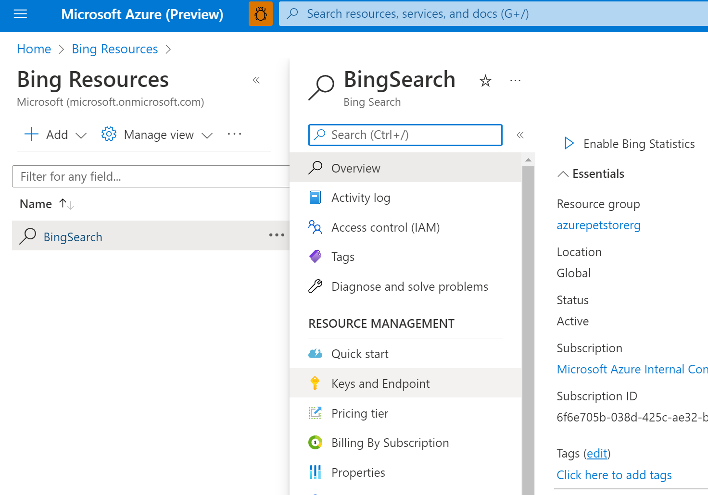
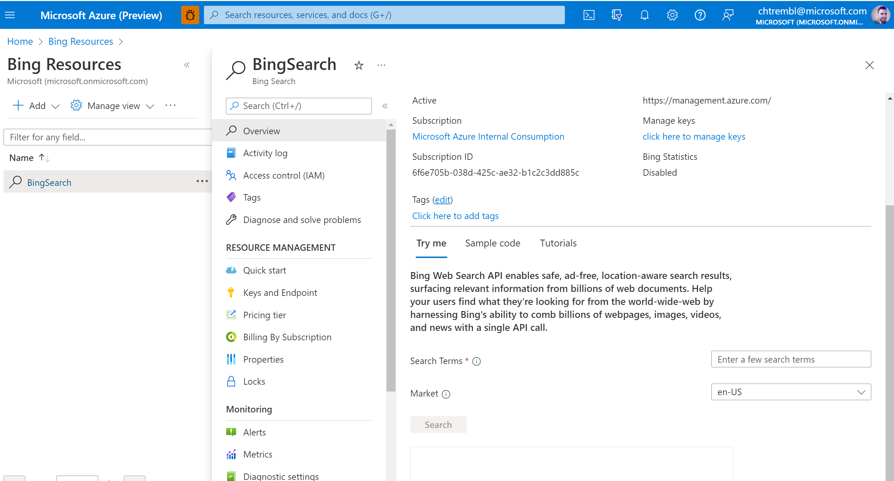
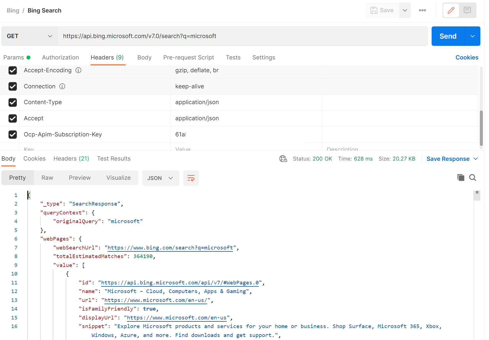

## Setting up Bing Search and querying the API ##

## Step1 Provision Bing Search ##

Head to Azure Portal and Search for "Bing" Select Bing Resources and create a new "Bing Search" Resource.

> 📝 Please Note, I chose Bing Search vs Bing Custom Search. While Bing Web Search API allows you to search over the entire web, Bing Custom Search allows you to select the slices of the web that you want to search over and control the ranking when searching over your targeted web space. For this tutorial Bing Search us sufficient.

Give your new Bing Search Resource a name, subscription, pricing tier, resource group and acknowledge/consent and click "Create"

You should see the following:





Once your Bing Search Resource is provisioned you can start using it. You will want to take note of your Access Keys. Select "Keys and Endpoints" and copy one of your keys off somewhere safe.

You should see the following:



Back on the Overview tab you can Try Out the API and view Sample code etc...

You should see the following:



## Step2 Use Bing Search ##

[Bing Search API Documentation](https://docs.microsoft.com/en-us/azure/cognitive-services/bing-web-search/)

You can use POSTMan for Free, to initiate GET Request(s) to Bing Search API

Download POSTMan [here](https://www.postman.com/)

Within POSTMan you can create a new GET Request with a Search URL containing Search Query Parameter and Header Value containing your subscription key from above (The step where you copied the key off somewhere safe)

You should see the following:



As seen in the above screenshot I created a new GET Request, gave it a URL ```https://api.bing.microsoft.com/v7.0/search?q=microsoft``` and specified 1 header with a key: ```Ocp-Apim-Subscription-Key``` and value: ```<The step where you copied the key off somewhere safe>```

```
curl --header "Ocp-Apim-Subscription-Key: keyhere" https://api.bing.microsoft.com/v7.0/search?q=microsoft
```
You can also programatically integrate with this Bing Search API from code as well. Below I will detail how it can be done with Java

[https://github.com/chtrembl/azure-cloud/blob/main/petstore/petstoreapp/src/main/java/com/chtrembl/petstoreapp/controller/WebAppController.java](https://github.com/chtrembl/azure-cloud/blob/main/petstore/petstoreapp/src/main/java/com/chtrembl/petstoreapp/controller/WebAppController.java) Snippet:

```java
@GetMapping(value = "/bingSearch")
	public String bingSearch(Model model) throws URISyntaxException {
		logger.info(String.format("PetStoreApp /bingsearch requested for %s, routing to bingSearch view...",
				this.sessionUser.getName()));
		String companies[] = { "Chewy", "PetCo", "PetSmart", "Walmart" };
		List<String> companiesList = Arrays.asList(companies);
		List<WebPages> webpages = new ArrayList<>();
		companiesList.forEach(company -> webpages.add(this.searchService.bingSearch(company)));
		model.addAttribute("companies", companiesList);
		model.addAttribute("webpages", webpages);

		return "bingSearch";
	}
```
[https://github.com/chtrembl/azure-cloud/blob/main/petstore/petstoreapp/src/main/java/com/chtrembl/petstoreapp/service/SearchServiceImpl.java](https://github.com/chtrembl/azure-cloud/blob/main/petstore/petstoreapp/src/main/java/com/chtrembl/petstoreapp/service/SearchServiceImpl.java) Snippet:

```java
@PostConstruct
	public void initialize() {
		this.bingSearchWebClient = WebClient.builder().baseUrl(this.containerEnvironment.getBingSearchURL())
				.build();
	}

@Override
	public WebPages bingSearch(String query) {
		Exception e = null;

		try {
			String response = this.bingSearchWebClient.get().uri("v7.0/search?q=" + query)
					.accept(MediaType.APPLICATION_JSON).accept(MediaType.APPLICATION_JSON)
					.header("Ocp-Apim-Subscription-Key", this.containerEnvironment.getBingSearchSubscriptionKey())
					.header("Cache-Control", "no-cache").retrieve()
                    .bodyToMono(String.class)
                    .block();

			SearchResponse searchResponse = this.objectMapper.readValue(response, SearchResponse.class);
			return searchResponse.getWebPages();

		} catch (WebClientException wce) {
			e = wce;
		} catch (IllegalArgumentException iae) {
			e = iae;
		} catch (JsonMappingException jme) {
			e = jme;
		} catch (JsonProcessingException jpe) {
			e = jpe;
		}
		WebPages webpages = new WebPages();
		webpages.value = new Value[1];
		Value value = new Value();
		value.setName(e.getMessage());
		webpages.value[0] = value;

		return webpages;
	}
```

[https://github.com/chtrembl/azure-cloud/blob/main/petstore/petstoreapp/src/main/java/com/chtrembl/petstoreapp/model/WebPages.java](https://github.com/chtrembl/azure-cloud/blob/main/petstore/petstoreapp/src/main/java/com/chtrembl/petstoreapp/model/WebPages.java) Snippet:

```java
package com.chtrembl.petstoreapp.model;

import java.io.Serializable;

@SuppressWarnings("serial")
public class WebPages implements Serializable {
	public String webSearchUrl = null;

	public Value[] value = null;

	public String getWebSearchUrl() {
		return webSearchUrl;
	}

	public void setWebSearchUrl(String webSearchUrl) {
		this.webSearchUrl = webSearchUrl;
	}

	public Value[] getValue() {
		return value;
	}

	public void setValue(Value[] value) {
		this.value = value;
	}
}
```
