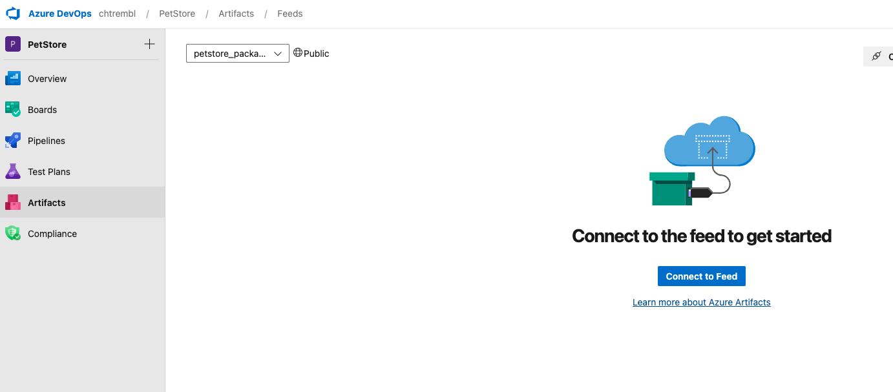
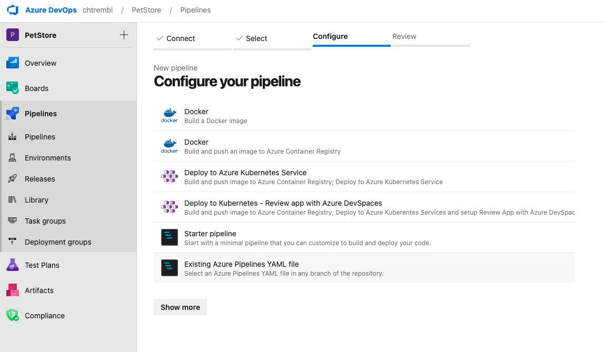
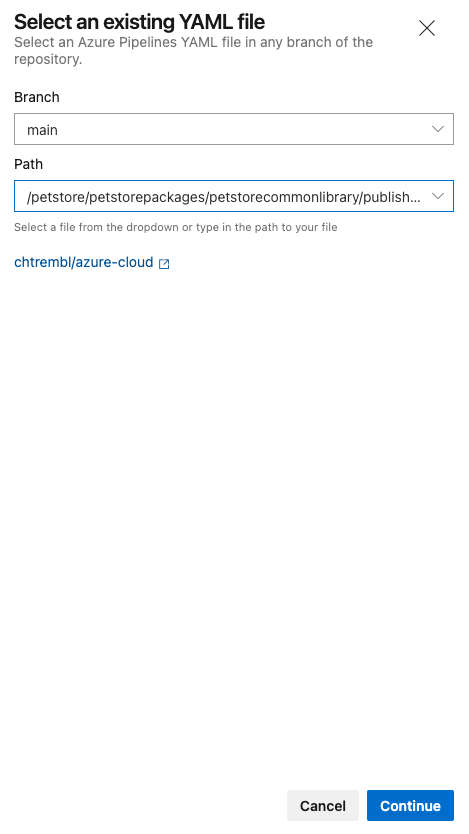

## Using Azure DevOps Artifacts to push/pull Python packages

Are you looking for a collaborative way for developers to source and distribute reusable Python packages? The following will walk through the steps needed to configure an Azure DevOps Pipeline to build and deploy Python Packages to Azure Artifacts for consumption by developers across your organization.

## Step1 Clone this repository and understand the contents ##

```
git clone git@github.com:youralias/azure-cloud.git
```
You will notice the following, petstorecommon is the reusable Python package that will be built by Azure DevOps Pipeline and distributed to Azure Artifacts
```azure-cloud/petstore/petstorepackages/petstorecommon```

petstorecommonconsumer is a sample Python project that consumed the reusable Python petstorecommon package
```azure-cloud/petstore/petstorepackages/petstorecommonconsumer```

build-publish-petstorecommon-package-pipeline is the pipeine that you will import into Azure DevOps Pipelines
```azure-cloud/petstore/petstorepackages/build-publish-petstorecommon-package-pipeline.yml```

## Step2 Understand the petstorecommon package that we are building ##

Inspect ```azure-cloud/petstore/petstorepackages/petstorecommon/src/utility.py```

```python
def getBreeds(animal):
    if animal == "Dog":
        return "Afador, American Bulldog, Australian Retriever"
    elif animal == "Cat":
        return "Abyssinian, American Bobtail"
    elif animal == "Fish":
        return "Goldfish, Bass"
```

This is the script that we will center our package around, a resusable package to retrieve pet breeds as needed.

In your terminal run the following:

```cd azure-cloud/petstore/petstorepackages/petstorecommon/src/petstorecommon```

```python run.py```

```bash
/opt/homebrew/bin/python3 /Users/christremblay/Development/git/azure-cloud/petstore/petstorepackages/petstorecommon/src/petstorecommon/run.py
Afador, American Bulldog, Australian Retriever
Abyssinian, American Bobtail
Goldfish, Bass
```

You will notice a litst
## Step3 Create an Azure DevOps Artifacts feed ##

Head to Azure DevOps and create a new Azure Artifacts feed, give it a name, for example ```petstore_packages```

You should see the following:




> 📝 Please Note, Now that the Artifacts feed is setup, we will come back to it in a bit

## Step4 Create an Azure DevOps Pipeline ##

Import the ```azure-cloud/petstore/petstorepackages/build-publish-petstorecommon-package-pipeline.yml``` and select run (which saves the pipeline)

```
trigger:
  branches:
    include:
    - main
  paths:
    include:
    - petstore/petstorepackages/petstorecommon/*

pool:
  vmImage: ubuntu-latest
strategy:
  matrix:
    Python39:
      python.version: '3.9'

steps:
- task: UsePythonVersion@0
  inputs:
    versionSpec: '$(python.version)'
  displayName: 'Use Python $(python.version)'

- script: |
    python -m pip install --upgrade build
  displayName: 'PIP Upgrade'
 
- script: |
    ls -l
    cd petstore/petstorepackages/petstorecommon
    sed -i "s|PACKAGE_VERSION|$(Build.BuildNumber)|g" pyproject.toml
    python -m build
  displayName: 'Python build'

- task: CopyFiles@2
  inputs:
    targetFolder: $(Build.ArtifactStagingDirectory)

- task: PublishBuildArtifacts@1
  inputs:
    PathtoPublish: '$(Build.ArtifactStagingDirectory)'
    ArtifactName: 'dist'
    publishLocation: 'Container'
  displayName: Publish Build Artifacts
  
- script: |
    pip install wheel
    pip install twine

- task: TwineAuthenticate@1
  inputs:
    artifactFeed: PetStore/petstore_packages
  displayName: Twine Authenticate
    
- script: |
    ls -l
    cd petstore/petstorepackages/petstorecommon
    python -m twine upload -r petstore_packages --config-file $(PYPIRC_PATH) dist/*.whl --verbose
```






The build will inititiate via ```python -m build```, and on each subsequent commit to your repository folder ```petstorepackages/petstorecommon``` it will run as well. Essentially every time a developer commits a change to ```petstorepackages/petstorecommon``` we will inititate a new pipeline to build and deploy a new package so the other team members/developers can consume. The build label gets injected as well via ```sed -i "s|PACKAGE_VERSION|$(Build.BuildNumber)|g" pyproject.toml``` and twine is used to deploy the package to Artifacts via the Artifact feed that we previously created ```petstore_packages```

> 📝 Please Note, The build will fail because there isn't yet permissions for this Pipeline to deploy to the Artifact feed.


Head to the settings of your Artifacts and add the ```Contributor``` permission.


Rerun the job and it should be successful, you will notice the Artifact gets populated with all of the meta data around it including steps to consume it.


## Step2 Create an Azure DevOps Pipeline ##